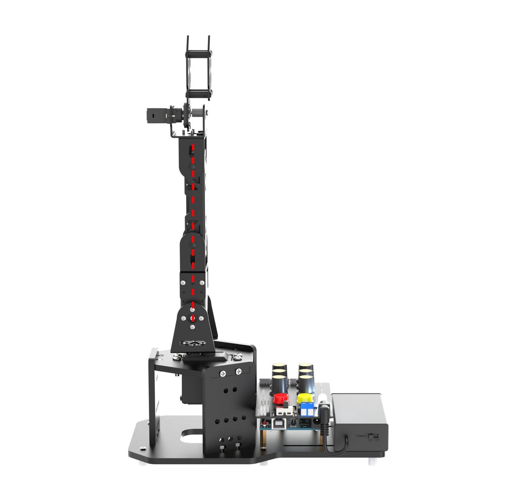
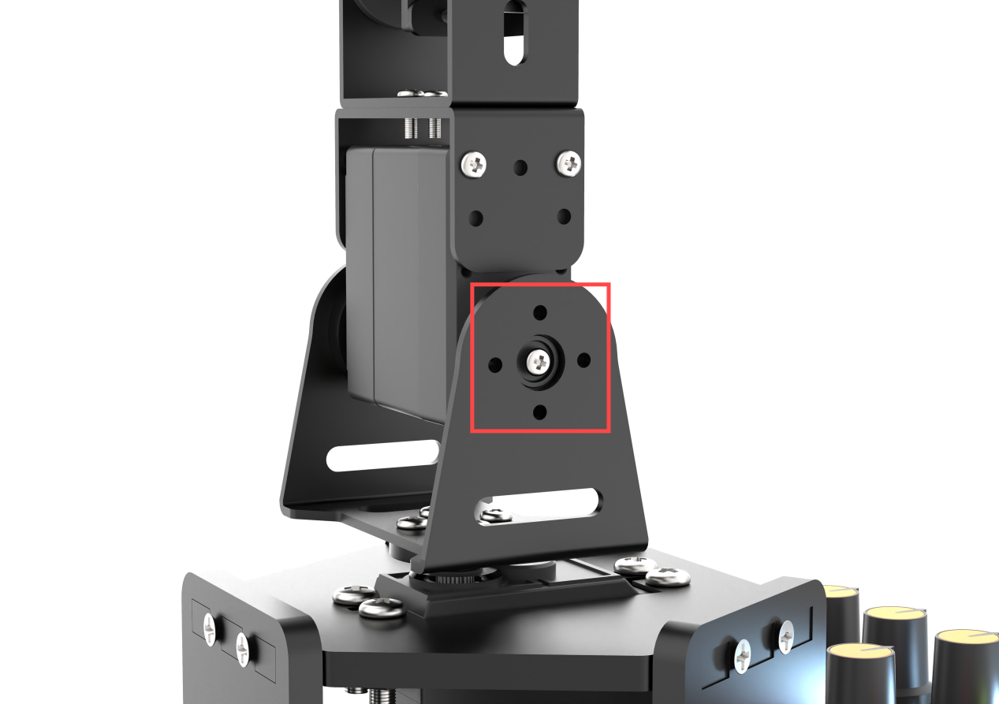

# 学前先看

## 1. 认识MiniArm机械臂

### 1.1 产品简介

MiniArm是一款基于Arduino UNO开发板的机械臂。采用Arduino编程，搭载UNO6路旋钮扩展板与无线蓝牙模块即可快速使用旋钮或手机APP来控制机械臂；采用7.4V的锂电池供电，使得机械臂可以随意移动使用。

预留IO接口和IIC接口，配合传感器拓展包，即可开发出更多有趣好玩的创意项目。

### 1.2 发货清单

**螺丝螺母配件包详见下表**

## 2. 组装接线及充电说明

### 2.1 组装及接线

1)  用**4颗M4\*14圆头螺丝**和**4颗M4螺母**，将舵机装至舵机板上。

**安装时注意舵盘需远离带有弧形孔位的一侧。**

2)  用**2颗M3\*10平头螺丝**和**2颗M3螺母**，将方形板安装至舵机板上；另外两块方形板也按照相同的方式安装。

3)  用**6颗M3\*10平头螺丝**和**6颗M3螺母**，将方形板固定在大底板上；

    再用**6颗M3\*10平头螺丝**，将**6颗M3\*8双通尼龙柱**，固定在大底板的下方。

:::{Note}

大底板上孔位少的一侧，位于机械臂的右边（以机械臂为第一视角）。

:::

4)  用**4颗M3\*6圆头螺丝**将**4颗M3\*15双通铜柱**固定在Arduino UNO主板上；

再使用**4颗M3\*10平头螺丝**，将主板固定在底板上；

将扩展板的排针，对准主板的排母（**一一对齐**）插入主板中。

用**4颗M3\*10平头螺丝**和**4颗M3螺母**将电池盒安装在大底板上。在安装电池时请先确认电池盒开关拨到“**OFF**”档将电池装入电池盒中，并将电源线接入扩展板的DC接口中。

:::{Note}

有两个孔位是安装在大底板的缝隙中。

:::

5)  将云台舵机接入任意一个舵机接口（**白色接S（信号线）、红色接+、黑色接-**），将机械臂开机，即可中位。中位完成后，用**4颗M2\*6圆头螺丝**将U型支架安装在舵盘上（**安装时注意，**U型支架**的底部，与底座平行**）。

6)  将4号舵机接入扩展板上的任意一个舵机接口（白色接S（信号线）、黑色接+、黑色接-），将机械臂开机，即可中位。中位完成后，将机械臂笔直的插入底座U型支架中。

7)  将舵机线按照标签上的ID号一一对应接入舵机接口中。

:::{Note}

舵机的正负极不要接反（1~3号接口：橙色接S（信号线）、红色接+、棕色接-；4、5号接口：白色接S（信号线）、黑\红色接+、黑色接-）。

:::

8)  将蓝牙模块的排针与扩展板上的排母一一对齐，接入蓝牙模块接口中。

### 2.2 充电说明

1. 将两节18650的电池按照正负极对应（**正对正，负对负**）装到电池充电器中。

2. 取出配套的USB数据线先连接电源，再接入充电器的USB接口中进行充电。

:::{Note}

充电头需用户自备。

:::

3.  充电时，指示灯亮红色，充电完成后指示灯亮绿色，充电完成后请及时将充电器拔掉，避免过度充电。

### 2.3 电池使用规范

锂电池由于运输中不能充满，初次使用，请先给电池充电。

- 请使用套件附带的电池充电器以及USB数据线给电池充电。

- 电池充电时电源指示灯亮红色，充满电后指示灯亮绿色；充满后请及时断开电源，避免电池过度充电。

- 若预计长时间不使用机械臂，请将电池充满电，将电池盒上的开关拨到“**OFF**”挡，并把电池盒上的电源线拔掉，存放在阴凉干燥的的地方。

:::{Note}

因未按本册“**注意事项及电池使用规范**”规范使用而造成产品损坏、经济损失及安全事故等后果，我司不承担任何相关责任。

:::

### 2.4 设备使用注意事项

- 确保舵机线、电源线正确连接。

- 开机后不要强行掰动舵机，避免舵机产生损伤。

- 请勿将舵机长时间处于极限位置，避免舵机堵转。

- 连接手机APP时，请将手机的GPS定位以及蓝牙打开。

- 接入Type-B下载线时请将电池盒开关拨到“**OFF**”挡，避免下载线误碰到扩展板的电源引脚，造成短路。

- 下载程序时请将蓝牙模块拔下，避免串口冲突导致程序下载失败。

## 3. 偏差调试

MiniArm在组装过程中，若因机械臂摔落使舵机主轴偏移产生偏差，或更换舵机，以及其他操作使舵机主轴发生偏移，都需要进行偏差调试，而偏差分为小偏差和大偏差两种情况。根据情况不同，调试的方法也有所不同。

### 3.1 准备工作

1)  根据“**[2. 组装接线及充电说明](#bookmark2)**”内容，将机械臂组装完成。

2)  将电池盒和扩展板的开关拨到“**ON**”档，此时RGB亮白灯，机械臂回到中位姿态。

### 3.2 判断大小偏差

1)  机械臂处于中位姿态时，2-4号舵机的主轴螺丝呈笔直的一条线（下文以中心线代称），如下图：

2)  5号舵机U型支架的凹槽横线与前方方形板的横线平行，如下方左图；1号舵机机械爪处于刚刚闭合的状态、且机械爪右侧的三颗螺丝呈一条笔直的直线，如下方右图；则表明机械臂无需调整偏差，可跳过本节内容。

	
	

3)  若舵机与中心线夹角小于13°，则为小偏差，可以通过“[3.3 小偏差调节](#bookmark3)”来进行调节；偏差情况以2号舵机为例，如下图所示：

4)  如舵机与中心线的夹角大于13°，可以通过“[3.4 大偏差调节](#bookmark4)”来进行调节；偏差情况以4号舵机为例，如下图所示：

### 3.3 小偏差调节

小偏差可通过转动旋钮来调节，旋钮与舵机对应关系如下所示：

<table style="text-align:center;" class="docutils-nobg" border="1">
    <thead><tr><th>旋钮</th><th>舵机</th><th>控制说明（以机械臂本身）</th></tr></thead>
    <tbody>
    	<tr><td>S1</td><td>1号舵机（爪子）</td><td>旋钮控制爪子的开合</td></tr>
        <tr><td>S2</td><td>2号舵机（腕关节）</td><td rowspan="3">旋钮控制各关节舵机的转动</td></tr>
        <tr><td>S3</td><td>3号舵机（小臂）</td></tr>
        <tr><td>S4</td><td>4号舵机（大臂）</td></tr>
        <tr><td>S5</td><td>5号舵机云台</td><td>旋钮控制云台的转动</td></tr>
    </tbody>
</table>

1)  将机械臂开机，长按扩展板上的K1按键1S，RGB亮绿灯时松开，即可进入偏差调节模式。

:::{Note}

调节偏差时会先将舵机置于旋钮当前位置。

:::

2)  接着转动旋钮以2号舵机为例，将机械臂调到中位姿态。

3)  调节完成后，长按K2按键1S，RGB亮白灯时松开，此时会舵机偏差保存，并退出中位模式。

### 3.4 大偏差调节

大偏差的调节则需要将舵机从U型支架上拆下来，进行中位后，再重新安装，接着再重复小偏差调节的步骤即可。

1)  开机后，机械臂回归中位姿态，此时可以发现4号舵机有明显的偏差，偏差角度大于13°。

2)  将机械臂断电（以下涉及拆卸步骤，切勿在通电下进行）。

3)  将4号舵机U型支架上的螺丝拧下。

4)  将机械臂取下来，手持机械臂，开机上电。此时舵机会回到中位姿态，查看主舵盘上的孔位与主轴螺丝是否呈一条直线。

5)  若是，即可将机械臂垂直装在U型支架上。

:::{Note}

安装时1号舵机朝向前方。

:::

6. 若不是，将主舵盘上的主轴螺丝拧下，拔出，装至直线的状态，再拧上主轴螺丝，参照步骤6安装即可。

     

7)  安装完成后，可根据“**[3.3 小偏差调节](#bookmark3)**”进行小偏差的调节。
## 4 动手操作

用户可直接通过搭载的六路旋钮扩展板对机械臂进行控制，由于MiniArm机械臂为5自由度，六路旋钮中仅有S1~S5五路能控制MiniArm(S6旋钮无效)。

### 4.1 准备工作及注意事项

1)  确认机械臂正确安装以及舵机线连接正确，关于如何组装和接线的内容可前往“**[1.2 组装接线及充电说明](#bookmark2)**”中进行查看。

2)  若转动旋钮时发现舵机无法正常转动，请勿继续转动旋钮，避免舵机堵转。

### 4.2 设备开机

1)  将电池盒与扩展板上的开关拨到“**ON**”档。

2)  此时扩展板上的RGB灯亮白色，机械臂回归中位姿态。

3)  同时按下扩展板上的K1、K2按键，等待RGB灯亮绿色后松开即可退出中位模式（**若不退出，则无法进行旋钮或APP控制**）。

### 4.3 旋钮控制操作步骤

退出中位模式两秒后，机械臂上的舵机会转动到到当前旋钮所处的位置。用户可转动扩展板上S1~S5的5个旋钮，分别控制机械臂的1-5号舵机。

1)  关于旋钮与舵机的对应关系如下表所示：

<table style="text-align:center" class="docutils-nobg" border="1">
    <thead><tr><th>旋钮</th><th>舵机</th><th>控制说明（以机械臂本身）</th></tr></thead>
    <tbody>
    	<tr><td>S1</td><td>1号舵机（爪子）</td><td>旋钮控制爪子的开合</td></tr>
        <tr><td>S2</td><td>2号舵机（腕关节）</td><td rowspan="3">旋钮控制各关节舵机的转动</td></tr>
        <tr><td>S3</td><td>3号舵机（小臂）</td></tr>
        <tr><td>S4</td><td>4号舵机（大臂）</td></tr>
        <tr><td>S5</td><td>5号舵机云台</td><td>旋钮控制云台的转动</td></tr>
    </tbody>
</table>

2)  除了上述介绍的通过扩展板来控制机械臂外，我们还可以通过其他模式来对机械臂进行控制。

| RGB灯颜色 |      模式      |              实现功能              |
|:---------:|:--------------:|:----------------------------------:|
|   白色    |    中位模式    |      ID1~5号舵机处于中位姿态       |
|   绿色    |    普通模式    |              旋钮控制              |
|   红色    | 编辑动作组模式 |              编辑动作              |
|   黄色    | 运行动作组模式 | 运行在红灯状态下编辑好的离线动作组 |
|   蓝色    |    APP模式     |       通过手机APP控制机械臂        |

例如当我们长按扩展板上的红色按键，扩展板上的RGB灯会切换为**红色**，进入编辑动作组模式。当编辑完动作后执行时，RGB灯会切换为**黄色**，代表正在执行动作组。

通过手机APP进行连接时，扩展板上的RGB灯会切换为**蓝色**，此时进入手机APP控制模式。关于扩展板上RGB灯及其对应模式可参考下表所示：

关于如何具体编辑一个完整的动作组，用户可以前往“**动作编辑教学/2.1 离线旋钮编程**”进行学习了解。

关于如何通过手机连接和控制机械臂，用户可以前往“**遥控玩法学习/3.1 手机APP控制**”进行学习了解。