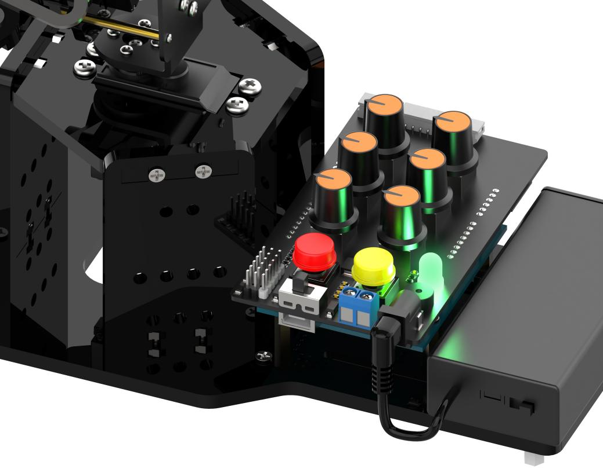
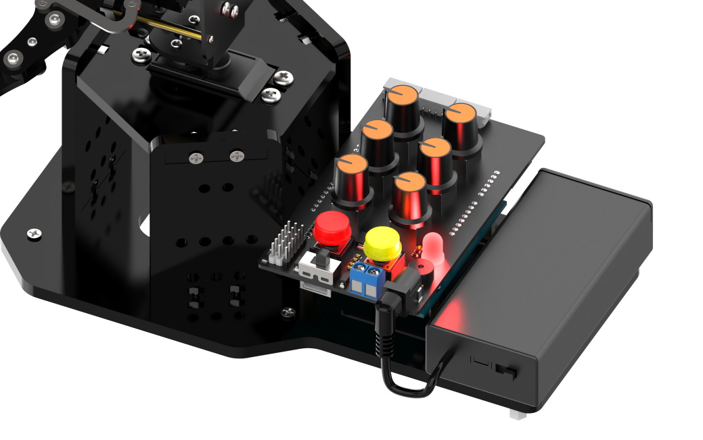
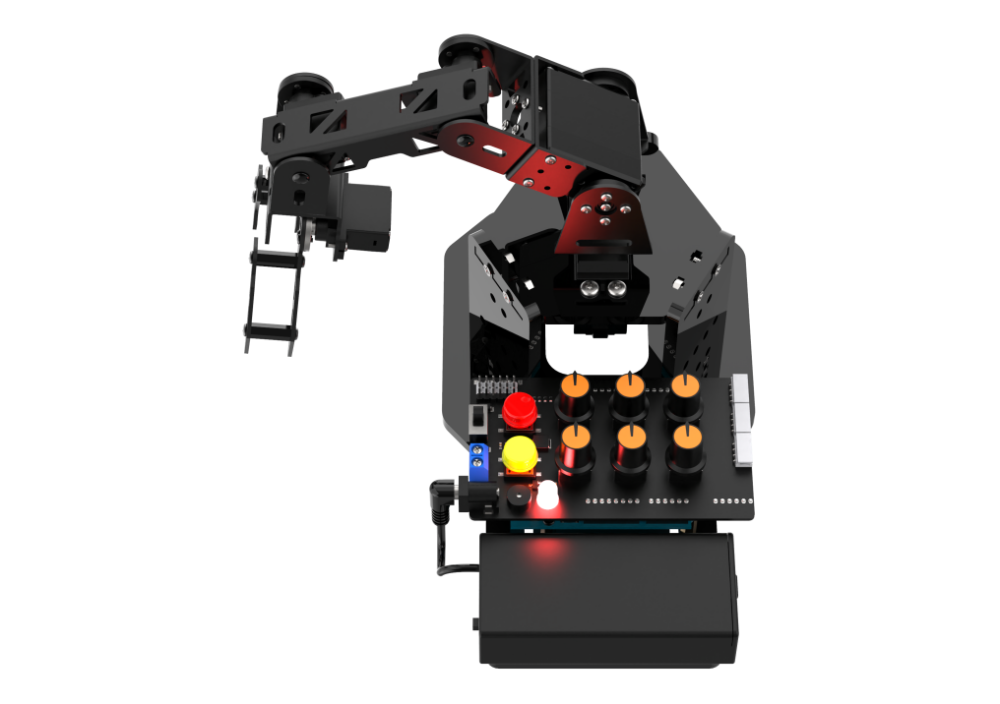
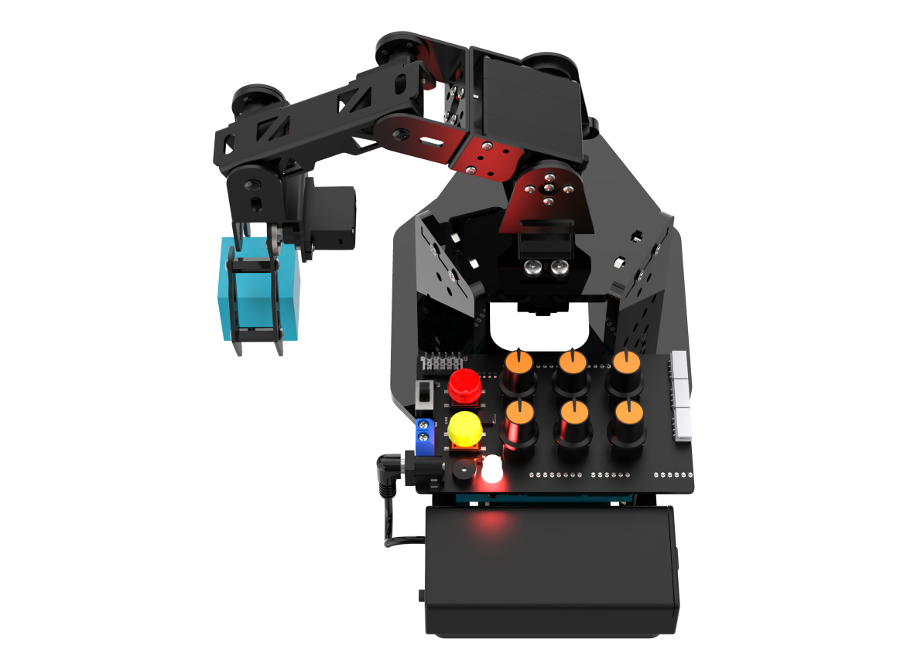
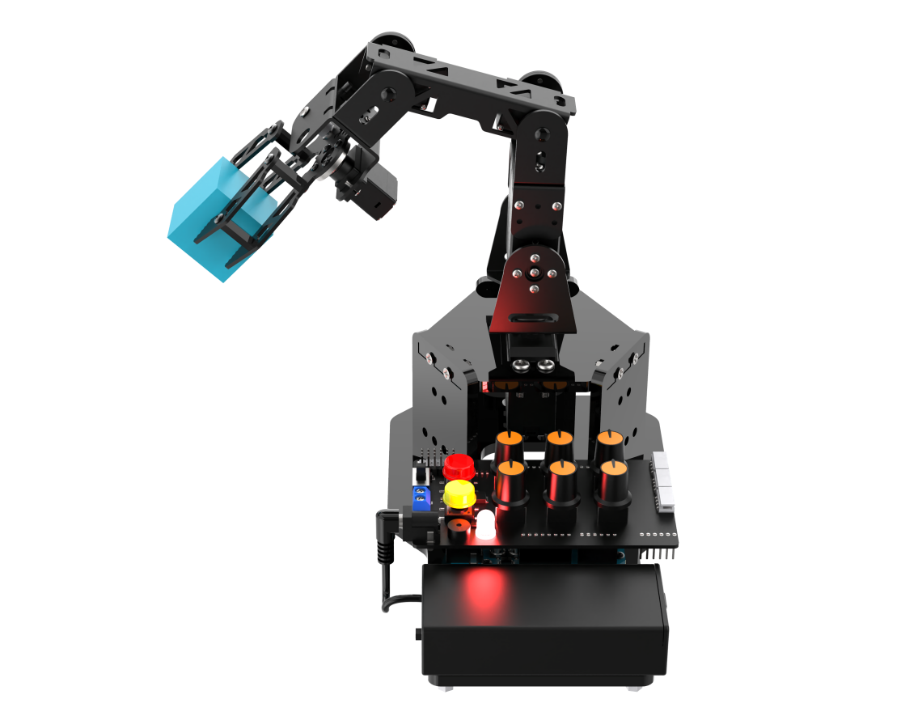
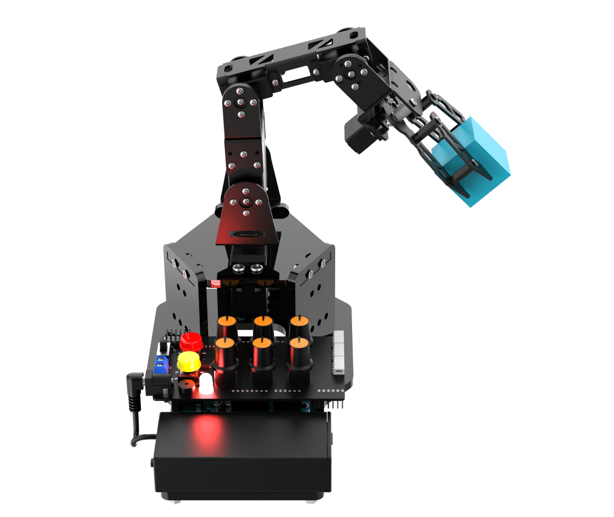
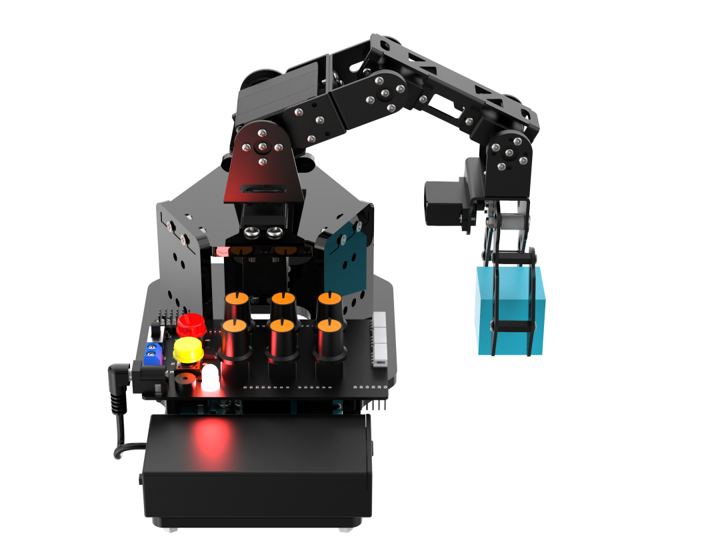
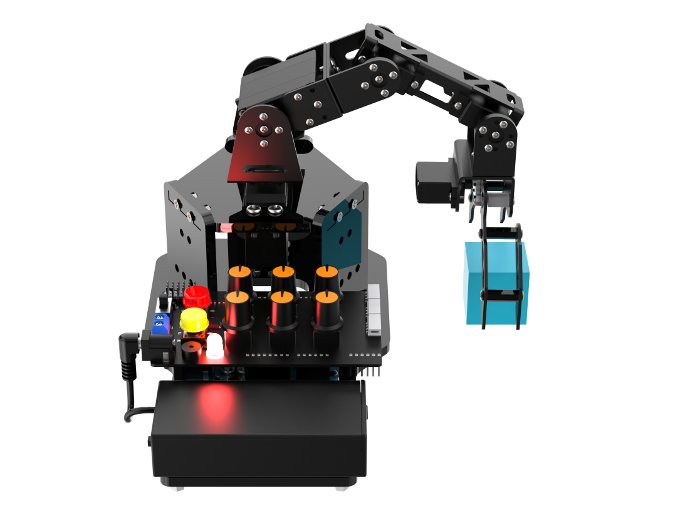
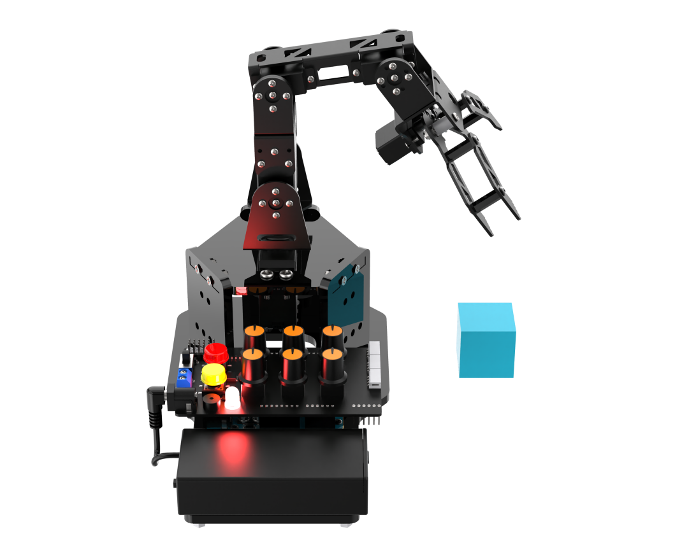
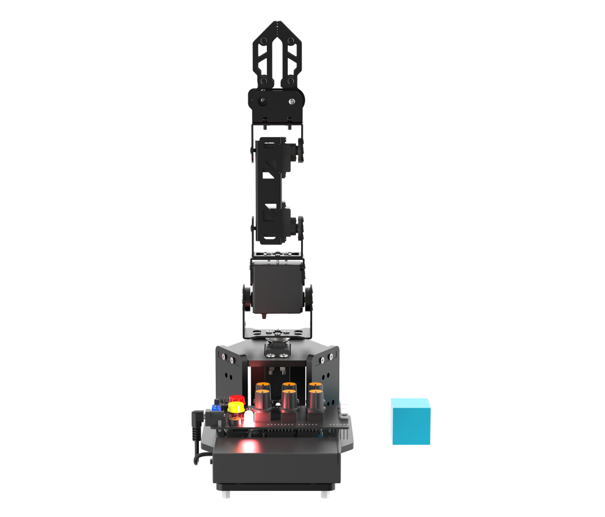

# 离线旋钮编程

本节将编辑一个动作，先抓取机械臂左侧的小木块，再转动至右侧放下，最后让云台舵机回归中位。

## 1. 模式及按键介绍

关于本玩法使用到的按键功能及模式说明，具体可参考下表：

<table style="text-align:center" class="docutils-nobg" border="1">
    <thead><tr><th>模式</th><th>按键</th><th>效果</th></tr></thead>
    <tbody>
    	<tr><td>①中位模式（白灯常亮）</td><td>开机默认模式，同时长按“<b>K1、K2</b>”方可退出</td><td>ID1~5舵机处于90°姿态</td></tr>
        <tr><td rowspan="3">②普通模式（绿灯常亮）</td><td>长按红色按键“<b>K1</b>”</td><td>进入③并清除原有动作组</td></tr>
        <tr><td>短按黄色按键“<b>K2</b>”</td><td>进入④执行保存的动作组一次</td></tr>
        <tr><td>长按黄色按键“<b>K2</b>”</td><td>进入④循环执行保存的动作组</td></tr>
        <tr><td rowspan="2">③编辑动作组模式（红灯常亮）</td><td>短按红色按键“<b>K1</b>”</td><td>保存动作</td></tr>
        <tr><td>长按红色按键“<b>K1</b>”</td><td>将编辑的动作组保存下来并退出，切换为普通模式</td></tr>
        <tr><td>④运行动作组模式（黄灯常亮）</td><td>短按红色按键“<b>K1</b>”</td><td>停止动作组运行，切换为普通模式</td></tr>
    </tbody>
</table>

## 2. 旋钮编程实操

1)  打开机械臂，长按扩展板上的K1、K2按键，待绿灯点亮时松开。等待2S后，舵机回到旋钮控制姿态。

2)  长按扩展板上的红色按键“**K1**”，蜂鸣器会发出提示音，RGB灯颜色会从绿色切换为红色，此时机械臂清除控制板中保存的动作组，进入动作组编辑模式。

3)  转动旋钮S1-S5，使机械臂的方向转动至左侧，让机械臂处于待抓取状态，短按“**K1**”，蜂鸣器短鸣，保存第一个动作。

4)  接着可以将小方块放至机械爪下，转动旋钮S1使机械爪闭合，抓住小方块。短按红色按键“**K1**”，蜂鸣器短鸣，保存动作。

5)  转动旋钮S4，控制机械臂向上提。短按红色按键“**K1**”，蜂鸣器短鸣，保存动作。

6)  转动旋钮S5，使机械臂向右旋转。短按红色按键“**K1**”，蜂鸣器短鸣，保存动作。

7)  转动旋钮S4，控制机械臂下垂，短按红色按键“**K1**”，蜂鸣器短鸣，保存动作。

8)  转动旋钮S1，松开小木块，短按红色按键“**K1**”，蜂鸣器短鸣，保存动作。

9)  转动旋钮S4，提起机械臂，短按红色按键“**K1**”，蜂鸣器短鸣，保存动作。

10) 转动旋钮S1-S5，使机械臂回中，短按红色按键“**K1**”，蜂鸣器短鸣，保存动作。

11) 最后长按红色按键“**K1**”，**蜂鸣器长鸣，RGB变为绿色**，此时机械臂会保存当前编辑的动作组并退出该模式。

:::{Note}

长按红色按键“K1”进入到动作组编辑模式时会连同之前编辑的动作组数据一起清除。

:::

## 3. 运行动作组

编辑完动作组后，可以通过按下扩展板上的黄色按键“**K2**”来运行保存的动作组。长按则可以循环运行该动作组。

:::{Note}

编辑好的动作组是能够被断电保存的，即断电后下次开机还能够再次运行。

如果想停止正在运行的动作组，可以短按红色按键“K1”使其切换回普通模式。

:::

