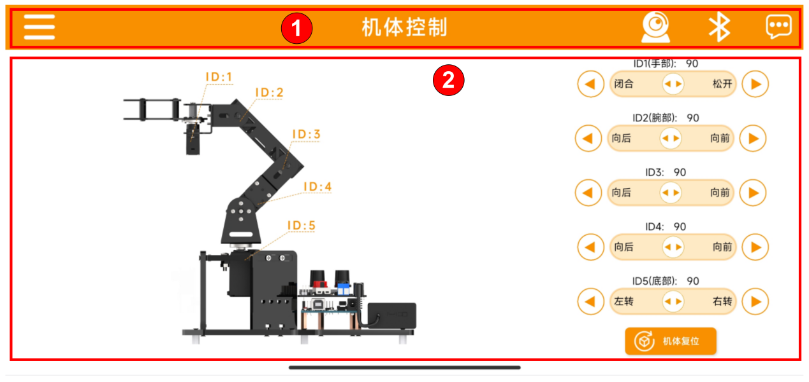

# 遥控玩法学习

## 1. 手机APP安装与连接

### 1.1 手机APP安装

[安卓系统](https://play.google.com/store/apps/details?id=com.Wonder.bot)

[iOS系统](https://apps.apple.com/cn/app/wonderbot-lobot/id1519146341)

### 1.2 手机APP连接

:::{Note}

APP使用前，请先在手机设置中开启蓝牙与定位服务。

请通过APP内的蓝牙按钮与设备进行配对连接，请勿在手机设置里通过密钥的形式进行配对。

本小节以安卓版本APP为例，IOS版本教程一致使用。

:::

1. 首先需要确认蓝牙模块已正确安装在MiniArm的6路旋钮扩展板上，注意蓝牙模块排针和引脚需一一对齐，如下图所示：

2. 打开电池盒和扩展板的电源开关，同时按下扩展板上的K1、K2按键，待RGB灯亮绿灯后松开即可退出中位模式。（**若不退出，则无法进行旋钮或APP控制**）。

3. 打开手机APP“**Wonderbot**”，点击左上角的图标选择机器人类型，这里点击后选择“**MiniArm**”。

4. 选择后，进入玩法界面，点击右上角闪烁的图标，找到蓝牙列表中的“**Hiwonder**”点击连接。

:::{Note}

若点击蓝牙图标后第一时间未显示“Hiwonder”的名称，可点击“重新搜索”查找目标。

:::

5. 连接成功后，右上角蓝牙图标会变为常亮模式，点击机体复位，机械臂回归中位姿态。

6. 接下来可前往本节同路径下的“**3.2 手机APP控制**”中学习使用手机APP控制机械臂。

## 2. 手机APP控制

请先根据上节课程安装完手机APP。

手机APP具有滑杆控制功能和图传功能，通过滑动滑杆，可以控制机械臂各个舵机的转动角度；

### 2.1 滑杆控制

我们将当前APP界面分为了两部分，如下图所示：

- #### 菜单栏

|  | 返回主界面选择机器人类型 |
|:----------------------------------------------------------------:|:------------:|
|  |   打开图像回传功能   |
|  |     蓝牙连接     |
|  |     更多信息     |

- #### 控制区 

|  | 控制机械爪张开、闭合，（1号舵机），角度范围0-180° |
|:-----------------------------------------------------------------:|:----------------------------:|
|  | 控制机械臂转动（2~5号舵机），角度范围为0~180°  |
|  |         控制所有舵机回到中位姿态         |

### 2.2 图传功能

注意：MiniArm的图传功能需要根据“**[AI视觉玩法课程/ 3. 图像回传](https://docs.hiwonder.com/projects/miniArm/en/latest/docs/6.aI_vision_application_course.html#id14)**”教程将固件烧录进ESP32-CAM内。

1.  点击菜单栏上的图标，连接名为“**HW_ESP32Cam**”的WIFI连接后，即可打开图像回传功能。图像回传模式下的界面如下图所示：

 

此时在手机APP上即可看到ESP32-CAM传输过来的实时图像。
