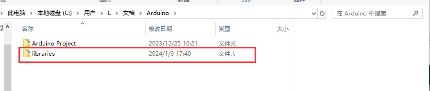
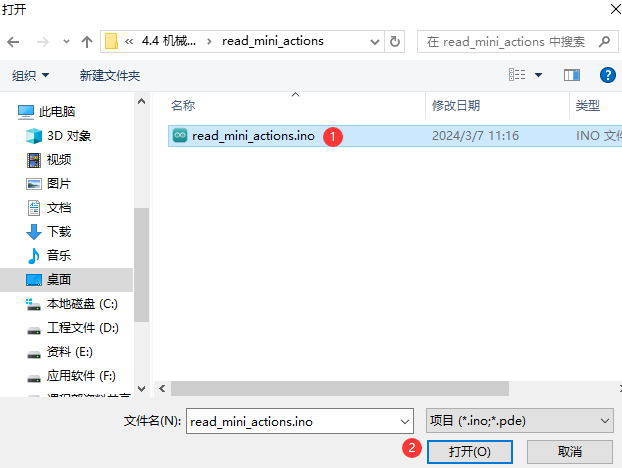
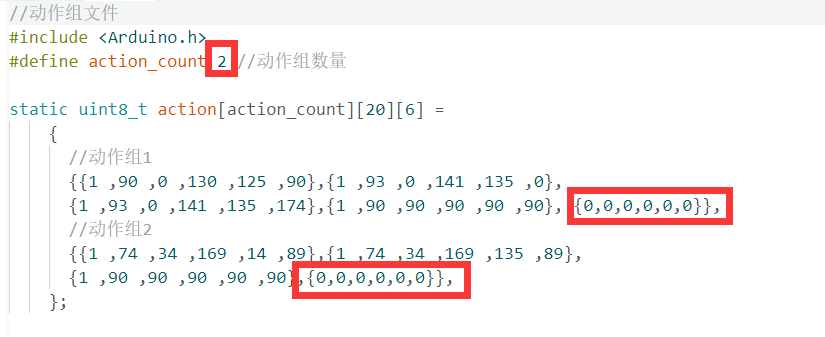

# 二次开发课前准备

## 1. Arduino IDE安装及介绍

### 1.1 Arduino IDE安装方法

Arduino IDE 是一款专门为 Arduino 单片机而设计的软件，功能强大。无论是哪个版本，其安装过程都是相同的，本节以 Arduino-2.2.1 的 windows 版软件为例进行讲解：

1)  在本文档同路径下找到ArduinoIDE的安装包，如下所示，双击打开。（若想下载最新版软件，可通过arduino官网“[**<u>https://www.arduino.cc/en/software</u>**](https://www.arduino.cc/en/software)”进行下载）


2)  点击“**我同意**”，进入安装。


3)  选择默认勾选选项即可，点击“**下一步**”，进入下一步操作。


4)  点击“**浏览**”选择安装的路径，然后点击“**安装**”开始安装。


5)  等待软件安装完成。


:::{Note}

“安装过程如果提示需要芯片驱动的安装，请勾选“始终信任来自Arduino LLC的软件（A）”，然后点击“安装”即可。

:::


6)  安装完成后，点击“**完成**”。


### 1.2 软件简要说明

1)  Arduino IDE 的主界面如下图，可分为5个区域：


2. **菜单栏**： 负责Arduino IDE相关设置工作。


| **图标** | **功能** |
|:--:|:--:|
| 文件 | 可以新建或打开项目文件，也可以对界面进行首选项设置 |
| 编辑 | 编辑选项，可对代码进行注释、缩进、查找等文本编辑 |
| 项目 | 项目选项，对整个项目进行设置，编译运行、添加库文件等 |
| 工具 | 工具选项，可以选择开发板和端口以及获得开发板信息等 |
| 帮助(H) | 帮助选项，帮助用户入门，常见问题解决等 |

3. **工具栏**：项目相关的一些工具，包括编译程序、下载程序、串口监视器等工具。

| **图标** | **功能** |
|:--:|:--:|
|  | 校验，验证一个程序是否编写无误，若无误则编译该项目 |
|  | 下载，下载程序到 Arduino 控制器上 |
|  | 调试，部分开发板可以通过Arduino IDE实时调试 |
|  | 选择开发板，可以选择不同的开发板进行项目开发 |
|  | 串口绘图仪，可以将打印到Arduino串口的数据绘制成图表 |
|  | 串口监视器，打印串口信息 |

4. **侧边栏**：Arduino IDE的核心，负责显示工作文件夹、代码调试、库文件安装等。


| **图标** | **功能** |
|:--:|:--:|
|  | 项目文件夹，显示当前项目的文件。 |
|  | 开发板管理器，添加开发板工具包。 |
|  | 库管理，添加或删除程序的库文件。 |
|  | 调试，对项目实时调试。 |
|  | 搜索，可搜索或替换代码或变量。 |

5. **编辑区**：编辑代码的区域。

6. **状态栏**：显示当前编辑器的一些状态，例如代码的行列、开发板的信息等。

### 1.3 Arduino IDE界面设置

1)  修改中文界面：在Arduino IDE界面选择“**File**”-\>“**Preferences**”，在弹出的窗口中“**language**”选项栏中，选择切换为中文，随后点击“**OK**”即可。


2)  我们可以通过选择“**文件-\>首选项**”在弹出的窗口下修改项目文件路径、编辑器文字大小、颜色主题等设置。


### 1.4 Arduino下载程序

1)  这里我们以一个打印“**hiwonder**”字样的例程为例进行说明。在本文档同路径下的“**Demo**”文件夹中双击打开“**Demo.ino**”的示例程序。


2)  将Arduino通过UNO数据线（Type-B）连接至电脑。


3.  在“**选择开发板**”选项中找到Arduino对应的开发板。（**这里以Arduino Uno为例，COM口不唯一，我们可以通过电脑的设备管理中查看COM号，此处以COM6为例**）


4.  点击按钮可对程序进行编译，可以验证程序是否存在语法错误等问题。


5.  编译成功后，再点击按钮会将程序上传到Arduino开发板上。


6.  上传完成后，点击打开串口监视器，我们可以看到在串口监视器中打印出了“hiwonder”字样。


### 1.5 ESP32-Cam环境配置

编程软件安装完成后，在后续体验ESP32-Cam时还需参照本文对开发板进行配置，若不配置，则无法下载ESP32-Cam相关的玩法程序。

本文提供了两种配置方法，其方法1可直接一键安装开发板包，大大提升了安装的成功率；方法2为在线下载开发板包，通过此方法，用户可任意选择不同版本的开发板包。

**以下步骤请在连网的情况下进行。**

- #### 一键安装开发板包

1)  双击图标打开编辑界面，然后依次选择“**文件 - 首选项**“。


2)  在打开的页面中找到“**其它开发板管理器地址**”选框，将以下链接复制进去：**https://www.arduino.cn/package_esp32_index.json** ， 然后点击“**确定**”。


3)  关闭当前软件编辑界面（**切勿跳过此步骤，否则可能会配置失败**）。

4)  在本文档同路径下找到ESP32开发板包。


5)  然后双击进行安装。


6)  等待安装成功之后，双击打开Arduino软件（**若之前已打开，则需要关闭后重新打开**）。

7)  若要下载ESP32-Cam相关程序请点击“**工具**”，然后在开发板选项中选择“**ESP32 Dev Module**”。


8)  至此，ESP32-Cam配置工作已完成。

**配置完成后，若关闭编程界面再次打开，找不到上图所示的ESP32开发板，请重复以上步骤。**

- #### 在线下载开发板包

1)  双击打开编程软件。然后依次选择“**文件-\>首选项**”。


2)  打开的页面中找到“**其它开发板管理器地址**”选框，将以下链接复制进去：**https://www.arduino.cn/package_esp32_index.json，**然后点击“**确定**”。


3)  然后依次点击“**工具-\>开发板-\>开发板管理器**”。


4)  在版本选择框这里往下拉找到esp32开发板，点击“**选择版本**”的下拉按钮，选择一个开发板包版本(建议选择1.0.5以上的版本，这里以2.0.4版本为例)，点击“**安装**”。


5)  安装完成后点击“**关闭**”即可（**安装过程需要时间，请耐心等待，若安装失败，可重复点击安装**）。


<p id="bookmark1"></p>

### 1.6 库文件导入（选看）

如果程序中需要导入库文件，我们可以参考下面的方法：

- #### 在线导入

此方法通常用于对Arduino官方使用的一些库文件导入，例如：LED点阵的驱动库文件（TM1640）、OLED屏幕显示的库文件（U8g2）、RGB灯的驱动库文件（FastLED）等。

我们以RGB灯的驱动库FastLED为例进行说明：

1.  在Arduino IDE界面左侧的侧边栏处点击。

2.  在弹出的库管理栏中输入“**FastLED**”就会自动搜索库文件，然后点击“**安装**”即可。


3.  弹出如下提示，则表示安装成功。


- #### 本地导入

通常用于下载库文件或者自定义库文件的导入，这里以FastLED库文件为例进行说明。

1.  在Arduino IDE界面选择“**项目-\>导入库-\>添加.ZIP库**”。


2.  在弹出的窗口中找到FastLED.zip（库文件压缩包已放在该文档同目录下的“**03 Arduino IDE安装包\\**”文件夹下），点击打开。


3.  弹出如下提示，则表示库文件安装完成。


**！在本地导入库文件过程中，如果出现如下错误，可以参考下文的解决方案：**


这里我们以FastLED库文件为例进行说明，我们可以通过将库文件解压，然后直接放入项目路径下的libraries文件夹中来解决此问题。具体方案如下：

- 首先我们将FastLED库文件解压。


- 在Arduino IDE中按顺序打开“**文件-\>首选项**”。


- 在打开的首选项中，复制项目路径。


- 将其粘贴在我的电脑中，按下回车，打开本项目的路径。


- 将之前解压出来的库文件放入libraries文件夹中。




- 最后重启Arduino IDE就会发现，库文件已经在Arduino IDE的库中了。

## 2. 机械臂底层程序分析

本节主要讲解机械臂的控制程序功能实现，通过对舵机中位函数、蓝牙处理函数、旋钮读取函数、舵机控制函数、蜂鸣器相关函数、动作组运行函数、按键处理函数的分析，让用户加深对MiniArm底层实现的了解。

**MiniArm出厂已默认烧录底层程序，若需重新烧录请查看[2.3 MiniArm底层程序烧录](#bookmark2)**。

### 2.1 程序运行效果

1)  打开机械臂电源后，机械臂回到中位，同时扩展板上的RGB灯亮白色，为中位程序。


2)  同时按下2个按键持续1s时间，当RGB灯亮绿色时，即解锁中位功能，进入旋钮控制玩法。


3)  长按K1时，会先清除上一次的动作组并进入动作组编辑模式，之后用旋钮控制机械臂的姿态，按下K1会将当前姿态记录到动作组里，最后长按K1退出动作组编辑模式，并将编辑的动作组保存到Flash中。接着短按K2即可运行动作组。

其详细按键说明可查看“**离线旋钮编程教学**”。

4)  当插上蓝牙模块并连接上时，会进入蓝牙控制玩法。


### 2.2 程序简要分析

本玩法程序名为“**MiniArm.ino**”，关于程序的实现逻辑可参考下面的流程图：


- #### 舵机中位函数servos_middle()

servos_middle()函数是使所有舵机都处于中位的函数，运行在set_up()函数中，为了给用户安装时产生一个中位的安装环境，可在后续程序中去掉。

程序流程如下：

①读取当前偏差角度；

②将所有舵机设置为中位角度；

③循环检测当前按键状态：

- 当K1按键被按下超过两秒，则进入偏差调节，此时可转动旋钮将与旋钮对应的舵机进行中位，接着长按K2超过2秒后，将会保存当前调整后的姿态。

- 当两个按键同时被按下且按下时间约2秒时，则跳出该循环，然后跳出该函数；

- 当两个按键没有同时被按下或按下的计数没达到2秒时，则清空计数并继续循环。

```c
void servos_middle(void)
{
  // 读取偏差角度 
  for (int i = 0; i < 16; ++i) {
    eeprom_read_buf[i] = EEPROM.read(EEPROM_SERVO_OFFSET_START_ADDR + i);
  }
  if (strcmp(eeprom_read_buf, EEPROM_START_FLAG) == 0) {
    // Serial.println("EEPROM read");
    memset(eeprom_read_buf,  0 , sizeof(eeprom_read_buf));
    for (int i = 0; i < 6; ++i) {
      eeprom_read_buf[i] = EEPROM.read(EEPROM_SERVO_OFFSET_DATA_ADDR + i);
    }
    memcpy(servo_offset , eeprom_read_buf , 6);
  }

  int16_t set_angles = 0;
  // 设置舵机为中位角度
  for (int i = 0; i < 5; ++i) {
    set_angles = 90 + servo_offset[i];
    set_angles = set_angles < limt_angles[i][0] ? limt_angles[i][0] : set_angles;
    set_angles = set_angles > limt_angles[i][1] ? limt_angles[i][1] : set_angles;
    servos[i].write(i == 0 || i == 5 ? 180 - set_angles : set_angles);
  }

  uint16_t step = 0 , i = 0 , count[2] = {0,0};
  // 循环检测，若2个按键同时按下1s时间，则跳出中位任务 
  while(true)
  {
    for(i = 0 ; i < 2 ; i++)
    {
      if(!digitalRead(keyPins[i]))
        count[i] = count[i] > 500 ? 500 : count[i]+1;
      else
        count[i] = 0;
    }
    switch(step)
    {
      case 0: //获取按键值
        if(count[0] > LONG_PRESS && count[1] > LONG_PRESS-50)
        {
          // 计算偏差
          for(i = 0; i < 6 ; i++){
            servo_offset[i] = knob_angles[i] - 90 + servo_offset[i];
          }
          for (int j = 0; j < strlen(EEPROM_START_FLAG) + 1; ++j) { /* 存储空间已初始化标志 */
            EEPROM.write(EEPROM_SERVO_OFFSET_START_ADDR + j, EEPROM_START_FLAG[j]);
          }
          memcpy(eeprom_read_buf , (uint8_t*)servo_offset , 6);
          // memset(eeprom_read_buf , 0 , sizeof(eeprom_read_buf)); //清除偏移量
          for (int k = 0; k < 6; ++k) {// 保存偏差
            EEPROM.write(EEPROM_SERVO_OFFSET_DATA_ADDR + k, eeprom_read_buf[k]);
          }
          return;

        }else if(count[0] > LONG_PRESS) //单独长按K1，则跳入偏移调节
        {
          step = 1;
          FastLED.clear(); //绿色
          rgbs[0].g = 100;
          FastLED.show();
        }
        break;

      case 1: //调节偏差
        knob_update(); // 旋钮读取更新
        servo_control(); // 舵机控制
        if(count[1] > LONG_PRESS) //跳出调节模式
        {
          FastLED.clear(); //白色
          rgbs[0].r = 100;
          rgbs[0].g = 100;
          rgbs[0].b = 100;
          FastLED.show();
          step = 0;
        }
        break;

      default:
        step = 0;
        break;
    }
    delay(10);
  }
}
```

- #### 蓝牙处理函数recv_handler()

recv_handler()函数是接收蓝牙的串口信息解析并控制机械臂的处理函数。

程序分析：

读取串口信息直到遇到‘\$’符号截至读取，判断第一个字符：

1.  当第一个字符为‘A’~‘F’时，则控制对应的臂舵机运动；

```c
void recv_handler(void) {
  
  while (Serial.available() > 0) {
    String cmd = Serial.readStringUntil('$');
    switch (cmd[0]) {
      case 'A':
        app_angles[0] = atoi(cmd.c_str() + 1);
        g_mode = MODE_APP;
        break;
      case 'B':
        app_angles[1] = atoi(cmd.c_str() + 1);
        g_mode = MODE_APP;
        break;
      case 'C':
        app_angles[2] = atoi(cmd.c_str() + 1);
        g_mode = MODE_APP;
        break;
      case 'D':
        app_angles[3] = atoi(cmd.c_str() + 1);
        g_mode = MODE_APP;
        break;
      case 'E':
        app_angles[4] = atoi(cmd.c_str() + 1);
        g_mode = MODE_APP;
        break;
      case 'F':
        app_angles[5] = atoi(cmd.c_str() + 1);
        g_mode = MODE_APP;
        break;
```

2.  当为‘G’~‘J’时，则控制RGB灯的颜色；

```c
      case 'G':
        g_mode = MODE_APP;
        rgbs[0].r = atoi(cmd.c_str() + 1);
        break;
      case 'H':
        g_mode = MODE_APP;
        rgbs[0].g = atoi(cmd.c_str() + 1);
        break;
      case 'I':
        g_mode = MODE_APP;
        rgbs[0].b = atoi(cmd.c_str() + 1);
        break;
      case 'J':
        g_mode = MODE_APP;
        FastLED.show();
        break;
```

3.  当为‘Z’时，则控制蜂鸣器鸣响；

```c
      case 'Z':
        {
          g_mode = MODE_APP;
          if (cmd[1] == '1') {
            play_tune(DOC6, 10000u, 1u);
          }
          if (cmd[1] == '0') {
            play_tune(DOC6, 1u, 0u);
          }
          break;
        }
      default:
        break;
    }
  }
```

- #### 旋钮读取函数knob_update()

knob_update()函数是读取5个旋钮电位器的值，并根据该值控制对应舵机的位置。

程序逻辑如下：

1.  读取各电位器的模拟值大小，并通过加权计算得出旋钮预期的值。

2.  将旋钮预期值映射到舵机的0~180度的范围内，读取当前的旋钮值并储存。

3.  如果当前的旋钮值和下一次读取的旋钮值之间的差值为5，则会进入旋钮模式。（例如：当前在APP模式下，若去转动旋钮就会产生差值，此时手掌进入旋钮模式且不会断开与APP的连接，再次使用APP就会回到APP控制模式；若不转动，旋钮值没有变化，则不会进入旋钮模式）

4.  若当前处于旋钮模式，则将旋钮当前值映射到的舵机角度赋值给舵机，此时舵机将会转动到对应的角度。

```c
void knob_update(void) { /* 旋钮读取更新 */
  static uint32_t last_tick = 0;
  static float values[6];
  float angle = 0;
  if (millis() - last_tick < 10) {
    return;
  }
  last_tick = millis();
  values[0] = values[0] * 0.7 + analogRead(A0) * 0.3;
  values[1] = values[1] * 0.7 + analogRead(A1) * 0.3;
  values[2] = values[2] * 0.7 + analogRead(A2) * 0.3;
  values[3] = values[3] * 0.7 + analogRead(A3) * 0.3;
  values[4] = values[4] * 0.7 + analogRead(A4) * 0.3;
  values[5] = values[5] * 0.7 + analogRead(A5) * 0.3;
  for (int i = 0; i < 6; ++i) {
    angle = map(values[i], 0, 1023, 0, 180);
    angle = angle < 0 ? 0 : (angle > 180 ? 180 : angle);
    if (fabs(angle - knob_angles[i]) > 5 && g_mode != MODE_KNOB) { /* 当发现旋钮被旋转超过阈值则恢复旋钮控制模式(可能处于手机app控制模式) */
      g_mode = MODE_KNOB;
      action_group_running_step = 0;
      rgbs[0].r = 0;
      rgbs[0].g = 255;
      rgbs[0].b = 0;
      FastLED.show();
    }
    if (g_mode == MODE_KNOB) {
      knob_angles[i] = angle;
    }
  }
}
```

- #### 舵机控制函数servo_control()

servo_control()函数是实际控制舵机的函数，该函数每25ms进入一次，根据模式的不同，计算每一个舵机的实际角度值，最终赋值给PWM控制函数，控制舵机的角度。

由于0号舵机与其他舵机的机械角度相反，所以需要在这里进行一次翻转。

```c
void servo_control(void) {
  static uint32_t last_tick = 0;
  static uint8_t tmp_angles = 0;
  static int16_t set_angles = 0;
  if (millis() - last_tick < 20) {
    return;
  }
  last_tick = millis();
  for (int i = 0; i < 5; ++i) {
    if (g_mode == MODE_APP) {
      tmp_angles = app_angles[i];
    } else if (g_mode == MODE_KNOB) {
      tmp_angles = knob_angles[i];      
    } else if (g_mode == MODE_EXTENDED) {
      tmp_angles = extended_func_angles[i];
    } else{
      tmp_angles = action_angles[i];
    }

    if(servo_angles[i] > tmp_angles)
    {
      servo_angles[i] = servo_angles[i] * 0.9 + tmp_angles * 0.1;
      if(servo_angles[i] < tmp_angles)
        servo_angles[i] = tmp_angles;
    }else if(servo_angles[i] < tmp_angles)
    {
      servo_angles[i] = servo_angles[i] * 0.9 + (tmp_angles * 0.1 + 1);
      if(servo_angles[i] > tmp_angles)
        servo_angles[i] = tmp_angles;
    }

    set_angles = servo_angles[i] + servo_offset[i];

    set_angles = set_angles < limt_angles[i][0] ? limt_angles[i][0] : set_angles;
    set_angles = set_angles > limt_angles[i][1] ? limt_angles[i][1] : set_angles;
    servos[i].write(i == 0 || i == 5 ? 180 - set_angles : set_angles);
  }
}
```

- #### 蜂鸣器相关函数

1. tune_task()函数是蜂鸣器鸣响任务函数，根据play_tune()函数设置的相关参数，按顺序鸣响设置的音调数组。

```c
void tune_task(void) {
  static uint32_t l_tune_beat = 0;
  static uint32_t last_tick = 0;
  // 若未到定时时间 且 响的次数跟上一次的一样
  if (millis() - last_tick < l_tune_beat && tune_beat == l_tune_beat) {
    return;
  }
  l_tune_beat = tune_beat;
  last_tick = millis();
  if (tune_num > 0) {
    tune_num -= 1;
    tone(buzzerPin, *tune++);
  } else {
    noTone(buzzerPin);
    tune_beat = 10;
    l_tune_beat = 10;
  }
}
```

2. play_tune()函数是设置蜂鸣器鸣响的函数接口，用户可以调用该函数设置蜂鸣器鸣响，参数1为需要鸣响的音调数组，参数2为每个音调鸣响的时间，参数3为该音调数组内包含的音调个数。

```c
void play_tune(uint16_t *p, uint32_t beat, uint16_t len) {
  tune = p;
  tune_beat = beat;
  tune_num = len;
}
```

- #### 动作组运行函数action_group_task()

action_group_task()函数是执行机械臂动作组的函数，运行在loop()循环中。

函数逻辑如下：

1. 当action_group_running_step为0时，不会运行动作组。

2. 当action_group_running_step为1或2时，开始运行动作组。先将动作组的动作全部读取出来，接着判断动作组里是否有动作，若有动作，则将action_group_running_step赋值为3~5，跳入下一步进行运行。

```c
  switch (action_group_running_step) {
    case 0:
      break;
    case 1:
    case 2:
      {
        g_mode = MODE_ACTIONGROUP;
        action_index = 0;
        action_num = 0;
        for (int i = 0; i < 16; ++i) {
          eeprom_read_buf[i] = EEPROM.read(i);
        }
        if (strcmp(eeprom_read_buf, EEPROM_START_FLAG) == 0) {
          action_num = EEPROM.read(EEPROM_ACTION_NUM_ADDR);
          if (action_num > 0) {
            tick_wait = 1000;
            action_index = 0;
            if (action_group_running_step == 1) {
              action_group_running_step = 3;
            }
            if (action_group_running_step == 2) {
              action_group_running_step = 4;
            }
          } else {
            action_group_running_step = 0;
          }
        } else {
          action_group_running_step = 0;
        }
        break;
      }
```

3. 将读取到的动作组里的动作分别运行，直到动作组运行结束，则将action_group_running_step赋值为6，跳入下一说步。

```c
    case 3:
    case 4:
    case 5:
      {
        memset(eeprom_read_buf, 0, 16);
        for (int i = 0; i < EEPROM_ACTION_UNIT_LENGTH; ++i) {
          eeprom_read_buf[i] = EEPROM.read(EEPROM_ACTION_START_ADDR + EEPROM_ACTION_UNIT_LENGTH * action_index + i);
        }
        for (int i = 0; i < 6; ++i) {
          action_angles[i] = eeprom_read_buf[i];
        }
        action_index += 1;
        if (action_index >= action_num) {
          if (action_group_running_step == 4) {
            action_group_running_step = 4;
            action_index = 0;
          } else {
            action_group_running_step = 6;
          }
        }
        break;
      }
```

4. 将RGB灯亮绿色，并跳回第一步，动作组停止。

```c
    case 6:
      action_group_running_step = 0;
      tick_wait = 50;
      rgbs[0].r = 0;
      rgbs[0].g = 255;
      rgbs[0].b = 0;
      FastLED.show();
      break;
    default:
      break;
```

- #### 按键处理函数key_scan()

key_scan()函数是扫描处理按键信号并调用对应玩法功能的函数，其程序流程如下：

1.  先读取按键的状态，接着进入状态机进行对应状态的调用。

```c
    uint16_t io = digitalRead(keyPins[i]);
```

2. 当为松开状态时，则无动作。

```c
    case 0:
      { /* 松开普通状态下 */
        if (state) {
          key_step[i] = 1;
          pressed_tick[i] = last_tick;
        }
        break;
      }
```

3. 当K1为短按时，则判断是否处于动作组编辑状态。若为编辑状态，则直接新增动作并鸣响一声；若不是，则停止动作组的运行并长鸣一声。

```c
  if (i == 0)  //K1
  {
    if (learning) { /* 增加新动作 */
      memcpy(&action_group[action_index++], knob_angles, 6);
      play_tune(DOC5, 100, 1);
    } else { /* 停止动作组运行 */
      if (action_group_running_step != 0) {
        action_group_running_step = 0;
        play_tune(DOC6, 800, 1);
        rgbs[0].r = 0;
        rgbs[0].g = 255;
        rgbs[0].b = 0;
        FastLED.show();
      }
    }
  }
```

当K2短按时，且不处于动作组编辑状态，则运行动作组，并鸣响一声。

```c
  if (i == 1)  //K2
  {
    if (!learning) { /* 单次运行动作组 */
      if (action_group_running_step == 0) {
        action_group_running_step = 1;
        play_tune(DOC6, 100u, 1u);
        rgbs[0].r = 255;
        rgbs[0].g = 200;
        rgbs[0].b = 0;
        FastLED.show();
      }
    }
  }
```

4. 当K1长按时，若处于动作编辑模式，则保存动作组。若不处于动作组编辑模式，则开启动作组编辑模式。

```c
if (i == 0) {
  if (learning) {                            /* 退出动作编辑模式但不保存 */
    for (int j = 0; j < action_index; ++j) { /* 保存动作组到EEPROM */
      for (int k = 0; k < 6; ++k) {
        EEPROM.write(EEPROM_ACTION_START_ADDR + EEPROM_ACTION_UNIT_LENGTH * j + k, action_group[j][k]);
      }
    }
    EEPROM.write(EEPROM_ACTION_NUM_ADDR, action_index);       /* 保存动作组包含的动作个数 */
    for (int j = 0; j < strlen(EEPROM_START_FLAG) + 1; ++j) { /* 存储空间已初始化标志 */
      EEPROM.write(0 + j, EEPROM_START_FLAG[j]);
    }
    learning = false;
    play_tune(MI_RE_DO, 150, 3);
    rgbs[0].r = 0;
    rgbs[0].g = 255;
    rgbs[0].b = 0;
    FastLED.show();
  } else { /* 进入动作编辑模式 */
    if (action_group_running_step == 0) {
      learning = true;
      action_index = 0;
      play_tune(DO_RE_MI, 150, 3);
      rgbs[0].r = 255;
      rgbs[0].g = 0;
      rgbs[0].b = 0;
      FastLED.show();
    }
  }
}
```

当K2长按时，若处于动作组编辑模式，则推出该模式，并鸣响一声；若不处于动作组编辑模式，则循环运行动作组。

```c
if (i == 1) {
  if (learning) { /* 退出动作编辑模式并保存 */
    learning = false;
    play_tune(MI_RE_DO, 150, 3);
    rgbs[0].r = 0;
    rgbs[0].g = 255;
    rgbs[0].b = 0;
    FastLED.show();

  } else {
    if (action_group_running_step == 0) { /* 循环运行动作组 */
      play_tune(DOC6, 300u, 1u);
      rgbs[0].r = 255;
      rgbs[0].g = 200;
      rgbs[0].b = 0;
      FastLED.show();
      action_group_running_step = 2; /* 循环运行 */
    }
  }
}
```

<p id="bookmark2"></p>

### 2.3 MiniArm底层程序烧录

- #### 准备工作及注意事项

根据“**[1.6 库文件导入(选看)](#bookmark1)**”课程，将本节同目录下的.zip库文件压缩包导入Arduino IDE中（**若在前面的课程中已导入FastLED-master.zip库文件，则可跳过此步骤**）。


- #### 程序下载

:::{Note}

下载程序前需先将蓝牙模块取下，否则会因串口冲突导致程序下载失败。

接入Type-B下载线时请将电池盒开关拨到“OFF”挡，避免下载线误碰到扩展板的电源引脚，造成短路。

:::

1)  找到并打开本节同目录下的“**02 机械臂底层程序文件\MiniArm\MiniArm.ino**”程序文件。


2)  将Arduino通过UNO数据线（Type-B）连接至电脑。


3)  点击“**选择开发板**”选项，软件会自动检测当前Arduino串口，点击进行连接。


4)  点击，将程序下载至Arduino中，等待下载完成即可。


## 3. 机械臂简易控制教程

本文旨在为用户展示如何通过Arduino平台，获取MiniArm的动作数据，以及进行动作写入和运行。

### 3.1 动作读取

- #### 基础程序下载 

该程序的源代码位于：“**1.教程资料\4.二次开发课前准备\4.3 机械臂简易控制教程\02 程序文件\01 读取动作数据程序\read_mini\read_mini.ino**”。

:::{Note}

下载程序前需先将蓝牙模块取下，否则会因串口冲突导致程序下载失败。

接入Type-B下载线时请将电池盒开关拨到“OFF”挡，避免下载线误碰到扩展板的电源引脚，造成短路。

:::

1)  双击打开Arduino IDE 客户端


2)  将Arduino通过UNO数据线（Type-B）连接至电脑


3)  点击“**文件-\>打开**”。


4)  打开路径“**1.教程资料\4.二次开发课前准备\4.3 机械臂简易控制教程**”\\**02 程序文件\读取动作数据程序**，选择“**read_mini**”文件夹中的“**read_mini.ino**”程序，并点击“**打开**”。


5. 在“**选择开发板**”选项中找到Arduino对应的开发板。（**这里以Arduino Uno为例，COM口不唯一，我们可以通过电脑的设备管理中查看COM号，此处以COM6为例**）


6. 确认无误后，点击图标，验证程序。如果程序无误，状态区则会依次显示“**正在编译程项目-编译完成**”，编译完成后显示当前项目使用的字节数、程序存储空间等信息。


7. 编译无误后我们点击图标，将程序上传到开发板中。状态区依次显示“**正在编译项目-上传-上传成功**”上传成功之后，状态区停止打印上传信息。


- #### 获取动作数据

1)  此时保持Type-B数据线与电脑连接（请勿拔掉，否者无法通讯）。

2)  同时按下**Ctrl+Shift+M**打开串口监视器，即可实时查看当前舵机数据，数据中分别对应1-5号舵机的角度数据。


3)  通过旋转MiniArm上的旋钮S1-S5，即可改变所对应的舵机角度，随后将动作数据保存即可。

### 3.2 动作运行

- #### 动作写入

1)  打开本文档同路径下的“**02 程序文件\02** **运行动作程序**\\**mini_action\\ mini_action.ino**”程序文件。


2)  找到下图所框代码，将获取到的动作数据写入即可。


**在动作数据中，第1~5位则分别表示1~5号舵机相应的舵机角度。**

3)  参照上文“**1.1基础程序下载**”将“ **mini_action.ino**”程序下载至Arduino UNO控制板中。

4)  下载完成后，将机械臂开机，即可运行设置好的动作。

- #### 动作运行效果

将机械臂开机，保持Type-B数据线与电脑连接，打开串口监视器，选择波特率为“115200”。

当动作运行完毕后会在串口监视器终打印“**The action is running successfully!**”，表示当前动作执行成功。


- #### 动作运行程序分析

动作运行程序路径位于：**“1.教程资料\4.二次开发课前准备\4.3 机械臂简易控制教程\02 程序文件\运行动作程序\mini_action\mini_action.ino”**。

关于程序的实现逻辑可参考下面的流程图：


1. 首先初始化串口为115200，再将舵机引脚进行初始化，调用偏差读取函数**read_servo_offset()**，对当前机械臂的偏差进行读取。

```c
void setup() {
  // put your setup code here, to run once:
  Serial.begin(115200);
  // 设置串行端口读取数据的超时时间
  Serial.setTimeout(500);
  
  // 绑定舵机IO口
  for (int i = 0; i < 5; ++i) {
    servos[i].attach(servoPins[i]);
  }

  //调用偏差读取
  read_servo_offset();

  delay(2000);
  Serial.println("start");
}
```

2. 在用户任务 **user_task()** 函数内，存放用户所需运行的代码。

```c
void user_task(void)
{
  static uint32_t last_tick = 0;
  if (millis() - last_tick < 100) {
    return;
  }
  last_tick = millis();

  Serial.println("The action is running successfully!");
}
```

3. 最后调用 **servo_control()** 控制舵机转向相应的角度实现相应的动作，动作执行前会对当前机械臂的偏差进行调节。

```c
// 舵机控制任务（不需修改）
void servo_control(void) {
  static uint32_t last_tick = 0;
  if (millis() - last_tick < 20) {
    return;
  }
  last_tick = millis();

  for (int i = 0; i < 5; ++i) {
    servo_expect[i] = extended_func_angles[i] + servo_offset[i];
    if(servo_angles[i] > servo_expect[i])
    {
      servo_angles[i] = servo_angles[i] * 0.9 + servo_expect[i] * 0.1;
      if(servo_angles[i] < servo_expect[i])
        servo_angles[i] = servo_expect[i];
    }else if(servo_angles[i] < servo_expect[i])
    {
      servo_angles[i] = servo_angles[i] * 0.9 + (servo_expect[i] * 0.1 + 1);
      if(servo_angles[i] > servo_expect[i])
        servo_angles[i] = servo_expect[i];
    }

    servo_angles[i] = servo_angles[i] < limt_angles[i][0] ? limt_angles[i][0] : servo_angles[i];
    servo_angles[i] = servo_angles[i] > limt_angles[i][1] ? limt_angles[i][1] : servo_angles[i];
    servos[i].write(i == 0 || i == 5 ? 180 - servo_angles[i] : servo_angles[i]);
  }
}
```

如果想要修改手臂舵机转动的速度，需保持实际值与期望值的系数相加后总和为1。

例如：若将实际值的系数修改为0.5，那么对应到期望值的系数就需要修改成0.5。修改后下载程序，则可看到控制机械臂的舵机转动速度明显变快。


## 4. 机械臂多个动作控制

**本文旨在为用户展示如何通过Arduino平台，对MiniArm进行动作组写入和运行。**

### 4.1 动作读取

<p id="bookmark3"></p>

- #### 基础程序下载

该程序的源代码位于：“**1.教程资料\4.二次开发课前准备\4.4机械臂多个动作控制\02 程序文件\01 读取动作数据程序\read_mini_actions\read_mini_actions.ino**”。


:::{Note}

下载程序前需先将蓝牙模块取下，否则会因串口冲突导致程序下载失败。

接入Type-B下载线时请将电池盒开关拨到“OFF”挡，避免下载线误碰到扩展板的电源引脚，造成短路。

:::

1)  双击打开Arduino IDE 客户端。


2)  将Arduino通过UNO数据线（Type-B）连接至电脑。


3)  点击“**文件-\>打开**”。


4)  打开以下路径“**1.教程资料\4.二次开发课前准备\4.4机械臂多个动作控制\02 程序文件\01** **读取动作数据程序**”，选择“**read_mini_actions**”文件夹中的“**read_mini_actions.ino**”程序，并点击“**打开**”。



5. 在“**选择开发板**”选项中找到Arduino对应的开发板。（**这里以Arduino UNO为例，COM口不唯一，我们可以通过电脑的设备管理中查看COM号，此处以COM6为例**）


6. 确认无误后，点击图标，验证程序。如果程序无误，状态区则会依次显示“**正在编译程项目-编译完成**”，编译完成后显示当前项目使用的字节数、程序存储空间等信息。


7. 编译无误后我们点击图标，将程序上传到开发板中。状态区依次显示**“正在编译项目-上传-上传成功”**上传成功之后，状态区停止打印上传信息。


- #### 获取动作数据

1. 此时保持Type-B数据线与电脑连接（请勿拔掉，否者无法通讯）。

2. 同时按下**Ctrl+Shift+M**打开串口监视器，即可实时查看当前舵机数据，数据中分别对应1-5号舵机的角度数据,数据中的第0位表示当前动作是否为有效数据，1表示有效数据，用于在动作执行时判断动作是否已经执行完毕。


3. 通过旋转MiniArm上的旋钮S1-S5，即可改变所对应的舵机角度。再将多个动作保存串联起来，就可以组成新的动作组。


### 4.2 动作组运行

- #### 动作组写入

1. 首先将获取到的动作数据，添加到本文档同路径下的“**02 程序文件\02 动作组运行程序\mini_actions_group\actions.h**”文件中。


2. 宏定义 **action_count** 表示当前的动作组数量，如果需要添加一个新的动作组，则action_count在原数据基础上加上1。



**添加动作组数据时请确保当前动作数据为二维数组**。在动作组数据中，第0位表示当前动作是否为有效数据，其中1表示动作正在运行，0则表示整个动作组运行完毕。**在动作数据中，第1-5位则分别表示1-5号舵机相应的舵机角度。注意：每个动作组数据的结尾必须加上{0,0,0,0,0,0}用于表示当前动作组已运行完毕。**

3. 动作组数据添加完成后参照上文“[**4.1 动作读取\\ 基础程序下载**](#bookmark3)”将“ **mini_actions_group.ino**”程序下载至Arduino UNO控制板中。

4. 下载完成后，将机械臂开机，即可运行设置好的动作组。

- #### 动作组运行效果

将机械臂开机，保持Type-B数据线与电脑连接，打开串口监视器，选择波特率为“115200”。

当动作组运行完毕后终端打印“**The action is running successfully!**”，表示当前动作组执行成功。


- #### 动作组运行程序分析

该程序源代码位于：“**1.教程资料\4.二次开发课前准备\4.4机械臂多个动作控制\02 程序文件\02 动作组运行程序\\ mini_actions_group\\ mini_actions_group.ino**”。

关于程序的实现逻辑可参考下面的流程图：


1.  首先初始化串口为115200，再将舵机引脚进行初始化，调用偏差读取函数 **read_servo_offset()**，对当前机械臂的偏差进行读取。

```c
void setup() {
  Serial.begin(9600);
  // 设置串行端口读取数据的超时时间
  Serial.setTimeout(500);
  pinMode(buzzerPin, OUTPUT);
  // 绑定舵机IO口
  for (int i = 0; i < 5; ++i) {
    servos[i].attach(servoPins[i],500,2500);
  }

  FastLED.addLeds<WS2812, rgbPin, GRB>(rgbs, 1);
  rgbs[0] = CRGB(0, 255, 0);
  FastLED.show();
  tone(buzzerPin, 1000);
  delay(100);
  noTone(buzzerPin);
}
```

2. 在用户任务user_task()函数内，通过action_ctl.action_set()函数设置当前执行的动作组序号。以代码“action_ctl.action_set(1)”为例，设置当前需运行的动作组序号为1。通过action_state_get()函数获取当前执行的动作组,该函数的返回值为当前正在执行的动作组序号，如已执行完毕则返回0。

```c
void user_task(void)
{
  static uint32_t last_tick = 0;
  if (millis() - last_tick < 100) {
    return;
  }
  last_tick = millis();

  static uint32_t step = 0;
  switch(step)
  {
    case 0:
      //动作组控制
      action_ctl.action_set(2);//执行动作组1
      Serial.print("action run.");
      step = 1;
      break;
    case 1:
      if(action_ctl.action_state_get() == 0)
      {
        Serial.println("");
        Serial.println("The action group is running successfully!");
      }else{
        Serial.print(" .");
      }
      break;
  }
}
```

3.  再通过action_ctl.action_task()函数设置当前动作的相应舵机角度。


```c
void HW_ACTION_CTL::action_task(void){
  static uint32_t last_tick = 0;
  static uint8_t step = 0;
  static uint8_t num = 0 , delay_count = 0;
  if(action_num != 0 && action_num <= action_count){
    // 间隔时间
    if (millis() - last_tick < 100) {
      return;
    }
    last_tick = millis();
    switch(step){
      case 0: //运行动作
        if(action[action_num-1][num][0] != 0){
          extended_func_angles[0] = action[action_num-1][num][1];
          extended_func_angles[1] = action[action_num-1][num][2];
          extended_func_angles[2] = action[action_num-1][num][3];
          extended_func_angles[3] = action[action_num-1][num][4];
          extended_func_angles[4] = action[action_num-1][num][5];
          step = 1;
        }else{ //若运行完毕
          num = 0;
          // 清空动作组变量
          action_num = 0;
        }
        break;
      case 1: //等待动作运行
        delay_count++;
        if(delay_count > 2){
          num++;
          delay_count = 0;
          step = 0;
        }
        break;
      default:
        step = 0;
        break;
    }
  }
}
```

4. 最后调用servo_control()控制舵机转向相应的角度实现相应的动作，动作执行前会对当前机械臂的偏差进行调节。如果修改手臂舵机转动的速度，需保持两项的系数相加的总和为1。例如将实际值的系数修改为0.5，那么对应到期望值的实际值就需要修改成0.5。修改后下载程序，则后续控制手臂舵机转动速度明显变快。


