# 二次开发玩法课程

## 1. 传感器库文件介绍

在我们的进行开发的过程中，为方便程序调用，会用到了一些库文件。其中包含Arduino官方库文件“**Servo、tone**”和我们自定义的库文件“**Ultrasound、FastLED**”。

本节将对MiniArm机械臂二次开发玩法所使用到的自定义库文件及调用的主要程序进行说明（其中FastLED库已封装本文将不再对它做分析）。

### 1.1 超声波库文件(Ultrasound)

Ultrasound是控制发光超声波模块发送、读取信息、设置模块上RGB灯的颜色以及获取测量距离的库函数。在后续的声波测距、声波夹取玩法中需要调用该函数来实现检测距离及控制模块灯颜色变化的功能。

下面就其中几个使用频率较高的函数来进行说明。

- #### 成员函数(Ultrasound::Color)

```c
//设置超声波rgb灯的颜色
//r1，g1，b1表示右边rgb灯的三原色的比例，范围0-255
//r2，g2，b2表示左边rgb灯的三原色的比例，范围0-255
void Ultrasound::Color(uint8_t r1, uint8_t g1, uint8_t b1, uint8_t r2, uint8_t g2, uint8_t b2)
{
  uint8_t RGB[6]; 
  uint8_t value = RGB_WORK_SIMPLE_MODE;
  
  wireWriteDataArray(ULTRASOUND_I2C_ADDR, RGB_WORK_MODE,&value,1);
  RGB[0] = r1;RGB[1] = g1;RGB[2] = b1;//RGB1
  RGB[3] = r2;RGB[4] = g2;RGB[5] = b2;//RGB2
  wireWriteDataArray(ULTRASOUND_I2C_ADDR, RGB1_R,RGB,6);
}
```

这是一个Ultrasound类的其中一个成员函数，主要是用于控制发光超声波模块上RGB灯的颜色。它接收六个参数，分别是r1、g1、b1和r2、b2、g2，分别代表发光超声波模块上左右两个RGB灯的红绿蓝三色。该函数的相关描述可参考下表：

<table style="text-align:center" class="docutils-nobg" border="1">
<tbody>
<tr>
<td colspan="4"><strong>Ultrasound::Color()</strong></td>
</tr>
<tr>
<td>函数描述</td>
<td colspan="3">控制发光超声波的RGB灯颜色</td>
</tr>
<tr>
<td>参数列表</td>
<td>r1、g1、b1、r2、g2、b2</td>
<td>返回值</td>
<td>无</td>
</tr>
<tr>
<td>使用说明</td>
<td colspan="3">
<p>1.Ultrasound ul;（创建发光超声波对象）</p>
<p>2.ul.Color(0,0,255,0,0,255);</p>
</td>
</tr>
</tbody>	
</table>


在函数中使用wireWriteDataArray来向发光超声波传感器的I2C地址写入数据。它向地址ULTRASOUND_I2C_ADDR写入一个字节的数据，该数据是RGB_WORK_SIMPLE_MODE的值。

然后将前面传入的两种颜色（RGB1和RGB2）的值分别赋给RGB数组的前六个元素。最后再次使用wireWriteDataArray函数，将前面设置的两种颜色的RGB值通过I2C协议发送给超声波传感器。

- #### 成员函数(Ultrasound::GetDistance)

这是一个Ultrasound类的其中一个成员函数，用于从发光超声波模块获取距离数据。

代码使用wireReadDataArray的函数从超声波传感器的I2C地址读取数据。从地址ULTRASOUND_I2C_ADDR的偏移量0处开始，读取2个字节的数据，并将这些数据存储在distance变量中，即获取到超声波模块的距离数据。

```c
//获取超声波测得的距离单位mm
u16 Ultrasound::GetDistance()
{
  u16 distance;
  wireReadDataArray(ULTRASOUND_I2C_ADDR, 0,(uint8_t *)&distance,2);
  return distance;
}
```

<table style="text-align:center" class="docutils-nobg" border="1">
<tbody>
<tr>
<td colspan="4"><strong>Ultrasound::GetDistance()</strong></td>
</tr>
<tr>
<td>函数描述</td>
<td colspan="3">直接获取发光超声波模块的测量距离</td>
</tr>
<tr>
<td>参数列表</td>
<td>无</td>
<td>返回值</td>
<td>返回u16类型的距离测量值</td>
</tr>
<tr>
<td>使用说明</td>
<td colspan="3">
<p>1.Ultrasound ul;（创建发光超声波对象）</p>
<p>2.ul.GetDistance();(返回直接测量的的距离值，有干扰)</p>
</td>
</tr>
</tbody>
</table>

- #### 成员函数（Ultrasound::Filter）

Filter一个Ultrasound类的其中一个成员函数，用于在GetDistance函数获取的数据之后对其进行滤波，减少干扰，获得一个更加平滑的平均值。

首先程序定义了滤波器的大小为3，用于存储最近读取的三个超声波测值。声明了一个静态整数数组filter_buf，其大小为FILTER_N + 1（即4）。

从GetDistance读取一个新的测值，并将其存储在filter_buf数组的最后一个位置。当数据累积到一定数量时，将filter_buf数组中的所有数据左移一位（丢弃最低位的数据），并将所有数据累加到filter_sum变量中，便于计算所有存储数据的总和。

最后，函数返回计算得到的平均值。这个平均值是通过将累加的总和除以滤波器的长度来计算的，结果被强制转换为整数类型并返回。

```c
#define FILTER_N 3                //递推平均滤波法
static int filter_buf[FILTER_N + 1];

int Ultrasound::Filter(void) {
  int i;
  int filter_sum = 0;
  filter_buf[FILTER_N] = GetDistance();     //读取超声波测值
  for(i = 0; i < FILTER_N; i++) {
    filter_buf[i] = filter_buf[i + 1];               // 所有数据左移，低位仍掉
    filter_sum += filter_buf[i];
  }
  return (int)(filter_sum / FILTER_N);
}
```

<table style="text-align:center" class="docutils-nobg" border="1">
<tbody>
<tr>
<td colspan="4"><strong>Ultrasound::Filter()</strong></td>
</tr>
<tr>
<td>函数描述</td>
<td colspan="3">获取滤波后的测量值</td>
</tr>
<tr>
<td>参数列表</td>
<td>无</td>
<td>返回值</td>
<td>返回int类型的滤波后的距离测量值</td>
</tr>
<tr>
<td>使用说明</td>
<td colspan="3">
<p>1.Ultrasound ul;（创建发光超声波对象）</p>
<p>2.ul.Filter();（返回滤波后的数值，去除干扰）</p>
</td>
</tr>
</tbody>
</table>


## 2. 声波测距

本节通过发光超声波模块检测障碍物距离，实现机械爪开合，控制RGB灯颜色变化。

### 2.1 实现流程图

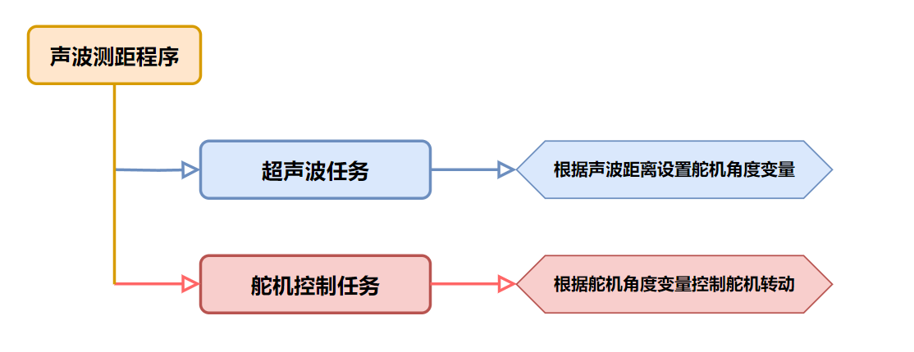

### 2.2 超声波传感器

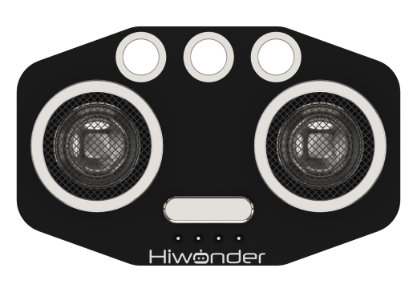

这是一款可发光的超声波测距模块，模块采用 IIC 通信接口，能通过 IIC通信进行读取超声波传感器测量的距离。

- #### 传感器工作原理

传感器测距时模块会自动发送 8 个 40khz 的方波，然后检测是否有信号返回； 如果有信号返回，便输出一个高电平，高电平持续的时间就是超声波从发射到返回的时间。

具体公式为：**测试距离=(高电平时间\*声速(340M/S))/2**。

- #### 传感器原理图

传感器通过CS100芯片控制，其中芯片引脚为（TP，TN）可发出8个40Khz方波，然后通过芯片引脚（RP，RN）检测回波信号，通过“**测试距离=(高电平时间\*声速(340M/S))/2**”公式计算出距离值。

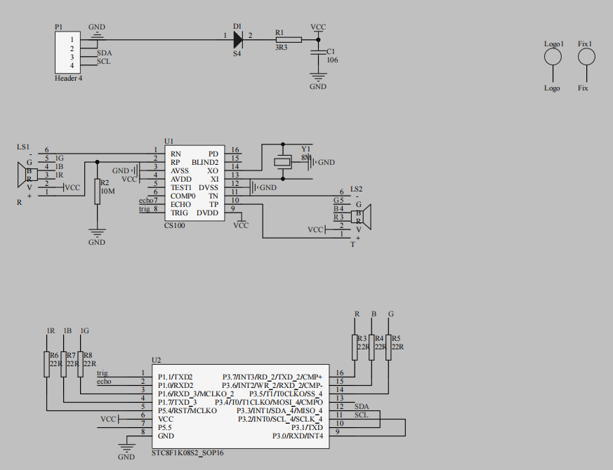

- **供电电压：5V**

- **工作电流：2mA**

- **有效测距：2cm - 400cm**

- #### 传感器接线 

将超声波模块通过4Pin线接入任意IIC接口。

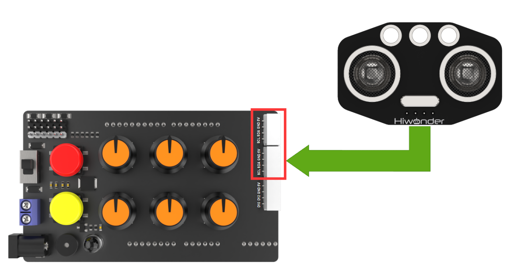

### 2.3 程序下载


:::{Note}

下载程序前需先将蓝牙模块取下，否则会因串口冲突导致程序下载失败。

接入Type-B下载线时请将电池盒开关拨到“OFF”挡，避免下载线误碰到扩展板的电源引脚，造成短路。

:::

1)  在本文档同路径下找到“**02 程序文件\\MiniArm_Ultrasound\MiniArm_Ultrasound.ino**”程序文件。

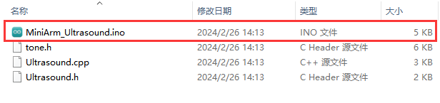

2)  将Arduino通过UNO数据线（Type-B）连接至电脑。


3)  点击**“选择开发板”**选项，软件会自动检测当前Arduino串口，点击进行连接。

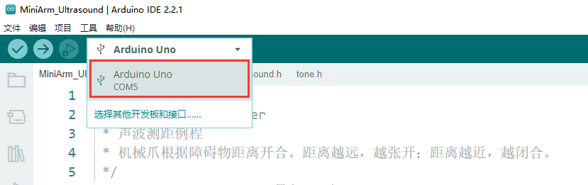

4)  点击，将程序下载至Arduino中，等待下载完成即可。


### 2.4 实现效果

打开机械臂电源后，首先机械臂会回到中位姿态，同时发光超声波模块和扩展板上RGB灯会亮蓝色。

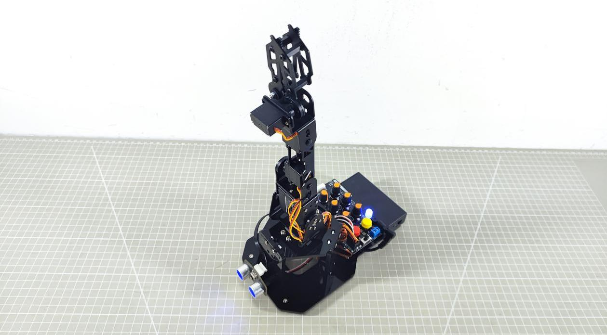

将障碍物正对超声波模块并移动障碍物使其缓慢靠近。

1.  当**距离\>20cm时**，机械爪张开，超声波模块和扩展板上RGB灯为蓝色；

2.  当**10cm\>距离\>20cm**时，障碍物靠近机械臂，机械爪将缓慢闭合，同时超声波模块和扩展板上的RGB灯由蓝色逐渐变为紫色；

3.  当**距离\<10cm**时，机械爪闭合，同时超声波模块和扩展板上RGB灯亮红色。

<p align="center">
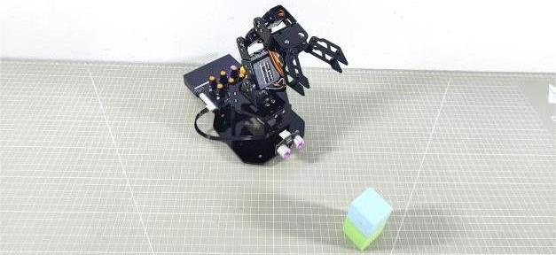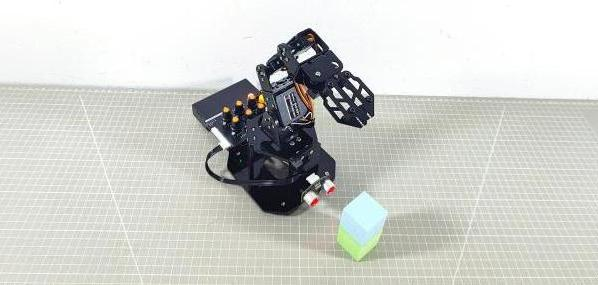
</p>

### 2.5 程序简要分析

- #### 导入库文件

```c
#include <FastLED.h> //导入LED库
#include <Servo.h> //导入舵机库
#include "tone.h" //音调库
#include "Ultrasound.h" //导入超声波库
#include <EEPROM.h>
```

导入本玩法所需要的RGB控制库、舵机控制库、蜂鸣器库、超声波控制的库文件。

- #### 定义引脚及创建对象

1)  定义了EEPROM起始标志、舵机偏移数据的起始和数据地址、舵机偏移数据的长度。


```c
#define EEPROM_START_FLAG "HIWONDER"
#define EEPROM_SERVO_OFFSET_START_ADDR 0u
#define EEPROM_SERVO_OFFSET_DATA_ADDR 16u
#define EEPROM_SERVO_OFFSET_LEN 6u
```

2. 定义了两个蜂鸣器的声调，及连接硬件的Arduino引脚：主要是六个舵机引脚、一个蜂鸣器引脚和一个RGB灯引脚。

```c
const static uint16_t DOC5[] = { TONE_C5 };
const static uint16_t DOC6[] = { TONE_C6 };

/* 引脚定义 */
const static uint8_t servoPins[6] = { 7, 6, 5, 4, 3, 2 };
const static uint8_t buzzerPin = 11;
const static uint8_t rgbPin = 13;
```

3)  创建了RGB灯、舵机及超声波传感器的对象。同时还创建了舵机控制的变量，其中：extended_func_angles数组用于存储每个舵机的期望角度，而servo_angles数组用于存储舵机的实际角度，范围0~180。除此之外还对机械臂的每一个关节设定了角度限位。

```c
//RGB灯控制对象
static CRGB rgbs[1];
//舵机控制对象
Servo servos[6];

// 创建超声波对象
Ultrasound ul;

static uint8_t extended_func_angles[6] = { 73,10,161,57,90,90 }; /* 二次开发例程使用的角度数值 */
const uint8_t limt_angles[6][2] = {{0,82},{0,180},{0,180},{0,180},{0,180},{0,180}}; /* 各个关节角度的限制 */
static uint8_t servo_angles[6] = { 73,10,161,57,90,90 };  /* 舵机实际控制的角度数值 */
```

- 对于期望值与实际值，可以看到loop主函数中调用的servo_control函数。

- 如果想要让舵机逐渐向目标位置靠近，则控制任务函数中需要调用到servo_angles\[i\] = servo_angles\[i\] \* 0.9 + extended_func_angles\[i\] \* 0.1这行代码。

- 这使得舵机在每次移动时都会在原先位置基础上加上部分期望值的舵机脉宽。而在移动过后会重新将当前的新数据进行赋值。这样当到达目标位置后，机械臂就能够停止移动。

```c
  for (int i = 0; i < 5; ++i) {
    servo_expect[i] = extended_func_angles[i] + servo_offset[i];
    if(servo_angles[i] > servo_expect[i])
    {
      servo_angles[i] = servo_angles[i] * 0.9 + servo_expect[i] * 0.1;
      if(servo_angles[i] < servo_expect[i])
        servo_angles[i] = servo_expect[i];
    }else if(servo_angles[i] < servo_expect[i])
    {
      servo_angles[i] = servo_angles[i] * 0.9 + (servo_expect[i] * 0.1 + 1);
      if(servo_angles[i] > servo_expect[i])
        servo_angles[i] = servo_expect[i];
    }
    servo_angles[i] = servo_angles[i] < limt_angles[i][0] ? limt_angles[i][0] : servo_angles[i];
    servo_angles[i] = servo_angles[i] > limt_angles[i][1] ? limt_angles[i][1] : servo_angles[i];
    servos[i].write(i == 0 || i == 5 ? 180 - servo_angles[i] : servo_angles[i]);
  }
```

4)  定义舵机相关变量和EEPROM读取缓冲区。


```c
static int8_t servo_offset[5];
static uint8_t servo_expect[5];
static uint8_t eeprom_read_buf[16];
```

其中servo_offset是舵机的偏差，servo_expect是舵机带偏差的期望值。

5. 定义了用于控制蜂鸣器的变量，并声明任务函数，用于执行不同的控制任务。


```c
/* 蜂鸣器控制相关变量 */
static uint16_t tune_num = 0;
static uint32_t tune_beat = 10;
static uint16_t *tune;

//舵机控制
static void servo_control(void);
// 超声波任务
static void ultrasound_task(void);
static void read_offset(void);
```

tune_num变量表示音调编号，tune_beat变量表示音调节拍；servo_control函数用于控制舵机，ultrasound_task函数用于读取超声波传感器的数据。

- #### 初始化设置

1)  在setup()函数中，主要是对相关的硬件设备进行初始化。首先是串口，将其通信的波特率设置为115200以及读取数据超时时间为500ms。

```c
void setup() {
  // put your setup code here, to run once:
  Serial.begin(115200);
  // 设置串行端口读取数据的超时时间
  Serial.setTimeout(500);
```

2)  绑定舵机IO口，使用FastLED库初始化扩展板上的RGB灯，并将其连接到rgbPin引脚。通过rgbs\[0\] = CRGB(0, 255, 0)设置RGB颜色为绿色。最后使用FastLED.show函数显示设置的颜色。


```c
  // 绑定舵机IO口
  for (int i = 0; i < 6; ++i) {
    servos[i].attach(servoPins[i],500,2500);
  }

  //RGB灯初始化并控制
  FastLED.addLeds<WS2812, rgbPin, GRB>(rgbs, 1);
  rgbs[0] = CRGB(0, 0, 100);
  FastLED.show();
```

3. 设置蜂鸣器的接口为输出模式，调用tone()函数使蜂鸣器发出声音，在延时100ms之后调用noTone()使蜂鸣器停止鸣响。

```c
  //蜂鸣器初始化并鸣响一声
  pinMode(buzzerPin, OUTPUT);
  tone(buzzerPin, 1000);
  delay(100);
  noTone(buzzerPin);
```

- #### 读取偏差角度

```c
void read_offset(void){
  // 读取偏差角度 
```

1)  首先获取存储器中偏差值的起始标志，存放在eeprom_read_buf读取缓冲区中。


```c
  for (int i = 0; i < 16; ++i) {
    eeprom_read_buf[i] = EEPROM.read(EEPROM_SERVO_OFFSET_START_ADDR + i);
  }
```

2. 判断存储器中的起始标志位是否为正确的起始标志位，若正确会将eeprom_read_buf缓冲区清空，串口打印“read offset”字符串，后续开始获取偏差值。


```c
  if (strcmp(eeprom_read_buf, EEPROM_START_FLAG) == 0) {
    memset(eeprom_read_buf,  0 , sizeof(eeprom_read_buf));
    Serial.println("read offset");
```

3. 在存储器中获取5个舵机的偏差值，并存放在读取缓冲区中。使用memcpy将读取缓冲区中的数据复制到servo_offset变量中。

由于偏差值有正负之分，而eeprom_read_buf变量为无符号变量，因此我们通过memcpy将偏差数据从无符号数转换为有符号数。


```c
    for (int i = 0; i < 5; ++i) {
      eeprom_read_buf[i] = EEPROM.read(EEPROM_SERVO_OFFSET_DATA_ADDR + i);
    }
    memcpy(servo_offset , eeprom_read_buf , 6);
```

- #### 超声波检测

1. 初始化完成后，接下来将调用loop主函数中的超声波任务函数ultrsound_task，它是用于实现测距功能的。函数首先定义了变量last_tick，主要用于计算时间间隔。

```c
// 超声波任务
void ultrasound_task(void)
{
  static uint32_t last_ul_tick = 0;
  // 间隔100ms
  if (millis() - last_ul_tick < 100) {
    return;
  }
  last_ul_tick = millis();

  // 获取超声波距离
  int dis = ul.Filter();
```
2. 接着检查从上次调用ultrasound_task函数到现在是否已经过去了100毫秒。如果是，则执行下面的代码。否则，函数直接返回。而其中的millis函数是Arduino板启动以来的时间。通过这种方式，该函数可确保每100毫秒执行一次下面检测距离的任务。

3. 然后通过ul.Filter函数来获取滤波后的超声波距离值，并将结果存储在变量dis中。

- #### 执行反馈

1)  如果检测到障碍物距离大于200mm，则控制1~5号舵机转动到180°的位置，即张开机械爪。同时通过rgbs函数和ul.color函数控制发光超声波模块和扩展板上的RGB灯显示为蓝色。

其中，rgbs.r、rgbs.g、rgbs.b代表扩展板上灯对应RGB三原色的亮度值，而ul.color（0,0,255,0,0,255）则代表发光超声波左右两个灯的RGB三原色亮度值。

```c
  // 若大于200mm
  if(dis >= 200)
  {
    //张开爪子
    extended_func_angles[0] = 0;
    // RGB灯蓝色
    rgbs[0].r = 0;
    rgbs[0].g = 0;
    rgbs[0].b = 255;
    FastLED.show();
    // 发光超声波蓝色
    ul.Color(0,0,255,0,0,255);
```

2)  如果检测到障碍物距离小于50mm，那么将控制1~5号舵机转动至0°的位置，即闭合机械爪。同时通过rgbs函数和ul.color函数控制发光超声波模块和扩展板上的RGB灯显示为红色。

```c
  }else if(dis <= 50) //若小于50mm
  {
    //闭合爪子
    extended_func_angles[0] = 82;
    // RGB红色
    rgbs[0].r = 255;
    rgbs[0].g = 0;
    rgbs[0].b = 0;
    FastLED.show();
    // 发光超声波红色
    ul.Color(255,0,0,255,0,0);
```

3)  当障碍物距离在50mm到200mm之间，则通过map函数设置颜色RGB元素中的R和B根据dis的变化而变化，如map(dis,50,200,255,0)是将障碍物的距离dis映射到R元素上，其中dis的范围是50mm~200mm，R的亮度范围是255~0。

而对于舵机角度的映射亦可参考上述内容，同样是将障碍物的距离映射至舵机开合的角度范围（0~180°）。

```c
  }else{
    // 颜色根据距离变化而变化，越靠近R越大B越小，越远则反之
    int color[3] = {map(dis , 50 , 200 , 255 , 0),0,map(dis , 50 , 200 , 0 , 255)};

    uint8_t angles = map(dis , 50 , 200 , 82 , 0);
    extended_func_angles[0] = angles;
    rgbs[0].r = color[0];
    rgbs[0].g = color[1];
    rgbs[0].b = color[2];
    FastLED.show();
    ul.Color(color[0],color[1],color[2],color[0],color[1],color[2]);
```

- #### 舵机控制任务

1)  在舵机控制任务中，先是同样使用last_tick变量作延时处理。

```c
// 舵机控制任务
void servo_control(void) {
  static uint32_t last_tick = 0;
  if (millis() - last_tick < 20) {
    return;
  }
  last_tick = millis();
```

2)  下面再通过action_ctl对象，获取到舵机的期望值。注意，这时的期望值是理想期望值加上舵机偏差的结果，因此此期望值为舵机实际的期望值。最后将舵机的实际期望值赋值给舵机的实际控制角度，再传给舵机对象，实际控制舵机的转动。


```c
  for (int i = 0; i < 5; ++i) {
    servo_expect[i] = extended_func_angles[i] + servo_offset[i];
    if(servo_angles[i] > servo_expect[i])
    {
      servo_angles[i] = servo_angles[i] * 0.9 + servo_expect[i] * 0.1;
      if(servo_angles[i] < servo_expect[i])
        servo_angles[i] = servo_expect[i];
    }else if(servo_angles[i] < servo_expect[i])
    {
      servo_angles[i] = servo_angles[i] * 0.9 + (servo_expect[i] * 0.1 + 1);
      if(servo_angles[i] > servo_expect[i])
        servo_angles[i] = servo_expect[i];
    }
    servo_angles[i] = servo_angles[i] < limt_angles[i][0] ? limt_angles[i][0] : servo_angles[i];
    servo_angles[i] = servo_angles[i] > limt_angles[i][1] ? limt_angles[i][1] : servo_angles[i];
    servos[i].write(i == 0 || i == 5 ? 180 - servo_angles[i] : servo_angles[i]);
  }
}
```

关于理想期望值和实际期望值我们在这里再解释一下。在action_ctl对象中，extended_func_angles为理想期望值，它排除了因舵机机械结构引起的偏差。而在实际项目中，舵机往往会因为机械结构产生一定的偏差范围，为了控制舵机角度能够更加准确，我们通过调节偏差计算出了舵机转动到理想位置所需要补充的角度，这个角度可以是正数、负数也可以是零，然后在舵机实际控制中，我们会在理想期望角度基础上加上偏差值，这样就得到了实际的期望角度。

### 2.6 功能延伸

这里以修改RGB彩灯渐变时的颜色为例来进行说明，从原来的渐变的紫色修改为黄色。具体修改内容可参考下面步骤：

1)  找到程序中控制RGB彩灯随距离变化的映射指令。这里是通过map函数设置颜色RGB元素中的R和B根据dis的变化而变化，map(dis,50,200,255,0)是将障碍物的距离dis映射到R元素上，map(dis,50,200,0,255)是将障碍物的距离dis映射到B元素上。

    因此距离越近，红色的占比就会越大，蓝色的占比就会越小，显示出来的渐变色为紫色。


```c
  }else if(dis <= 50) //若小于50mm
  {
    //闭合爪子
    extended_func_angles[0] = 82;
    // RGB红色
    rgbs[0].r = 255;
    rgbs[0].g = 0;
    rgbs[0].b = 0;
    FastLED.show();
    // 发光超声波红色
    ul.Color(255,0,0,255,0,0);
  }else{
    // 颜色根据距离变化而变化，越靠近R越大B越小，越远则反之
    int color[3] = {map(dis , 50 , 200 , 255 , 0),0,map(dis , 50 , 200 , 0 , 255)};
```

2. 将原先映射的元素从RGB中的B元素替换至G元素，需要注意颜色的颜色元素的范围是0~255。然后重新下载程序。这样当障碍物距离越近，红色占比就会越大，绿色占比就会越小，RGB灯显示出来的渐变色为黄色。


```c
    // 颜色根据距离变化而变化，越靠近R越大B越小，越远则反之
    int color[3] = {map(dis , 50 , 200 , 255 , 0), map(dis , 50 , 200 , 0 , 255), 0};
```

关于RGB颜色表，可前往链接进行查询：[<u>https://www.bchrt.com/tools/rgbcolor/</u>](https://www.bchrt.com/tools/rgbcolor/)

### 2.7 常见问题解答

问：代码上传后超声波测出的距离一直为0。

答：请检查您是否将4pin线连接至正确的IIC接口,并将扩展板上的旋钮转动至中位。

问：超声波测出的距离有时准确，有时不准确。

答：请使用光滑平整的物体进行测距。

## 3. 声波夹取

本节通过发光超声波模块检测障碍物距离，实现夹取方块并放在一侧的动作，同时还可以控制RGB灯的颜色变化。

### 3.1 程序流程图

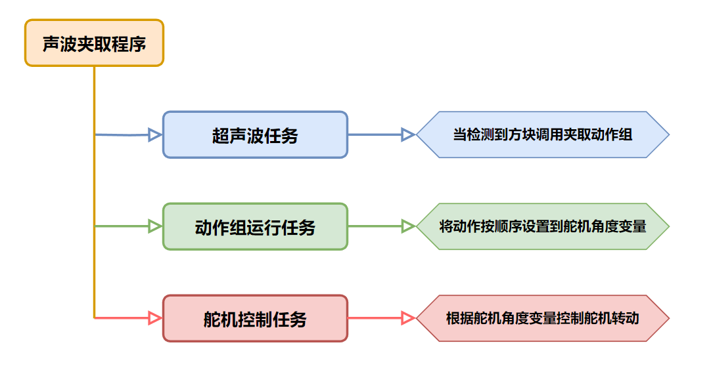

### 3.2 超声波传感器

关于超声波传感器内容，可以查看前面课程的

### 3.3 程序下载


:::{Note}

下载程序前需先将蓝牙模块取下，否则会因串口冲突导致程序下载失败。

接入Type-B下载线时请将电池盒开关拨到“OFF”挡，避免下载线误碰到扩展板的电源引脚，造成短路。

:::

1)  在与文档同路径下的“**02 程序文件\MiniArm_Ultrasound_Grab**”中找到的**“MiniArm_Ultrasound_Grab.ino”**程序文件。

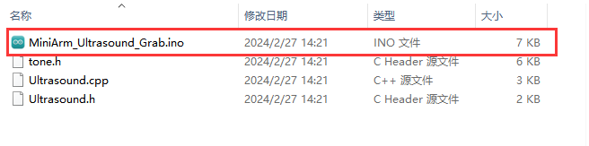

2)  将Arduino通过UNO数据线（Type-B）连接至电脑。


3)  点击**“选择开发板”**选项，软件会自动检测当前Arduino串口，点击进行连接。

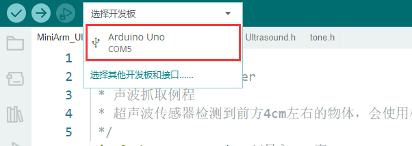

4)  点击，将程序下载至Arduino中，等待下载完成即可。


### 3.4 实现效果

打开机械臂电源后，首先机械臂会回到中位姿态，然后进入到夹取方块的预备动作，同时发光超声波模块上RGB灯会亮蓝色。

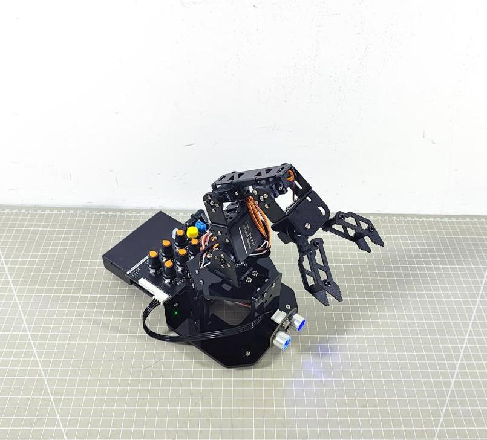

将方块放置在超声波模块前方4cm左右的位置，蜂鸣器会响一声然后夹取方块并放置在机械臂的左侧。在夹取过程中，扩展板上RGB灯亮红色。

<p align="center">
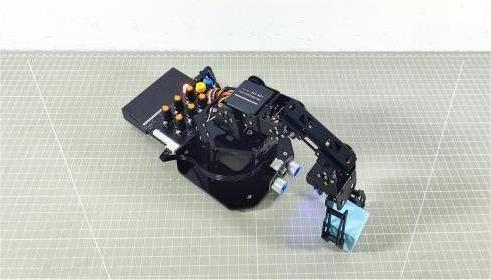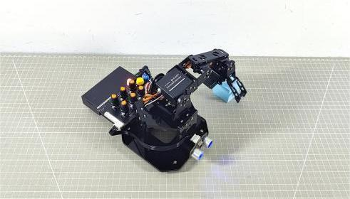
</p>

### 3.5 程序简要分析

- #### 导入库文件

```c
#include <FastLED.h> //导入LED库
#include <Servo.h> //导入舵机库
#include "tone.h" //音调库
#include "Ultrasound.h" //导入超声波库
#include "mini_servo.h"
```

导入本玩法所需要的RGB控制库、舵机控制库、超声波库及MiniArm机械臂控制库。

- #### 定义引脚及创建对象

1)  首先是定义了两个蜂鸣器的声调，及连接硬件的Arduino引脚：主要是六个舵机引脚、一个蜂鸣器引脚和一个RGB灯引脚。

```c
const static uint16_t DOC5[] = { TONE_C5 };
const static uint16_t DOC6[] = { TONE_C6 };

/* 引脚定义 */
const static uint8_t servoPins[5] = { 7, 6, 5, 4, 3};//舵机引脚定义
const static uint8_t buzzerPin = 11;
const static uint8_t rgbPin = 13;
```

2)  创建了RGB灯、动作组控制对象及舵机控制对象。同时还创建了舵机控制的变量，其中：limit_angle对机械臂的每一个关节设定了角度限位，而servo_angles数组用于存储舵机的实际角度，范围0~180。

```c
//RGB灯控制对象
static CRGB rgbs[1];
//动作组控制对象
HW_ACTION_CTL action_ctl;
//舵机控制对象
Servo servos[5];
// 创建超声波对象
Ultrasound ul;

const uint8_t limt_angles[5][2] = {{0,82},{0,180},{0,180},{0,180},{0,180}}; /* 各个关节角度的限制 */
static float servo_angles[5] = { 41 ,12 ,174 ,68 ,84 };  /* 舵机实际控制的角度数值 */
```

3)  在mini_servo.h动作组控制对象程序中，构造函数还定义了extended_func_angles变量，它是舵机角度的期望角度值，同时还声明了用于控制执行动作组及读取偏差的相关函数。

```c
class HW_ACTION_CTL{
  public:
    uint8_t extended_func_angles[5] = { 41 ,12 ,174 ,68 ,84 }; /* 二次开发例程使用的角度数值 */
    //控制执行动作组
    void action_set(int num);
    int action_state_get(void);
    void action_task(void);
    void read_offset();
    int8_t* get_offset(void);
    
  private:
    //动作组控制变量
    int action_num = 0;
    int8_t servo_offset[5];
    uint8_t eeprom_read_buf[16];
};
```

- 对于期望值与实际值，可以看到loop主函数中调用的servo_control函数。

- 如果想要让舵机逐渐向目标位置靠近，则控制任务函数中需要调用到servo_angles\[i\] = servo_angles\[i\] \* 0.9 + extended_func_angles\[i\] \* 0.1这行代码。

- 这使得舵机每次都会以实际值的90%+期望值的10%来移动，从而实际值逐渐接近期望值，当等于期望值时，手掌就能够停止移动。


```c
  for (int i = 0; i < 5; ++i) {
    if(servo_angles[i] > action_ctl.extended_func_angles[i])
    {
      servo_angles[i] = servo_angles[i] * 0.9 + action_ctl.extended_func_angles[i] * 0.1;
      if(servo_angles[i] < action_ctl.extended_func_angles[i])
        servo_angles[i] = action_ctl.extended_func_angles[i];
    }else if(servo_angles[i] < action_ctl.extended_func_angles[i])
    {
      servo_angles[i] = servo_angles[i] * 0.9 + (action_ctl.extended_func_angles[i] * 0.1 + 1);
      if(servo_angles[i] > action_ctl.extended_func_angles[i])
        servo_angles[i] = action_ctl.extended_func_angles[i];
    }
    servo_angles[i] = servo_angles[i] < limt_angles[i][0] ? limt_angles[i][0] : servo_angles[i];
    servo_angles[i] = servo_angles[i] > limt_angles[i][1] ? limt_angles[i][1] : servo_angles[i];
    
    servos[i].write(i == 0 || i == 5 ? 180 - servo_angles[i] : servo_angles[i]);
  }
}
```

4)  下面的部分声明了任务函数，用于执行不同的控制任务。servo_control函数用于控制舵机，play_tune()用于设置蜂鸣器的响声，tune_task()用于控制蜂鸣器鸣响，ultrasound_task函数用于读取超声波传感器的数据。

```c
static void servo_control(void);  //舵机控制
void play_tune(uint16_t *p, uint32_t beat, uint16_t len); /* 蜂鸣器控制接口 */
void tune_task(void); /* 蜂鸣器控制任务 */
static void ultrasound_task(void);  // 超声波任务
```

- #### 初始化设置

1)  在setup()函数中，主要是对相关的硬件设备进行初始化。首先是串口，将其通信的波特率设置为115200以及读取数据超时时间为500ms。

```c
void setup() {
  // put your setup code here, to run once:
  Serial.begin(115200);
  // 设置串行端口读取数据的超时时间
  Serial.setTimeout(500);
```

2)  绑定舵机IO口，使用FastLED库初始化扩展板上的RGB灯，并将其连接到rgbPin引脚。通过rgbs\[0\] = CRGB(0, 0, 100)设置RGB颜色为蓝色。最后使用FastLED.show函数显示设置的颜色。


```c
  // 绑定舵机IO口
  for (int i = 0; i < 5; ++i) {
    servos[i].attach(servoPins[i],500,2500);
  }

  //RGB灯初始化并控制
  FastLED.addLeds<WS2812, rgbPin, GRB>(rgbs, 1);
  rgbs[0] = CRGB(0, 0, 100);
  FastLED.show();
```

3. 读取舵机偏差值后，设置蜂鸣器的接口为输出模式，调用tone()函数使蜂鸣器发出声音，在延时100ms之后调用noTone()使蜂鸣器停止鸣响。

```c
  //读取偏差值
  action_ctl.read_offset();

  //蜂鸣器初始化并鸣响一声
  pinMode(buzzerPin, OUTPUT);
  tone(buzzerPin, 1000);
  delay(100);
  noTone(buzzerPin);
  ul.Color(0,0,255,0,0,255);
```

- #### 超声波检测

1. 初始化完成后，接下来将调用loop主函数中的超声波任务函数ultrsound_task，它是用于实现测距功能的。函数首先定义了变量last_tick，主要用于计算时间间隔。

```c
// 超声波任务
void ultrasound_task(void)
{
  static uint32_t last_ul_tick = 0;
  static uint8_t step = 0;
  static uint8_t act_num = 0;
  static uint32_t delay_count = 0;

  // 间隔100ms
  if (millis() - last_ul_tick < 100) {
    return;
  }
  last_ul_tick = millis();

  // 获取超声波距离
  int dis = ul.Filter();
```

2. 接着检查从上次调用ultrasound_task函数到现在是否已经过去了100毫秒。如果是，则执行下面的代码。否则，函数直接返回。而其中的millis函数是Arduino板启动以来的时间。通过这种方式，该函数可确保每100毫秒执行一次下面检测距离的任务。

3. 然后通过ul.Filter函数来获取滤波后的超声波距离值，并将结果存储在变量dis中。


- #### 执行反馈

1)  按步骤，首先检测检测超声波模块的获取的距离值，若在大于35mm且小于50mm范围内，RGB亮红灯，蜂鸣器鸣响一声后，进入到下一阶段。期间若障碍物距离不在以上范围，则不点亮LED，然后重新检测超声波模块获取的值。

```c
  switch(step)
  {
    case 0:
      if(dis > 35 && dis < 50) //若检测到物块
      {
        rgbs[0].r = 250;
        rgbs[0].g = 0;
        rgbs[0].b = 0;
        FastLED.show();
        play_tune(DOC6, 300u, 1u);
        act_num = 1;
        step++;
      }else //若未识别物块
      {
        rgbs[0].r = 0;
        rgbs[0].g = 0;
        rgbs[0].b = 0;
        FastLED.show();
      }
      break;
```

2)  进入case 1，通过delay_count的值进行延时等待，每进入一次case 1就要调用一次超声波任务，而每进入一次超声波任务就会演示100ms。因此case 1会先延时1000ms，再设置动作组编号并运行动作组。完成之后再跳入到下一阶段。

```c
    case 1: //等待1s，物块放到指定位置
      delay_count++;
      if(delay_count > 10)
      {
        delay_count = 0;
        // 运行动作组
        action_ctl.action_set(act_num);
        act_num = 0;
        step++;
      }
      break;
```

3)  case 2为等待动作运行结束的阶段，在完成以上的识别、等待和调用动作组过后，通过判断action_num变量是否为0，判断动作组是否运行结束，动作组结束以后，重新将step阶段的变量修改为0。

```c
    case 2: //等待动作状态清零
      if(action_ctl.action_state_get() == 0)
      {
        step = 0;
      }
      break;
    default:
      step = 0;
      break;
  }  
```

- #### 舵机控制任务

1)  在舵机控制任务中，先是同样使用last_tick变量作延时处理。

```c
// 舵机控制任务
void servo_control(void) {
  static uint32_t last_tick = 0;
  if (millis() - last_tick < 20) {
    return;
  }
  last_tick = millis();
```

2)  接着再通过action_ctl对象，获取到舵机的期望值（extended_func_angles），再与舵机实际值（servo_angles）结合，将舵机需要转动到的角度发送给舵机，从而控制舵机转动。

```c
  for (int i = 0; i < 5; ++i) {
    if(servo_angles[i] > action_ctl.extended_func_angles[i])
    {
      servo_angles[i] = servo_angles[i] * 0.9 + action_ctl.extended_func_angles[i] * 0.1;
      if(servo_angles[i] < action_ctl.extended_func_angles[i])
        servo_angles[i] = action_ctl.extended_func_angles[i];
    }else if(servo_angles[i] < action_ctl.extended_func_angles[i])
    {
      servo_angles[i] = servo_angles[i] * 0.9 + (action_ctl.extended_func_angles[i] * 0.1 + 1);
      if(servo_angles[i] > action_ctl.extended_func_angles[i])
        servo_angles[i] = action_ctl.extended_func_angles[i];
    }
    servo_angles[i] = servo_angles[i] < limt_angles[i][0] ? limt_angles[i][0] : servo_angles[i];
    servo_angles[i] = servo_angles[i] > limt_angles[i][1] ? limt_angles[i][1] : servo_angles[i];
    
    servos[i].write(i == 0 || i == 5 ? 180 - servo_angles[i] : servo_angles[i]);
  }
}
```

- 关于理想期望值（我们想让舵机转动到的角度）和实际期望值（舵机实际可以转动到的角度）说明如下：

在action_ctl对象中，extended_func_angles为理想期望值，它排除了因舵机机械结构引起的偏差。而在实际项目中，舵机往往会因为机械结构产生一定的偏差范围，为了控制舵机角度能够更加准确，我们通过调节偏差计算出了舵机转动到理想位置所需要补充的角度，这个角度可以是正数、负数也可以是零，然后在舵机实际控制中，我们会在理想期望角度基础上加上偏差值，这样就得到了实际的期望角度。

## 4. 触摸控制

本节通过触摸传感器检测触摸状态，实现触摸一下机械臂夹取方块，再触摸一下机械臂放置方块的动作，同时还可以控制RGB灯的颜色变化。

### 4.1 程序流程图

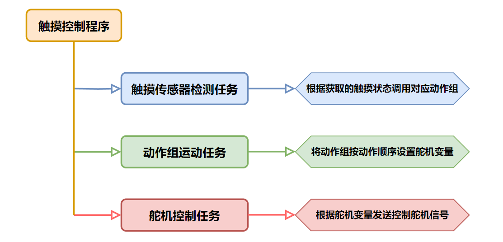

### 4.2 触摸传感器

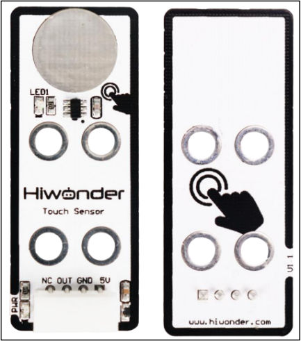

这是一款基于电容感应原理的触摸传感器，该传感器上主要通过镀金接触面感应人体或者金属。

- #### 传感器工作原理

当无任何人体或金属触碰到金属面时，信号端输出高电平；当人体或金属触碰到金属面时，信号端输出的是低电平。此外，隔着一定厚度的塑料、纸张等材料的接触也可以被感应到，且感应的灵敏度与接触面的大小和覆盖材料的厚度有关。

- #### 传感器原理图

在不触摸金属片的情况下，C2电容充满电，Touch输出高电平；当人体触碰到金属片会将C2电容中电压释放掉，这时Touch输出低电平。

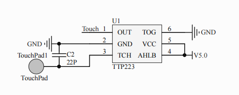

- **供电电压：5V**

- **工作电流：2mA**

- **接口型号：5264-4AW**

- #### 接线

将触摸传感器通过4Pin线接入D10、D12号接口，如下图。

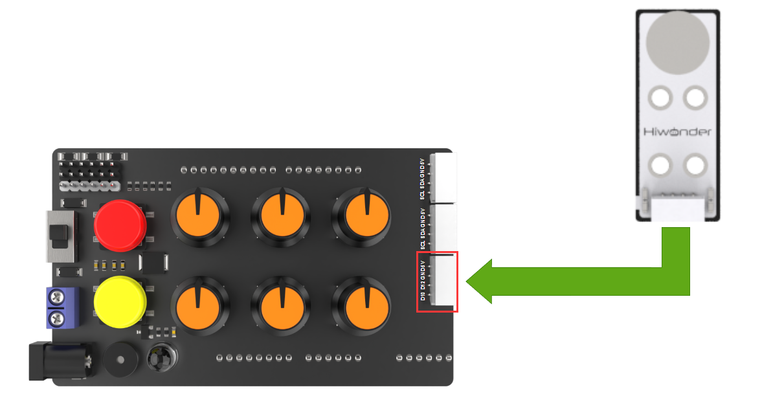

### 4.3 程序下载


:::{Note}

下载程序前需先将蓝牙模块取下，否则会因串口冲突导致程序下载失败。

接入Type-B下载线时请将电池盒开关拨到“OFF”挡，避免下载线误碰到扩展板的电源引脚，造成短路。

:::

1)  在本文档同路径下找到“**02 程序文件\MiniArm_touch\MiniArm_touch.ino**”程序文件。

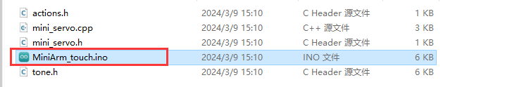

2)  将Arduino通过UNO数据线（Type-B）连接至电脑。


3)  点击“**选择开发板**”选项，软件会自动检测当前Arduino串口，点击进行连接。

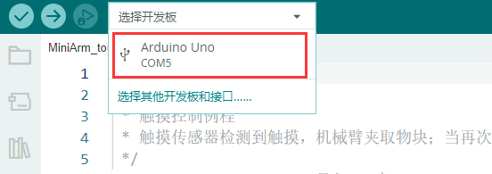

4)  点击，将程序下载至Arduino中，等待下载完成即可。


### 4.4 实现效果

打开机械臂电源后，首先机械臂会回到中位姿态，然后进入到夹取方块的预备动作。

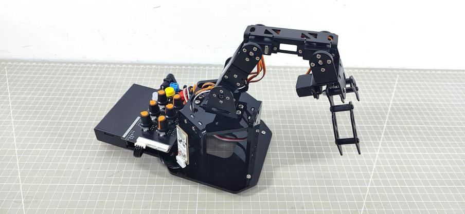

触碰一次传感器的金属面，此时扩展板上的蜂鸣器会发出一声鸣响，同时RGB灯亮红色。随后机械臂运行夹取方块的动作组。

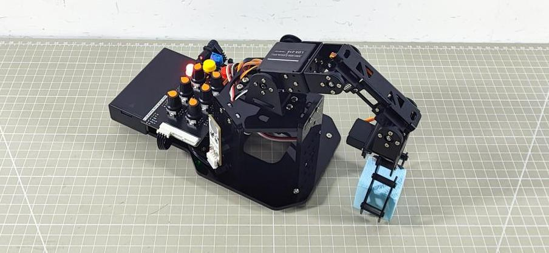

待机械臂停止运行后，再次触碰传感器的金属面，此时蜂鸣器会再响一声，并将方块放置在机械臂的左侧。在此期间，扩展板上RGB灯亮红色。

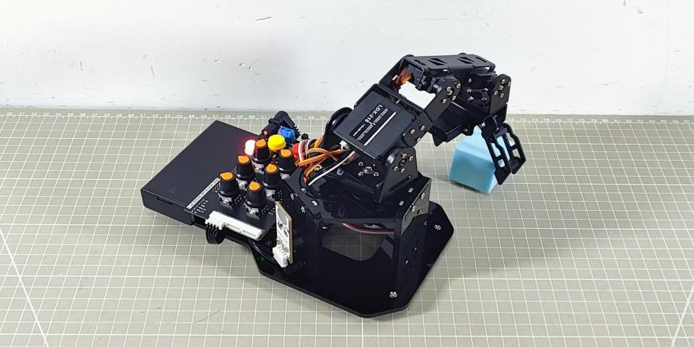

### 4.5 程序简要分析

- #### 导入库文件

```c
#include <FastLED.h> //导入LED库
#include <Servo.h> //导入舵机库
#include "tone.h" //音调库
#include "mini_servo.h"
```

导入本玩法所需要的RGB控制库、舵机控制库。

- #### 定义引脚及创建对象

1)  首先是定义了两个蜂鸣器的声调，及连接硬件的Arduino引脚：主要是六个舵机引脚、一个触摸传感器引脚、一个蜂鸣器引脚和一个RGB灯引脚。

```c
const static uint16_t DOC5[] = { TONE_C5 };
const static uint16_t DOC6[] = { TONE_C6 };

/* 引脚定义 */
const static uint8_t servoPins[5] = { 7, 6, 5, 4, 3};//舵机引脚定义
const static uint8_t touch = 12;
const static uint8_t buzzerPin = 11;
const static uint8_t rgbPin = 13;
```

2)  创建了RGB灯、动作组控制对象及舵机控制对象。同时还创建了舵机控制的变量，其中：limit_angle对机械臂的每一个关节设定了角度限位，而servo_angles数组用于存储舵机的实际角度，范围0~180。

```c
//RGB灯控制对象
static CRGB rgbs[1];
//动作组控制对象
HW_ACTION_CTL action_ctl;
//舵机控制对象
Servo servos[5];


const uint8_t limt_angles[5][2] = {{0,82},{0,180},{0,180},{0,180},{0,180}}; /* 各个关节角度的限制 */
static float servo_angles[5] = {40,15,175,65,90 };  /* 舵机实际控制的角度数值 */

```

3)  在mini_servo.h动作组控制对象程序中，构造函数还定义了extended_func_angles变量，它是舵机角度的期望角度值，同时还声明了用于控制执行动作组及读取偏差的相关函数。

```c
class HW_ACTION_CTL{
  public:
    uint8_t extended_func_angles[5] = { 41 ,12 ,174 ,68 ,84 }; /* 二次开发例程使用的角度数值 */
    //控制执行动作组
    void action_set(int num);
    int action_state_get(void);
    void action_task(void);
    void read_offset();
    int8_t* get_offset(void);
    
  private:
    //动作组控制变量
    int action_num = 0;
    int8_t servo_offset[5];
    uint8_t eeprom_read_buf[16];
};
```

- 对于期望值与实际值，可以看到在loop主函数中调用的servo_control函数。

- 如果想要让舵机逐渐向目标位置靠近，则控制任务函数中需要调用到servo_angles\[i\] = servo_angles\[i\] \* 0.85 + extended_func_angles\[i\] \* 0.15这行代码。

- 这使得舵机每次都会以实际值的85%+期望值的15%来移动，从而实际值逐渐接近期望值，当等于期望值时，机械臂就能够停止移动。


```c
  for (int i = 0; i < 5; ++i) {
    if(servo_angles[i] > action_ctl.extended_func_angles[i])
    {
      servo_angles[i] = servo_angles[i] * 0.9 + action_ctl.extended_func_angles[i] * 0.1;
      if(servo_angles[i] < action_ctl.extended_func_angles[i])
        servo_angles[i] = action_ctl.extended_func_angles[i];
    }else if(servo_angles[i] < action_ctl.extended_func_angles[i])
    {
      servo_angles[i] = servo_angles[i] * 0.9 + (action_ctl.extended_func_angles[i] * 0.1 + 1);
      if(servo_angles[i] > action_ctl.extended_func_angles[i])
        servo_angles[i] = action_ctl.extended_func_angles[i];
    }
    servo_angles[i] = servo_angles[i] < limt_angles[i][0] ? limt_angles[i][0] : servo_angles[i];
    servo_angles[i] = servo_angles[i] > limt_angles[i][1] ? limt_angles[i][1] : servo_angles[i];
    servos[i].write(i == 0 || i == 5 ? 180 - servo_angles[i] : servo_angles[i]);
  }
```

4)  下面的部分声明了任务函数，用于执行不同的控制任务。servo_control函数用于控制舵机，play_tune()用于设置蜂鸣器的响声，tune_task()用于控制蜂鸣器鸣响，touch_task()用于检测触摸传感器状态并调用执行动作组。

```c
static void servo_control(void); /* 舵机控制 */
void play_tune(uint16_t *p, uint32_t beat, uint16_t len); /* 蜂鸣器控制接口 */
void tune_task(void); /* 蜂鸣器控制任务 */
void touch_task(void); /* 触摸传感器检测任务 */
```

- #### 初始化设置

1)  在setup()函数中，主要是对相关的硬件设备进行初始化。首先是串口，将其通信的波特率设置为115200以及读取数据超时时间为500ms。

```c
void setup() {
  // put your setup code here, to run once:
  Serial.begin(115200);
  // 设置串行端口读取数据的超时时间
  Serial.setTimeout(500);
```

2)  绑定舵机IO口，使用FastLED库初始化扩展板上的RGB灯，并将其连接到rgbPin引脚。通过rgbs\[0\] = CRGB(0, 255, 0)设置RGB颜色为绿色。最后使用FastLED.show函数显示设置的颜色。


```c
  // 绑定舵机IO口
  for (int i = 0; i < 5; ++i) {
    servos[i].attach(servoPins[i],500,2500);
  }

  //RGB灯初始化并控制
  FastLED.addLeds<WS2812, rgbPin, GRB>(rgbs, 1);
  rgbs[0] = CRGB(0, 0, 100);
  FastLED.show();
```

3. 初始化触摸传感器及读取舵机偏差数据。


```c
  //初始化触摸传感器
  pinMode(touch, INPUT);
  //读取舵机偏差数据
  action_ctl.read_offset();
```

4. 设置蜂鸣器的接口为输出模式，调用tone()函数使蜂鸣器发出声音，在延时100ms之后调用noTone()使蜂鸣器停止鸣响。

```c
  //蜂鸣器初始化并鸣响一声
  pinMode(buzzerPin, OUTPUT);
  tone(buzzerPin, 1000);
  delay(100);
  noTone(buzzerPin);
```

- #### 触摸传感器检测任务

初始化完成后，接下来将调用loop主函数中的超声波任务函数touch_task，它是用于实现检测触摸传感器状态，并通过状态调用动作组。

- 函数首先定义了变量last_tick，主要用于计算时间间隔。

- 接着检查从上次调用ultrasound_task函数到现在是否已经过去了100毫秒。如果是，则执行下面的代码。否则，函数直接返回。而其中的millis函数是Arduino板启动以来的时间。通过这种方式，该函数可确保每100毫秒执行一次下面检测距离的任务。

- 通过digitalRead函数定义触摸传感器金属面被按下时数据为0，未被按下为1。


```c
// 触摸传感器检测任务
void touch_task(void)
{
  static uint32_t last_tick = 0;
  static uint8_t step = 0;
  static uint8_t act_num = 0;
  static uint32_t delay_count = 0;
  static uint8_t turn;
  static uint8_t stage = 0; //当前阶段。0表示抓取阶段；1表示放置阶段

  // 时间间隔100ms
  if (millis() - last_tick < 100) {
    return;
  }
  last_tick = millis();
```

- #### 执行反馈

1)  按步骤，首先读取触摸传感器引脚的电平，若按键的值等于0（即按键被按下），RGB亮红灯，蜂鸣器鸣响一声后，根据stage变量确定当前需要进入防止阶段还是夹取阶段。若要进入放置阶段，设置调用2号动作组；若要进入夹取阶段，设置调用1号动作组。

```c
  turn = digitalRead(touch);
  
  switch(step)
  {
    case 0:
      if(turn == 0) //若检测到按键按下
      {
        rgbs[0].r = 250;
        rgbs[0].g = 0;
        rgbs[0].b = 0;
        FastLED.show();
        play_tune(DOC6, 300u, 1u);
        if(stage)//放置阶段
        { 
          act_num = 2;
          stage = 0;
        }
        else    //夹取阶段
        { 
          act_num = 1;
          stage = 1;
        }
        count = 0;
        step++;
      }else //若未识别到触摸
      {
        rgbs[0].r = 0;
        rgbs[0].g = 0;
        rgbs[0].b = 0;
        FastLED.show();
      }
      break;
```

2)  进入case 1，通过delay_count的值进行延时等待，由于每进入一次case 1就要调用一次检测按键的任务，而每进入一次检测按键任务就会延时100ms。因此case 1会先延时1000ms，再通过action_set()将动作组运行标志位置位。之后再跳入到下一阶段。

```c
    case 1: //等待1s，木块放到指定位置
      delay_count++;
      if(delay_count > 10)
      {
        delay_count = 0;
        // 运行动作组
        action_ctl.action_set(act_num);
        act_num = 0;
        step++;
      }
      break;
```

- 在mini_servo.cpp文件下的动作组运行任务中，会直接判断action_num的值，不为0时便会运行动作组。

```c
class HW_ACTION_CTL{
  public:
    uint8_t extended_func_angles[5] = { 41 ,12 ,174 ,68 ,84 }; /* 二次开发例程使用的角度数值 */
    //控制执行动作组
    void action_set(int num);
    int action_state_get(void);
    void action_task(void);
    void read_offset();
    int8_t* get_offset(void);
    
  private:
    //动作组控制变量
    int action_num = 0;
    int8_t servo_offset[5];
    uint8_t eeprom_read_buf[16];
};
```

3)  case 2为等待动作运行结束的阶段，在完成以上的识别、等待和调用动作组过后，通过判断action_num变量是否为0，判断动作组是否运行结束，动作组结束以后，重新将step阶段的变量修改为0。

```c
    case 2: //等待动作状态清零
      if(action_ctl.action_state_get() == 0)
      {
        step = 0;
      }
      break;
    default:
      step = 0;
      break;
```

- #### 舵机控制任务
1)  在舵机控制任务中，先是同样使用last_tick变量作延时处理。

```c
// 舵机控制任务
void servo_control(void) {
  static uint32_t last_tick = 0;
  if (millis() - last_tick < 20) {
    return;
  }
  last_tick = millis();
```

2)  下面再通过action_ctl对象，获取到舵机的期望值。注意，这时的期望值是理想期望值加上舵机偏差的结果，因此此期望值为舵机实际的期望值。最后将舵机的实际期望值赋值给舵机的实际控制角度，再传给舵机对象，实际控制舵机的转动。

```c
  for (int i = 0; i < 5; ++i) {
    if(servo_angles[i] > action_ctl.extended_func_angles[i])
    {
      servo_angles[i] = servo_angles[i] * 0.9 + action_ctl.extended_func_angles[i] * 0.1;
      if(servo_angles[i] < action_ctl.extended_func_angles[i])
        servo_angles[i] = action_ctl.extended_func_angles[i];
    }else if(servo_angles[i] < action_ctl.extended_func_angles[i])
    {
      servo_angles[i] = servo_angles[i] * 0.9 + (action_ctl.extended_func_angles[i] * 0.1 + 1);
      if(servo_angles[i] > action_ctl.extended_func_angles[i])
        servo_angles[i] = action_ctl.extended_func_angles[i];
    }
    servo_angles[i] = servo_angles[i] < limt_angles[i][0] ? limt_angles[i][0] : servo_angles[i];
    servo_angles[i] = servo_angles[i] > limt_angles[i][1] ? limt_angles[i][1] : servo_angles[i];
    servos[i].write(i == 0 || i == 5 ? 180 - servo_angles[i] : servo_angles[i]);
  }
}
```

- 关于理想期望值和实际期望值我们在这里再解释一下。在action_ctl对象中，extended_func_angles为理想期望值，它排除了因舵机机械结构引起的偏差。而在实际项目中，舵机往往会因为机械结构产生一定的偏差范围，为了控制舵机角度能够更加准确，我们通过调节偏差计算出了舵机转动到理想位置所需要补充的角度，这个角度可以是正数、负数也可以是零，然后在舵机实际控制中，我们会在理想期望角度基础上加上偏差值，这样就得到了实际的期望角度。

### 4.6功能延伸 

我们可以将触摸传感器触摸状态修改为长按，具体修改内容可参考下面步骤：

1)  找到程序中检测触摸状态的部分内容，可以看到这里先获取传感器的状态并将其赋值给turn变量，然后通过检测turn的值来判断触摸传感器是否被触摸。


```c
// 触摸传感器检测任务
void touch_task(void)
{
  static uint32_t last_tick = 0;
  static uint8_t step = 0;
  static uint8_t act_num = 0;
  static uint32_t delay_count = 0;
  static uint8_t turn;
  static uint8_t stage = 0; //当前阶段。0表示抓取阶段；1表示放置阶段

  // 时间间隔100ms
  if (millis() - last_tick < 100) {
    return;
  }
  last_tick = millis();

  turn = digitalRead(touch);
  
  switch(step)
  {
    case 0:
      if(turn == 0) //若检测到按键按下
      {
        rgbs[0].r = 250;
        rgbs[0].g = 0;
        rgbs[0].b = 0;
        FastLED.show();
        play_tune(DOC6, 300u, 1u);
        if(stage)//放置阶段
```

2. 这里我们先创建一个变量count作为检测的定时间隔。首先在105行处我们第一次检测触摸状态，再来判断count变量的值，每次判断小于8时count会加1，而在前面的内容中我们知道，每次来到按键检测这一部分时系统会延时100ms，因此当count等于8时相当于延时了800ms.也就是说我们按在触摸片上的时间大致为800ms后会夹取方块并放置在左侧的动作组。

```c
  static uint8_t count = 0;
  turn = digitalRead(touch);
  
  switch(step)
  {
    case 0:
      if(count < 8) //若检测到按键按下
      {
        rgbs[0].r = 250;
        rgbs[0].g = 0;
        rgbs[0].b = 0;
        FastLED.show();
        play_tune(DOC6, 300u, 1u);
        if(stage)//放置阶段
```


## 5. 姿态控制

本节通过加速度传感器检测姿态，实现姿态控制机械臂的分拣动作，同时还可以控制RGB灯的颜色变化。

### 5.1 程序流程图

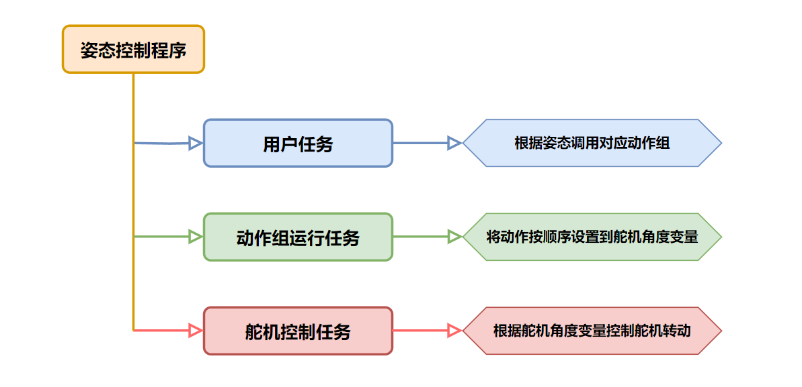

### 5.2 加速度传感器

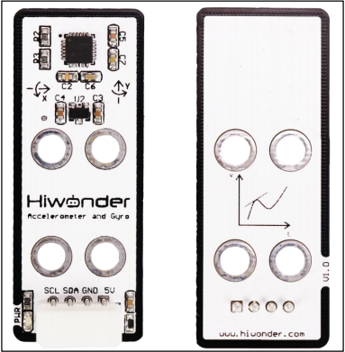

该传感器主要用到了 MPU6050 传感器元件。它集成了3 轴 MEMS 陀螺仪，3 轴 MEMS 加速度计，以及一个可扩展的数字运动处理器 DMP（ DigitalMotion Processor）。

- #### 传感器工作原理

传感器对陀螺仪和加速度计分别用了三个 16 位的 ADC，将其测量的模拟量转化为可输出的数字量。为了精确跟踪快速和慢速的运动，传感器的测量范围都是用户可控的，陀螺仪可测范围为±250，±500，±1000，±2000°/秒（ dps），加速度计可测范围为±2，±4，±8，±16g。

传感器倾斜方向对应X-Y轴的值如下所示：

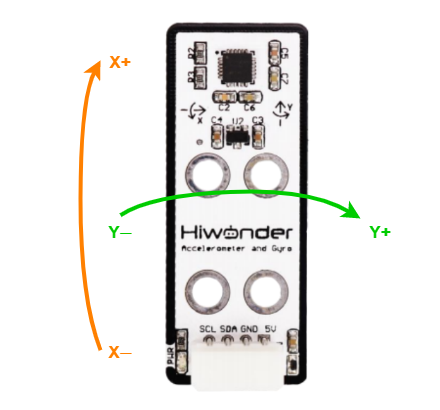

- #### 传感器原理图

传感器通过MPU6050芯片控制，其组合3轴MEMS陀螺仪和加速度计值。

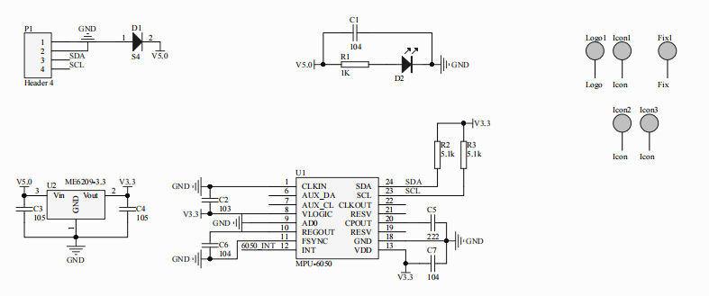

- #### 传感器接线

将加速度传感器通过4Pin线接入任意IIC接口。

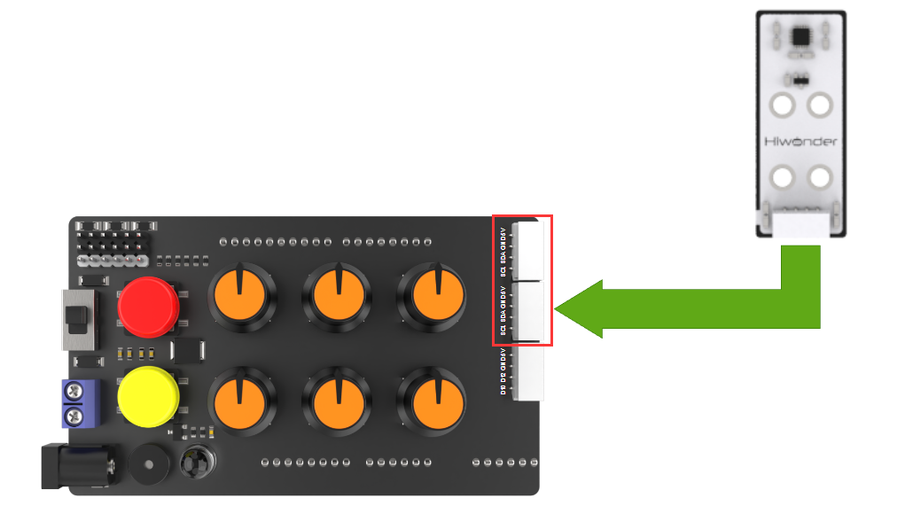

### 5.3 程序下载


:::{Note}

下载程序前需先将蓝牙模块取下，否则会因串口冲突导致程序下载失败。

接入Type-B下载线时请将电池盒开关拨到“OFF”挡，避免下载线误碰到扩展板的电源引脚，造成短路。

:::

1)  在与文档同路径下的“**02 程序文件\MiniArm_IMU**”中找到的“**MiniArm_IMU.ino**”程序文件。

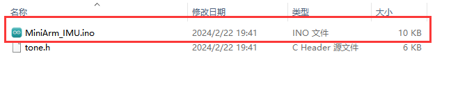

2)  将Arduino通过UNO数据线（Type-B）连接至电脑。


3)  点击“**选择开发板**”选项，软件会自动检测当前Arduino串口，点击进行连接。

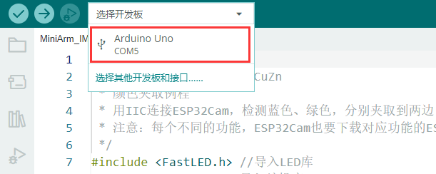

4)  点击，将程序下载至Arduino中，等待下载完成即可。


### 5.4 实现效果

打开机械臂电源后，首先机械臂会回到中位姿态，然后进入到夹取方块的预备动作。

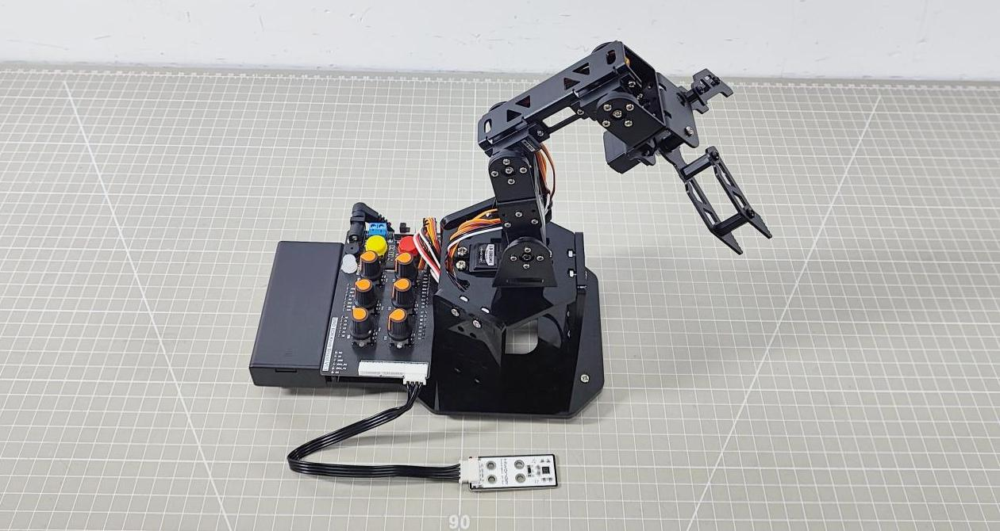

以加速度传感器上的hiwonder字样为正方向，手握加速度传感器向下倾斜，MiniArm蜂鸣器滴一声后机械臂夹取方块。

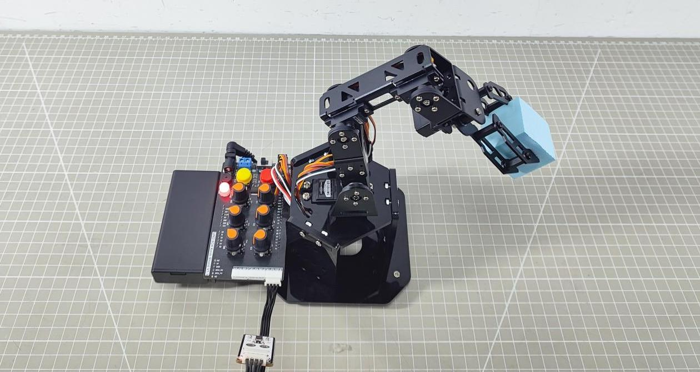

以加速度传感器上的hiwonder字样为正方向，手握加速度传感器向左倾斜，MiniArm蜂鸣器滴一声后机械臂将方块放置在机械臂的左侧。

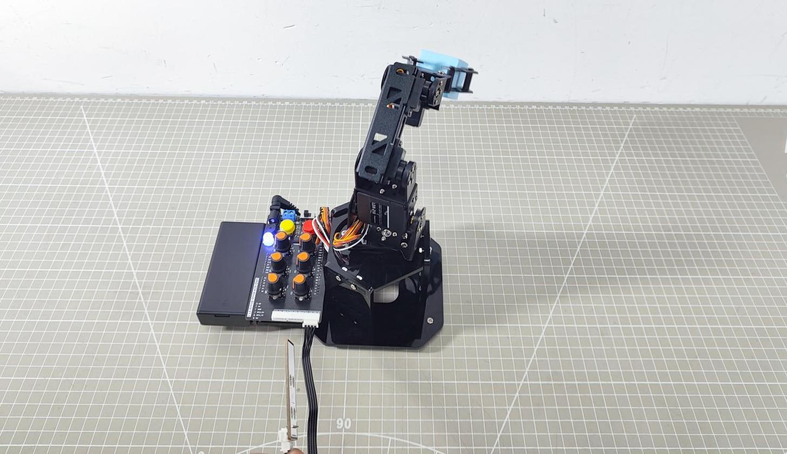

以加速度传感器上的hiwonder字样为正方向，手握加速度传感器向右倾斜，MiniArm蜂鸣器滴一声后机械臂将方块放置在机械臂的右侧。

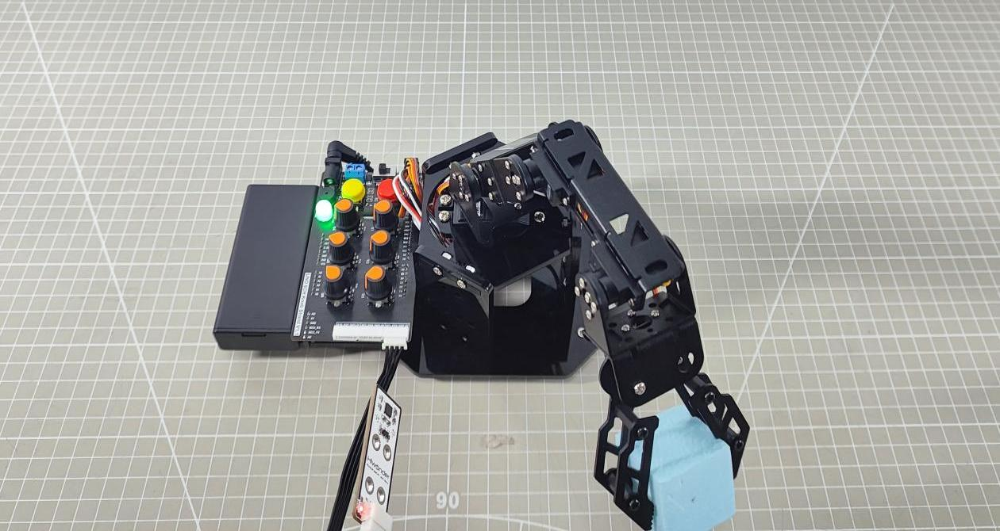

### 5.5 程序简要分析

- #### 导入库文件

```c
#include <FastLED.h> //导入LED库
#include <Servo.h> //导入舵机库
#include "tone.h" //音调库
#include <MPU6050.h>
#include "mini_servo.h"
```

导入RGB控制库、舵机控制库、音调库、加速度传感器库以及机械臂控制库。

- #### 定义引脚及创建对象

1)  创建MPU6050加速度计相关的变量，其中ax，ay，az表示三轴方向上的倾斜角度的值，gx，gy，gz表示三轴方向上的加速度的值。radianX_last为最终获取到的x轴方向上的倾斜角，radianY_last为最终获取到的y轴方向上的倾斜角。


```c
MPU6050 accelgyro;
int16_t ax, ay, az;
int16_t gx, gy, gz;
float ax0, ay0, az0;
float gx0, gy0, gz0;
float ax1, ay1, az1;
float gx1, gy1, gz1;

float dx;
float dz;
int ax_offset, ay_offset, az_offset, gx_offset, gy_offset, gz_offset;
float radianX;
float radianY;
float radianZ;
float radianX_last; //最终获得的X轴倾角
float radianY_last; //最终获得的Y轴倾角
```

2. 定义了两个蜂鸣器的声调，及连接硬件的Arduino引脚：主要是六个舵机引脚、一个蜂鸣器引脚和一个RGB灯引脚。

```c
const static uint16_t DOC5[] = { TONE_C5 };
const static uint16_t DOC6[] = { TONE_C6 };

/* 引脚定义 */
const static uint8_t servoPins[5] = { 7, 6, 5, 4, 3};//舵机引脚定义
const static uint8_t buzzerPin = 11;
const static uint8_t rgbPin = 13;
```

3)  创建了RGB灯、动作组控制对象及舵机控制对象。同时还创建了舵机控制的变量，其中：limit_angle对机械臂的每一个关节设定了角度限位，而servo_angles数组用于存储舵机的实际角度，范围0~180。

```c
//RGB灯控制对象
static CRGB rgbs[1];
//动作组控制对象
HW_ACTION_CTL action_ctl;
//舵机控制对象
Servo servos[5];

const uint8_t limt_angles[5][2] = {{0,90},{0,180},{0,180},{0,180},{0,180}}; /* 各个关节角度的限制 */
static float servo_angles[5] = { 80,15,175,65,90 };  /* 舵机实际控制的角度数值 */
```

4)  在动作组控制对象的构造函数中，还定义了extended_func_angles变量，它是舵机角度的期望角度值，同时还声明了用于控制执行动作组的相关函数。

```c
class HW_ACTION_CTL{
  public:
    uint8_t extended_func_angles[5] = { 41 ,12 ,174 ,68 ,84 }; /* 二次开发例程使用的角度数值 */
    //控制执行动作组
    void action_set(int num);
    int action_state_get(void);
    void action_task(void);
    void read_offset();
    int8_t* get_offset(void);
    
  private:
    //动作组控制变量
    int action_num = 0;
    int8_t servo_offset[5];
    uint8_t eeprom_read_buf[16];
};
```

- 对于期望值与实际值，在后续控制舵机转动中由于数值会有所差异，具体可以看到loop主函数中调用的servo_control函数。

- 如果想要让舵机逐渐向目标位置靠近，则控制任务函数中需要调用到servo_angles\[i\] = servo_angles\[i\] \* 0.85 + extended_func_angles\[i\] \* 0.15这行代码。

- 这使得舵机在每次移动时都会在原先位置基础上加上部分期望值的舵机脉宽。而在移动过后会重新将当前的新数据进行赋值。这样当到达目标位置后，机械臂就能够停止移动。


```c
  for (int i = 0; i < 5; ++i) {
    if(servo_angles[i] > action_ctl.extended_func_angles[i])
    {
      servo_angles[i] = servo_angles[i] * 0.9 + action_ctl.extended_func_angles[i] * 0.1;
      if(servo_angles[i] < action_ctl.extended_func_angles[i])
        servo_angles[i] = action_ctl.extended_func_angles[i];
    }else if(servo_angles[i] < action_ctl.extended_func_angles[i])
    {
      servo_angles[i] = servo_angles[i] * 0.9 + (action_ctl.extended_func_angles[i] * 0.1 + 1);
      if(servo_angles[i] > action_ctl.extended_func_angles[i])
        servo_angles[i] = action_ctl.extended_func_angles[i];
    }

    servo_angles[i] = servo_angles[i] < limt_angles[i][0] ? limt_angles[i][0] : servo_angles[i];
    servo_angles[i] = servo_angles[i] > limt_angles[i][1] ? limt_angles[i][1] : servo_angles[i];
    servos[i].write(i == 0 || i == 5 ? 180 - servo_angles[i] : servo_angles[i]);
  }
}
```

5)  下面的部分声明了任务函数，用于执行不同的控制任务。servo_control函数用于控制舵机，play_tune()用于设置蜂鸣器的响声，tune_task()用于控制蜂鸣器鸣响，action_task()用于调用动作组运行，update_mpu6050()用于更新加速度传感器获取数据。

```c
static void servo_control(void); /* 舵机控制 */
void play_tune(uint16_t *p, uint32_t beat, uint16_t len); /* 蜂鸣器控制接口 */
void tune_task(void); /* 蜂鸣器控制任务 */
void user_task(void); /* 用户任务 */

void update_mpu6050(void); /*更新倾角传感器数据*/
```

- #### 初始化设置

1)  在setup()函数中，主要是对相关的硬件设备进行初始化。首先是串口，将其通信的波特率设置为115200以及读取数据超时时间为500ms。

```c
void setup() {
  // put your setup code here, to run once:
  Serial.begin(115200);
  // 设置串行端口读取数据的超时时间
  Serial.setTimeout(500);
```

2)  绑定舵机IO口，使用FastLED库初始化扩展板上的RGB灯，并将其连接到rgbPin引脚。通过rgbs\[0\] = CRGB(0, 255, 0)设置RGB颜色为绿色。最后使用FastLED.show函数显示设置的颜色。


```c
  // 绑定舵机IO口
  for (int i = 0; i < 5; ++i) {
    servos[i].attach(servoPins[i],500,2500);
  }

  //RGB灯初始化并控制
  FastLED.addLeds<WS2812, rgbPin, GRB>(rgbs, 1);
  rgbs[0] = CRGB(0, 0, 100);
  FastLED.show();
```

3. 设置蜂鸣器的接口为输出模式，调用tone()函数使蜂鸣器发出声音，在延时100ms之后调用noTone()使蜂鸣器停止鸣响。组后读取舵机的偏差数据。

```c
  //蜂鸣器初始化并鸣响一声
  pinMode(buzzerPin, OUTPUT);
  tone(buzzerPin, 1000);
  delay(100);
  noTone(buzzerPin);

  //读取舵机偏差数据
  action_ctl.read_offset();
```

4)  创建加速度计的对象，设定角速度和加速度的量程，获取各轴的数据，最后校准数据。

```c
  //MPU6050 配置
  Wire.begin();
  accelgyro.initialize();
  accelgyro.setFullScaleGyroRange(3); //设定角速度量程
  accelgyro.setFullScaleAccelRange(1); //设定加速度量程
  delay(200);
  accelgyro.getMotion6(&ax, &ay, &az, &gx, &gy, &gz);  //获取当前各轴数据以校准
  ax_offset = ax;  //X轴加速度校准数据
  ay_offset = ay;  //Y轴加速度校准数据
  az_offset = az - 8192;  //Z轴加速度校准数据
  gx_offset = gx; //X轴角速度校准数据
  gy_offset = gy; //Y轴角速度校准数据
  gz_offset = gz; //Z轴角速度校准数据
```

- #### 用户任务

1. 初始化完成后，接下来将调用loop主函数中的超声波任务函数user_task，它是用于根据加速度传感器倾斜的角度，调用动作组控制机械臂。函数首先定义了变量last_tick，主要用于计算时间间隔。

```c
// 用户任务
void user_task(void)
{
  static uint32_t last_tick = 0;
  static uint8_t step = 0;
  static uint8_t act_num = 0;
  static uint32_t delay_count = 0;
  int color = 0;

  // 时间间隔100ms
  if (millis() - last_tick < 100) {
    return;
  }
  last_tick = millis();
```

2. 接着检查从上次调用ultrasound_task函数到现在是否已经过去了100毫秒。如果是，则执行下面的代码。否则，函数直接返回。而其中的millis函数是Arduino板启动以来的时间。通过这种方式，该函数可确保每100毫秒执行一次下面检测距离的任务。

3. 然后通过ul.Filter函数来获取滤波后的超声波距离值，并将结果存储在变量dis中。

-  #### 执行反馈

1)  按步骤，首先检测加速度计的X轴方向的倾斜角度（即向下倾斜），若倾斜角度大于40，控制扩展板上RGB亮红色，蜂鸣器鸣响一声后记录需要调用的动作组为1号动作组（即机械臂夹取方块）。若没有倾斜或倾斜角度过小则机械臂无反应。


```c
  switch(step)
  {
    case 0:
      if(radianX_last > 40) //抓取
      {
        rgbs[0].r = 100; //红色
        rgbs[0].g = 0;
        rgbs[0].b = 0;
        FastLED.show();
        play_tune(DOC6, 300u, 1u);
        // 需要运行动作组1进行分拣
        act_num = 1;
        step++;
      }else{ //若没识别到
        rgbs[0].r = 0;
        rgbs[0].g = 0;
        rgbs[0].b = 0;
        FastLED.show();
      }
      break;
```

2. 进入case 1，通过delay_count的值进行延时等待，由于每进入一次case 1就要调用一次检测倾斜角的任务，而每进入一次检测倾斜角的任务就会延时100ms。因此case 1会先延时1000ms，再设置动作组编号并运行动作组。完成之后再跳入到下一阶段。

```c
    case 1: //等待1s，木块放正
      delay_count++;
      if(delay_count > 5)
      {
        delay_count = 0;
        // 运行动作组
        action_ctl.action_set(act_num);
        act_num = 0;
        step++;
      }
      break;
```

3)  case 2为等待动作运行结束的阶段，在完成以上的识别、等待和调用动作组过后，通过判断action_num变量是否为0，判断动作组是否运行结束，动作组结束以后，进入下一个阶段。

```c
    case 2: //等待动作状态清零
      if(action_ctl.action_state_get() == 0)
      {
        step++;
      }
      break;
```

4)  case 3为检测加速度计在Y轴方向上的倾斜角（即左右方向）。

```c
    case 3:
      if(radianY_last > 50) //右边
      {
        rgbs[0].r = 0; 
        rgbs[0].g = 100;
        rgbs[0].b = 0;
        FastLED.show();
        play_tune(DOC6, 300u, 1u);
        // 需要运行动作组2进行分拣
        action_ctl.action_set(2);
        step++;
      }else if(radianY_last < -50) //左边
      {
        rgbs[0].r = 0; 
        rgbs[0].g = 0;
        rgbs[0].b = 100;//蓝色
        FastLED.show();
        play_tune(DOC6, 300u, 1u);
        // 需要运行动作组3进行分拣
        action_ctl.action_set(3);
        step++;
      }
      break;
```

- 当检测到加速度计Y轴的倾斜角度大于50，则加速度传感器向左倾斜，RGB彩灯亮绿灯，蜂鸣器响一声后，记录需要调用的动作组为2号动作组（即向左放置）。

- 当检测到加速度计Y轴的倾斜角小于-50，则加速度传感器向右倾斜，RGB彩灯亮蓝灯，蜂鸣器响一声后，记录需要调用的动作组为3号动作组（即向右放置）。

5)  最后case 4为等待动作状态清零的阶段，当动作组运行结束时，会将扩展板上的RGB彩灯清空，并将step当前阶段的变量设置为0，重新从阶段0开始执行。

```c
    case 4: //等待动作状态清零
      if(action_ctl.action_state_get() == 0)
      {
        FastLED.clear();
        step = 0;
      }
      break;
    default:
      step = 0;
      break;
  }
}
```

- #### 舵机控制任务

1)  在舵机控制任务中，先是同样使用last_tick变量作延时处理。

```c
// 舵机控制任务（不需修改）
void servo_control(void) {
  static uint32_t last_tick = 0;
  if (millis() - last_tick < 20) {
    return;
  }
  last_tick = millis();
```

2)  下面再通过action_ctl对象，获取到舵机的期望值。注意，这时的期望值是理想期望值加上舵机偏差的结果，因此此期望值为舵机实际的期望值。最后将舵机的实际期望值赋值给舵机的实际控制角度，再传给舵机对象，实际控制舵机的转动。

```c
  for (int i = 0; i < 5; ++i) {
    if(servo_angles[i] > action_ctl.extended_func_angles[i])
    {
      servo_angles[i] = servo_angles[i] * 0.9 + action_ctl.extended_func_angles[i] * 0.1;
      if(servo_angles[i] < action_ctl.extended_func_angles[i])
        servo_angles[i] = action_ctl.extended_func_angles[i];
    }else if(servo_angles[i] < action_ctl.extended_func_angles[i])
    {
      servo_angles[i] = servo_angles[i] * 0.9 + (action_ctl.extended_func_angles[i] * 0.1 + 1);
      if(servo_angles[i] > action_ctl.extended_func_angles[i])
        servo_angles[i] = action_ctl.extended_func_angles[i];
    }

    servo_angles[i] = servo_angles[i] < limt_angles[i][0] ? limt_angles[i][0] : servo_angles[i];
    servo_angles[i] = servo_angles[i] > limt_angles[i][1] ? limt_angles[i][1] : servo_angles[i];
    servos[i].write(i == 0 || i == 5 ? 180 - servo_angles[i] : servo_angles[i]);
  }
}
```

关于理想期望值和实际期望值我们在这里再解释一下。在action_ctl对象中，extended_func_angles为理想期望值，它排除了因舵机机械结构引起的偏差。而在实际项目中，舵机往往会因为机械结构产生一定的偏差范围，为了控制舵机角度能够更加准确，我们通过调节偏差计算出了舵机转动到理想位置所需要补充的角度，这个角度可以是正数、负数也可以是零，然后在舵机实际控制中，我们会在理想期望角度基础上加上偏差值，这样就得到了实际的期望角度。

### 5.6 功能延伸

我们可以将一下条件修改为：if(radianX_last \< -40)，这样我们将加速度传感器向X轴负方向倾斜便会运行抓取的动作。

```c
  switch(step)
  {
    case 0:
      if(radianX_last > 40) //抓取
      {
        rgbs[0].r = 100; //红色
        rgbs[0].g = 0;
        rgbs[0].b = 0;
        FastLED.show();
```

```c
    case 0:
      if(radianX_last < -40) //抓取
```

