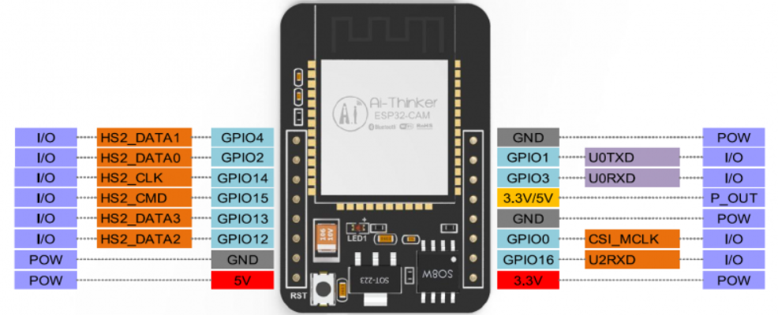
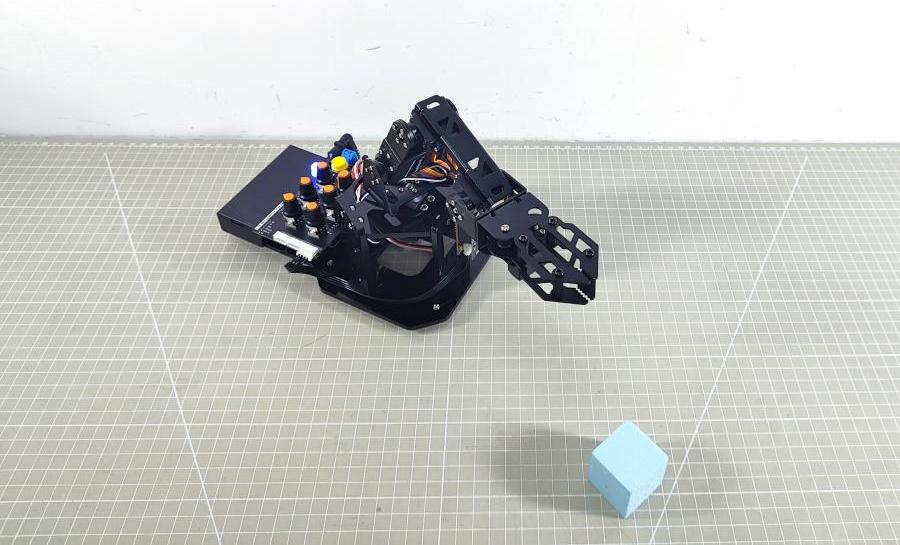
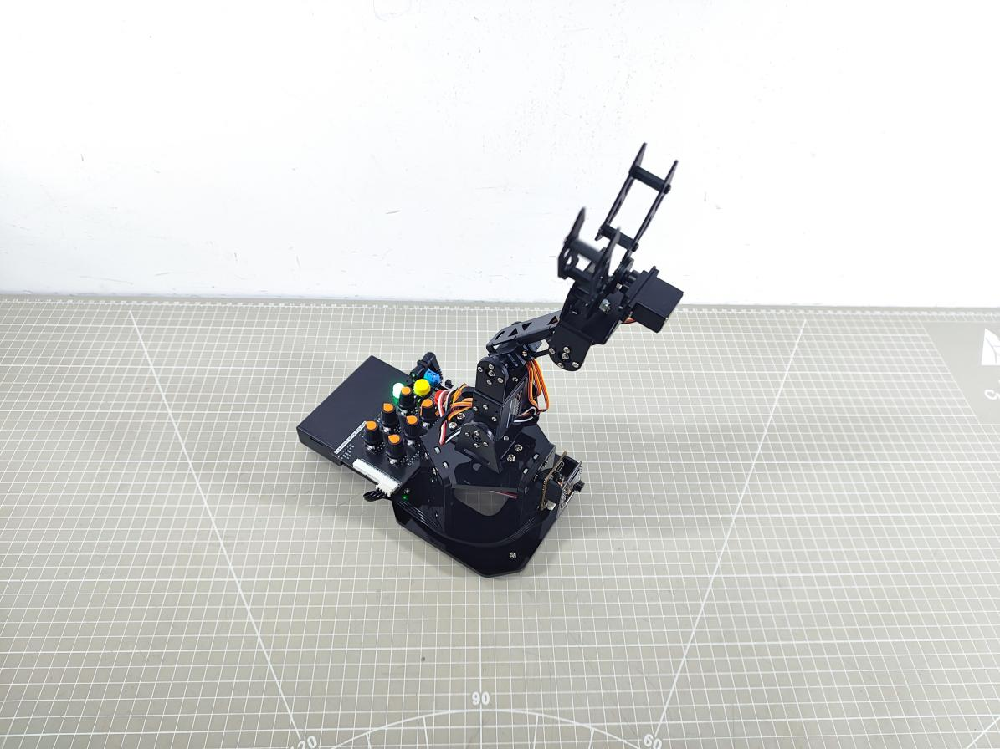

# AI视觉玩法课程

<p id="esp32-introduce"></p>

## 1. ESP32-Cam介绍

### 1.1 ESP32-Cam说明

- #### 硬件介绍

ESP32-CAM是一款基于ESP32微控制器的小尺寸摄像头模组。该模块可以作为最小系统独立工作，尺寸仅为27\*40.5\*4.5mm，深度睡眠电流最低达到6mA。

ESP32-CAM采用DIP封装，直接插上底板即可使用，为客户提供高可靠性的连接方式，方便应用于各种物联网硬件终端场合。

其硬件结构如下图所示：


- #### 工作原理

通过内置的摄像头模块进行图像采集，利用ESP32微控制器对图像数据进行处理，并通过Wi-Fi模块进行无线传输或保存到microSD卡中，同时支持多种通信协议和低功耗特性，广泛应用于各种物联网应用场景中。

### 1.2 接口说明及安装方法

- #### 摄像头载板接口说明


| 接口名称  |           接口说明           |
|:---------:|:----------------------------:|
| TypeC串口 |      串口通信、固件烧录      |
|   排母    |      连接ESP32-Cam模块       |
| 复位按钮  |       按下即可重启程序       |
|  IIC接口  | 二次开发接口，与主控进行连接 |
| 用户按钮  |      用户自定义扩展开发      |

- #### 摄像头的安装与连接

1)  将ESP32-Cam的排针，与摄像头载板的排母一一对齐进行安装。

<p align="center">

</p>

2)  使用Type-C数据线连接摄像头与电脑。


3)  根据“**[3. 图像回传](#image-return3)**”中的教程查看摄像头的回传画面。


### 1.3 注意事项

- 请保证模块输入电源至少5V 2A,否则图片会有几率出现水纹。

- ESP32 GPIO32管脚控制摄像头电源，当摄像头工作时，请把GPIO32拉低。

- 由于IO0连接摄像头XCLK,使用时请把IO0悬空，请勿接高低电平。

- 出厂已含有默认固件，不另外提供下载，如需重烧其他固件请谨慎操作。

### 1.4 参数说明

- #### ESP32-Cam引脚说明




- #### ESP32-Cam规格参数

|     参数     |                          描述                           |
|:------------:|:-------------------------------------------------------:|
|   工作电压   |                     5V 2A稳压源供电                     |
|    处理器    |                Tensilica LX6 双核处理器                 |
|     主频     |        80 MHz（正常工作速度），最高可达 240 MHz         |
|     SRAM     |                         520 KB                          |
|  外置存储器  |                   最大支持 8 MB PSRAM                   |
|    Flash     |              最大支持 16 MB 片外 SPI Flash              |
|   WiFi协议   |        802.11 b/g/n/d/e/i/k/r，速度高达 150 Mbps        |
| WiFi频率范围 |                      2.4 ~ 2.5 GHz                      |
|   蓝牙协议   | 支持蓝牙 v4.2，包含传统蓝牙 (BR/EDR) 和低功耗蓝牙 (BLE) |
|    摄像头    |        支持 OV2640 和 OV7670 摄像头，内置闪光灯         |
|   图片上传   |                 支持通过 Wi-Fi 上传图片                 |
|     存储     |                     支持 microSD 卡                     |
|     接口     |            GPIO/ADC/ DAC/ SPI/ I2C/PWM/ UART            |
|   电源电流   |                 深度睡眠模式下最低 6mA                  |
|   工作模式   |                      STA/AP/STA+AP                      |
|   二次开发   |                          支持                           |
|     尺寸     |                   27 × 40.5 × 4.5 mm                    |


:::{Note}

产品规格参数为理论值，仅供参考，请以实际效果为准。

:::

**关于产品详细参数可前往“4.拓展学习资料\5.ESP32-Cam摄像头模块资料”路径下查看产品规格书。**

可参考“[AI视觉玩法课程\ 1. ESP32-Cam介绍](#esp32-introduce)”路径下的教程，查看ESP32-Cam摄像头的实现效果。

## 2. ESP32-Cam库文件介绍

本节对ESP32-Cam模块的驱动库进行分析，这个库是用来获取ESP32-Cam模块识别到的人脸数据或颜色数据、控制补光灯亮度的，该库包含hw_esp32cam_ctl.h和hw_esp32cam_ctl.cpp这2个文件。

### 2.1 准备工作及注意事项

1)  在“**AI视觉玩法课程**”路径下打开任意程序，这里我们以“4. 颜色分拣”为例。


2)  在打开的程序中，选择“**hw_esp32cam_ctl.cpp**”。


### 2.2 程序简要分析

1)  初始化IIC通信的函数：begin()。

```c
void HW_ESP32Cam::begin(void)
{
  Wire.begin();
}
```

2)  向esp32Cam发送多个字节：wireWriteDataArray()。

```c
//写多个字节
static bool wireWriteDataArray(uint8_t addr, uint8_t reg,uint8_t *val,unsigned int len)
{
    unsigned int i;

    Wire.beginTransmission(addr);
    Wire.write(reg);
    for(i = 0; i < len; i++) 
    {
        Wire.write(val[i]);
    }
    if( Wire.endTransmission() != 0 ) 
    {
        return false;
    }
    return true;
}
```

参数及含义：

- **addr**：esp32Cam设备地址（0x52）

- **reg**：向esp32Cam写入的目标内存地址

- **\*va**l:需要发送的数据地址

- **len**：需要发送的字长

arduino主设备首先通过IIC发送设备地址，再向esp32Cam发送目标内存的地址，再根据字长按字节发送数据。之后通过endTransmission()检测数据是否发送成功，若返回值为0，表示数据发送成功，否则表示发送失败。

3)  向esp32Cam发送1个字节：wireWriteByte()

```c
static bool WireWriteByte(uint8_t val)
{
    Wire.beginTransmission(ESP32CAM_ADDR);
    Wire.write(val);
    if( Wire.endTransmission() != 0 ) {
        return false;
    }
    return true;
}
```

参数及含义：

- **val**：发送的数据内容

arduino主设备直接向esp32Cam发送设备地址，再将1字节的数据内容发送给esp32Cam。之后通过endTransmission()检测数据是否发送成功，若返回值为0，表示数据发送成功，否则表示发送失败。

4)  从esp32Cam读取多字节的数据：wireReadDataArray()

```c
static int WireReadDataArray(uint8_t reg, uint8_t *val, unsigned int len)
{
    unsigned char i = 0;
    
    /* Indicate which register we want to read from */
    if (!WireWriteByte(reg)) {
        return -1;
    }
    
    /* Read block data */
    Wire.requestFrom(ESP32CAM_ADDR, len);
    while (Wire.available()) {
        if (i >= len) {
            return -1;
        }
        val[i] = Wire.read();
        i++;
    }   
    return i;
}
```

参数及含义：

- **reg**：esp32Cam中需要读取的数据地址

- **\*val**：arduino主设备中用于存放数据的地址

- **len**：需要读取的字长

arduino主设备首先向esp32Cam发送需要读取的数据地址，若无应答返回-1，表示esp32Cam建立连接失败。之后，向esp32Cam设备发送字长，通过while循环以及i的变量按字节读取数据，并存放在val\[\]数组中。若读取过程中，实际读取的字长超过了需要读取的字长，则返回-1，表示读取失败。最后，在读取成功后返回i，即实际读取到的字长（**i可能小于或等于len**）

5)  读取esp32Cam检测人脸的结果：faceDetect()

```c
//读取ESP32Cam检测人脸
bool HW_ESP32Cam::faceDetect(void)
{
  uint8_t face_info[4];
  Serial.print("face ");
  int num = WireReadDataArray(0x01,face_info,4);
  if((num == 4) && (face_info[2] > 0)) //接收识别到的人脸的x,y,w,h值
  {
      Serial.println(" 1");
      return true;
  }
  Serial.println(" 0");
  return false;
}
```

定义face_info\[4\]数组用于存放数据，通过wireReadDataArray()函数，从0x01的地址，读取四个字节存放在face_info\[4\]数组中。其中，各元素含义如下：

- **face_info\[0\]**：x（识别到人脸区域左上角的x坐标值）

- **face_info\[1\]**：y（识别到人脸区域左上角的y坐标值）

- **face_info\[2\]**：w（识别到人脸区域的宽度）

- **face_info\[3\]**：h（识别到人脸区域的高度）

通过num变量接收数据的长度，如果为4且face_info\[2\]（即w的值）为大于0，则表示识别到人脸，则返回true，否则返回false。

6)  读取esp32Cam识别颜色的结果：colorDetect()

```c
//读取ESP32Cam识别颜色，返回颜色代号
int HW_ESP32Cam::colorDetect(void)
{
  uint8_t color_info[2][4];
  int num = WireReadDataArray(0x00,color_info[0],4);
  if((num == 4) && (color_info[0][2] > 0)) //接收识别到的颜色的x,y,w,h值
  {
      return 2;
  }
  num = WireReadDataArray(0x01,color_info[1],4);
  if(num == 4)
  {
    if(color_info[1][2] > 0) //若w值大于0，则识别到颜色1
    {
      return 1;
    }
  }
  return 0;
}
```

定义color_info\[2\]\[4\]二维数组用于存放数据，各元素含义如下：

- **color_info\[\*\]\[0\]**：x（识别到颜色区域左上角的x坐标值）

- **color_info\[\*\]\[1\]**：y（识别到颜色区域左上角的y坐标值）

- **color_info\[\*\]\[2\]**：w（识别到颜色区域的宽度）

- **color_info\[\*\]\[3\]**：h（识别到颜色区域的高度）

以上，若\*为0表示识别颜色1，若\*为1表示识别颜色2。

通过wireReadDataArray()函数，从0x00的地址，读取四个字节数据存放在color_info\[0\]\[4\]数组中，表示识别到颜色1的参数信息。根据num接收的数据长度以及color_info\[0\]\[2\]的值（即识别到颜色1的区域宽度）判断是否识别到颜色1，若num=4且color_info\[0\]\[2\]\>0则识别到颜色1，识别到则返回1。

否则按照以上步骤，从0x01的地址读取数据存放在color_info\[1\]\[4\]数组中，再判断是否读取到颜色2识别到则返回2。

若以上都没有结果，则返回0。

7)  读取esp32Cam识别颜色的位置：color_position()

```c
//读取ESP32Cam识别颜色位置，读取成功返回true和位置数据
bool HW_ESP32Cam::color_position(uint16_t *color_info)
{
  int num = WireReadDataArray(0x01,(uint8_t*)color_info,8);
  if((num == 8) && (color_info[2] > 0)) //接收识别到的颜色的x,y,w,h值
  {
    return true;
  }
  return false;
}
```

参数及含义如下：

**\*color_info**：存放接收到数据的地址

通过wireReadDataArray()函数，从0x01的地址，读取8个字节数据存放在color_info所指向的地址中。根据num接收的数据长度以及color_info\[2\]的值（即识别到颜色区域的宽度）判断是否识别到颜色，若num=8且color_info\[2\]\>0则识别到颜色，识别到则返回true，否则返回false。

8)  控制esp32Cam的补光灯亮度：set_led()

```c
void HW_ESP32Cam::set_led(uint8_t lightness)
{
  lightness = lightness < 0 ? 0 : lightness;
  lightness = lightness > 255 ? 255 : lightness;
  wireWriteDataArray(ESP32CAM_ADDR , 0x11 , &lightness , 1);
}
```

参数及含义如下：

lightness：补光灯亮度（0~255）

首先识别传入参数是否有限，主要通过判断参数的值是否在0-255范围内， 若小于0，则使其为0，若超出255，则使其为255。以此，保证传入参数的有效性。最后，通过wireWriteDataArray()函数将lightness参数值，发送给esp32Cam的0x11的地址。

<p id="image-return3"></p>

## 3. 图像回传

本节通过连接ESP32-Cam产生的热点，登录固定网址查看摄像头实时回传画面。

:::{Note}

若无法使用图像回传功能或下载了其他玩法的固件，需要重新烧录图像回传固件才可以使用图像回传功能。

:::

**固件下载可查看本文档中的 [<u>3.4 图像回传固件烧录（选看）</u>](#firmware-burning34)**

### 3.1 连接ESP32-Cam摄像头

- #### 连接模式介绍

ESP32-Cam摄像头有下列两种网络模式：

1.  AP直连模式：开发板能够开启热点被手机连接上。（但不能联通外部网络）

2.  STA局域网模式：开发板能够主动去连接指定的热点/Wi-Fi。（可联通外部网络）

使用直连模式操作更加简单方便，这里建议用户先学习直连模式的配置方法进行相应功能的体验，局域网模式可根据需求来选看。

另外用户无论是选择AP直连还是STA局域网模式，玩法功能都一致。

- #### 直连模式连接（必看）

1)  确认摄像头已连接至扩展板的IIC接口中，将机械臂开机。


2)  此时摄像头会产生一个名称为“**HW_ESP32Cam**”的热点，点击连接即可。


3)  连接完成后，在浏览器中输入地址“**192.168.5.1**”点击搜索，即可进入到摄像头回传界面。


- #### 局域网模式连接（选看）

1)  将手机热点打开，设置热点名称为“**HiwonderESP**”，密码为“**hiwonder**”。

:::{Note}

热点名称和密码与本文保持一致，否则会连接不上

:::


2)  确认摄像头已连接至扩展板的IIC接口中，将机械臂开机，稍等片刻，摄像头就会自动连接手机热点。


3)  网络连接成功后，使用Type数据线连接摄像头与电脑。


4)  打开“**2.软件工具&程序合辑\5.串口调试助手工具**”路径下的友善串口调试助手工具。


5)  选择端口，此处以COM3为例（**端口号不唯一，如果是COM1请不要选择，它是系统通信端口**），将波特率设置为“**115200**”。


6)  点击页面左上方的按钮打开串口通信，按下ESP32摄像头载板上的“**RST**”按键，往下滑到最后一行，即可看到摄像头的IP地址“**192.168.197.226**”（**IP地址不唯一，用户需以实际为准**）。


7)  此时可断开Type-C数据线，将电脑也连接至摄像头同一热点下。


8)  在浏览器搜索界面输入摄像头的IP地址“**192.168.197.226**”即可查看回传界面。


### 3.2 开启图像回传

连接完成后，点击界面上的“**Start Stream**”按钮即可开启图像回传。


### 3.3 界面介绍

此界面可分为两个部分，①界面设置区域，②画面回传区域。


界面设置区域的常用按钮介绍说明如下图及表所示：


| 编号 | 按钮名称 | 按钮功能 |
|:--:|:--:|:--:|
| 1 | Resolution | 可选择画面显示的分辨率，分辨率越小画面越流畅。 |
| 2 | H-Mirror | 水平翻转画面 |
| 3 | V-Flip | 垂直翻转画面 |
| 4 | Face Detection | 点击后，可进行人脸识别 |
| 5 | Face Recognition | 同时选中Face Detection和Face Recognition按钮待识别到人脸后点击“Get Still”按键即可学习特定人脸 |
| 6 | Get Still | 点击可学习特定人脸 |
| 7 | Stop Stream | 关闭图像回传画面 |
| 8 | Save | 保存图像 |

可参考“**4.拓展学习资料\5.ESP32-Cam摄像头模块资料**”查看ESP32-Cam更详细的使用说明教程。

<p id="firmware-burning34"></p>

### 3.4 图像回传固件烧录（选看）

1)  根据“**[AI视觉玩法课程\6.1 ESP32-Cam介绍](#esp32-introduce)**”将ESP32-Cam安装并连接至机械臂的IIC接口上。


2)  将Type-C数据线一端连接ESP32-Cam另一端连接电脑的USB接口。


3)  双击并打开“**2.软件工具&源码程序\4.固件烧录工具**”路径下的

“**flash_download_tools_v3.6.5.exe**”文件。


4)  稍等片刻，在打开的界面中，选择“**ESP32 DownloadTool**”。


5)  在烧录界面中，先再点击“”选择固件(解压“camera_web_server_V1.1.zip”文件，找到“**ESP32-Cam图像回传固件\HW_ESP32cam_web_server_0.bin**”)再根据下图所框内容选择如下配置。

:::{Note}

如果图传画面出现颠倒，请烧录HW_ESP32cam_web_server_1.bin

:::


    


6)  选择端口号（端口号以实际情况为准，切勿选择COM1，否则会烧录不成功）。


7)  先点击“**ERASE**”，对底层固件进行擦除（**一定要进行此操作**），再点击“**START**”，开始烧录。


8)  稍等片刻，会出现完成的提示。


9)  烧录完成后断开Type-C数据线即可。

## 4. 颜色分拣

本节讲解MiniArm通过搭载的ESP32-Cam，实现识别红、蓝方块，并将方块夹取放置到对应位置的功能实现。

### 4.1 实现流程图


### 4.2 ESP32-Cam开发板模块


这是一款集成了ESP32芯片和摄像头模块的开发板，模块插入载板后，采用 IIC 通信接口，能通过 IIC通信进行读取颜色、人脸数据。

- #### 模块工作原理

ESP32-CAM板载了OV2640摄像头模块，通过串行接口将采集的图像数据传输给ESP32芯片，后者可处理图像并通过IIC通信传输至其他设备。

- #### 模块原理图

模块通过ESP32芯片控制同时负责整个系统的控制和通讯功能，通过OV2640摄像头采集图像数据，经过处理和分析，最终执行相应操作。


- 供电电压：5V

- 功耗：6mA-180mA

- 工作温度：-20℃~70℃

- #### 传感器接线

将ESP32-Cam的排针接到摄像头载板的排母上，再使用4PIN线将摄像头载板与扩展板上的任意一个IIC接口进行连接。


<p id="program-download4"></p>

### 4.3 程序下载

:::{Note}

下载程序前需先将蓝牙模块取下，否则会因串口冲突导致程序下载失败。

接入Type-B下载线时请将电池盒开关拨到“OFF”挡，避免下载线误碰到扩展板的电源引脚，造成短路。

:::

- #### Arduino UNO程序下载

1)  找到并打开本节同目录下的

“**02 程序文件\02 uHand UNO颜色分拣例程\MiniArm_color_clamp\MiniArm_color_clamp.ino**”程序文件。


2)  将Arduino通过UNO数据线（Type-B）连接至电脑。


3)  点击“**选择开发板**”选项，软件会自动检测当前Arduino串口，点击进行连接。


4)  点击，将程序下载至Arduino中，等待下载完成即可。


<p id="esp32-program-download4"></p>

- #### ESP32-Cam程序下载

1)  参照“**[二次开发课前准备\4.1 Arduino开发环境搭建\02 Arduino IDE使用说明-\>3.ESP32-Cam环境配置]()**”搭建好ESP32开发板环境。

2)  找到并打开本节同目录下的

    **“ESP32Cam_color_clamp\ESP32Cam_color_clamp.ino”**程序文件。


3)  将ESP32-Cam通过USB数据线（Type-C）连接至电脑。


4)  点击**“选择开发板”**选项，在选择其他开发板和端口选项中，选择**AI Thinker ESP-CAM**，并选择对应端口。


5)  点击，将程序下载至ESP32Cam中，等待下载完成即可。


### 4.4 实现效果

1)  打开机械臂电源后，机械臂进入夹取的初始位置，同时扩展板上的RGB灯亮蓝色。


2)  当识别到蓝色方块时，RGB亮蓝灯，机械臂将方块抓取，放置在左边。


3)  当识别到绿色方块时，RGB亮绿灯，机械臂将方块抓取，放置在右边。


### 4.5 程序简要分析

本玩法程序名为“**MiniArm_color_clamp.ino**”，关于程序的实现逻辑可参考下面的流程图：


- #### 导入库文件

1)  导入玩法所需的RGB控制库、舵机控制库、ESP32Cam的通信库、蜂鸣器的音调库文件。

```c
#include <FastLED.h> //导入LED库
#include <Servo.h> //导入舵机库
#include "hw_esp32cam_ctl.h" //导入ESP32Cam通讯库
#include "tone.h" //音调库
```

2)  定义音调常量和颜色常量。

```c
#define COLOR_1   1
#define COLOR_2   2

const static uint16_t DOC5[] = { TONE_C5 };
const static uint16_t DOC6[] = { TONE_C6 };
```

- #### 定义引脚及创建对象

1)  首先定义了用于连接硬件的Arduino引脚，主要是五个舵机引脚、一个蜂鸣器引脚和一个RGB灯引脚。

```c
/* 引脚定义 */
const static uint8_t servoPins[5] = { 7, 6, 5, 4, 3};//舵机引脚定义
const static uint8_t buzzerPin = 11;
const static uint8_t rgbPin = 13;
```

2)  然后定义了用于控制RGB灯、ESP32Cam通讯、动作组控制及舵机控制的对象。同时还创建了舵机控制的变量，其中：limit_angle对机械臂的每一个关节设定了角度限位，而servo_angles数组用于存储舵机的实际角度，范围0~180。

```c
//RGB灯控制对象
static CRGB rgbs[1];
//ESP32Cam通讯对象
HW_ESP32Cam hw_cam;
//动作组控制对象
HW_ACTION_CTL action_ctl;
//舵机控制对象
Servo servos[5];

const uint8_t limt_angles[5][2] = {{0,82},{0,180},{0,180},{0,180},{0,180}}; /* 各个关节角度的限制 */
static uint8_t servo_angles[5] = { 40,21,159,115,90 };  /* 舵机实际控制的角度数值 */
```

3)  在动作组控制对象的构造函数中，还定义了extended_func_angles变量，它是舵机角度的期望角度值，同时还声明了用于控制执行动作组的相关函数。

```c
class HW_ACTION_CTL{
  public:
    uint8_t extended_func_angles[5] = { 0,0,0,0,90 }; /* 二次开发例程使用的角度数值 */
    //控制执行动作组
    void action_set(int num);
    int action_state_get(void);
    void action_task(void);
    
  private:
    //动作组控制变量
    int action_num = 0;
};
```

- 对于期望值与实际值，在后续控制舵机转动中由于数值会有所差异，具体可以看到loop主函数中调用的**servo_control**函数。

- 如果想要让舵机逐渐向目标位置靠近，则控制任务函数中需要调用到servo_angles\[i\] = servo_angles\[i\] \* 0.9 + extended_func_angles\[i\] \* 0.1这行代码。

- 这使得舵机每次都会以实际值的90%+期望值的10%来移动，从而实际值逐渐接近期望值，当等于期望值时，手臂就能够停止移动。


```c
  for (int i = 0; i < 5; ++i) {
    if(servo_angles[i] > action_ctl.extended_func_angles[i])
    {
      servo_angles[i] = servo_angles[i] * 0.9 + action_ctl.extended_func_angles[i] * 0.1;
      if(servo_angles[i] < action_ctl.extended_func_angles[i])
        servo_angles[i] = action_ctl.extended_func_angles[i];
    }else if(servo_angles[i] < action_ctl.extended_func_angles[i])
    {
      servo_angles[i] = servo_angles[i] * 0.9 + (action_ctl.extended_func_angles[i] * 0.1 + 1);
      if(servo_angles[i] > action_ctl.extended_func_angles[i])
        servo_angles[i] = action_ctl.extended_func_angles[i];
    }
```

4)  接着定义了用于控制蜂鸣器的变量，并声明任务函数，用于执行不同的控制任务。servo_control函数用于控制舵机；play_tune用于控制蜂鸣器鸣响；tune_task函数用于执行蜂鸣器任务，espcam_task函数用于处理与ESP32-CAM相关的通信。

```c
/* 蜂鸣器控制相关变量 */
static uint16_t tune_num = 0;
static uint32_t tune_beat = 10;
static uint16_t *tune;


static void servo_control(void); /* 舵机控制 */
void play_tune(uint16_t *p, uint32_t beat, uint16_t len); /* 蜂鸣器控制接口 */
void tune_task(void); /* 蜂鸣器控制任务 */
void espcam_task(void); /* esp32cam通讯任务 */
```

- #### 初始化设置

1)  在setup()函数中，主要是对相关的硬件设备进行初始化。首先是串口，将其通信的波特率设置为115200以及读取数据超时时间为500ms。

```c
void setup() {
  // put your setup code here, to run once:
  Serial.begin(115200);
  // 设置串行端口读取数据的超时时间
  Serial.setTimeout(500);
```

2)  绑定舵机IO口，方便通过引脚对其进行控制。

```c
  // 绑定舵机IO口
  for (int i = 0; i < 5; ++i) {
    servos[i].attach(servoPins[i],500,2500);
  }
```

3)  初始化与ESP32-CAM的通信接口并设置ESP32-CAM的补光灯亮度为10（在0到255的范围内）。


```c
  hw_cam.begin(); //初始化与ESP32Cam通讯接口
  hw_cam.set_led(10); // 控制ESP32Cam补光灯亮度 [亮度值(0~255)]
```

4. 使用FastLED库初始化扩展板上的RGB灯，并连接到rgbPin引脚。通过rgbs\[0\] = CRGB(0, 0, 100)设置颜色为蓝色，使用FastLED.show函数显示设置的颜色。


```c
  //RGB灯初始化并控制
  FastLED.addLeds<WS2812, rgbPin, GRB>(rgbs, 1);
  rgbs[0] = CRGB(0, 0, 100);
  FastLED.show();
```

5. 设置蜂鸣器的引脚为输出模式，控制蜂鸣器短鸣一声后停止。


```c
  //蜂鸣器初始化并鸣响一声
  pinMode(buzzerPin, OUTPUT);
  tone(buzzerPin, 1000);
  delay(100);
  noTone(buzzerPin);
```

6. 通过串口输出“**Start**”字符串，表明传感器已经做好准备，并开始传输数据了。

```c
  delay(2000);
  Serial.println("start");
```

- #### 循环调用子函数

初始化完成后，进入loop主函数，依次循环调用“**espcam_task**”函数，检测颜色识别，执行抓取放置的操作；调用“**tune_task**”函数，执行蜂鸣器任务；调用“**servo_control**”函数，控制舵机；action_task()调用动作组。

```c
void loop() {
  // esp32cam通讯任务
  espcam_task();
  // 蜂鸣器鸣响任务
  tune_task();
  // 舵机控制
  servo_control();
  // 动作组运动任务
  action_ctl.action_task();
}
```

- #### esp32cam通讯任务

1)  “espcam_task”函数的定义中，last_tick变量，用于记录上一次任务执行的时间点；step变量，跟踪当前任务执行的阶段；act_num记录需要调用的动作组编号；delay_count变量设置演示的计量单位，color变量存放摄像头的检测结果。

```c
// esp32cam通讯任务
void espcam_task(void)
{
  static uint32_t last_tick = 0;
  static uint8_t step = 0;
  static uint8_t act_num = 0;
  static uint32_t delay_count = 0;
  int color = 0;
```

2)  last_tick变量结合millis()作延时操作，具体的通过millis()函数获取到当前程序运行的时间，与last_tick变量作差，如果差值小于100，则跳出该函数；如果大于或等于100，则意味着已经延时了100ms，接着再将当前的时间赋值给last_tick变量，用作下一次的延时操作。

```c
  // 时间间隔100ms
  if (millis() - last_tick < 100) {
    return;
  }
  last_tick = millis();
```

3)  根据检测到的颜色执行对应的任务，如控制RGB LED、蜂鸣器以及舵机的角度，以下是对这个switch代码段的分析：

```c
  switch(step)
  {
    case 0:
      color = hw_cam.colorDetect(); //获取颜色
      if(color == COLOR_1) //若识别到颜色1
      {
        rgbs[0].r = 250;
        rgbs[0].g = 0;
        rgbs[0].b = 0;
```

- case 0：使用hw_cam.colorDetect()检测颜色，若检测到颜色1，则让RGB亮红灯，蜂鸣器发声并；检测到蓝色与此同理。


```c
    case 0:
      color = hw_cam.colorDetect(); //获取颜色
      if(color == COLOR_1) //若识别到颜色1
      {
        rgbs[0].r = 250;
        rgbs[0].g = 0;
        rgbs[0].b = 0;
        FastLED.show();
        play_tune(DOC6, 300u, 1u);
        // 需要运行动作组1进行分拣
        act_num = 1;
        step++;
```

若未检测到目标颜色则关闭RGB灯。

```c
      }else{ //若没识别到
        rgbs[0].r = 0;
        rgbs[0].g = 0;
        rgbs[0].b = 0;
        FastLED.show();
      }
```

- case 1：等待一段时间后记录运行的动作组编号，跳转到下一阶段。


```c
    case 1: //等待1s，木块放正
      delay_count++;
      if(delay_count > 10)
      {
        delay_count = 0;
        // 运行动作组
        action_ctl.action_set(act_num);
        act_num = 0;
        step++;
      }
      break;
```

- case 2：等到动作状态清零，若动作组运行结束，将step设置为0，重新开始检测颜色。

```c
    case 2: //等待动作状态清零
      if(action_ctl.action_state_get() == 0)
      {
        step = 0;
      }
      break;
    default:
      step = 0;
      break;
```

- #### 动作组运行任务

```c
void HW_ACTION_CTL::action_task(void){
```

1)  首先这里创建动作组运行的变量：last_tick用于作短暂的延时；step为当前动作组运行的阶段；num暂存动作组中运行的第几个动作；delay_count作延时，等待动作运行结束。

```c
  static uint32_t last_tick = 0;
  static uint8_t step = 0;
  static uint8_t num = 0 , delay_count = 0;
```

2)  switch为实际调用动作组的部分，以下为具体分析：

- case 0：运行动作组，将动作组中的动作按顺序传递给extended_func_angles舵机的期望角度，跳转到下一阶段。若num=0即动作运行完毕，则会清空动作组变量，跳出循环。


```c
      case 0: //运行动作
        if(action[action_num-1][num][0] != 0)
        {
          extended_func_angles[0] = action[action_num-1][num][1] + servo_offset[0];
          extended_func_angles[1] = action[action_num-1][num][2] + servo_offset[1];
          extended_func_angles[2] = action[action_num-1][num][3] + servo_offset[2];
          extended_func_angles[3] = action[action_num-1][num][4] + servo_offset[3];
          extended_func_angles[4] = action[action_num-1][num][5] + servo_offset[4];

          step = 1;

        }else{ //若运行完毕
          num = 0;
          // 清空动作组变量
          action_num = 0;
          
        }
        break;
```

- case 1:通过delay_count变量延时等待动作运行，随后将num+1跳转到case 0开始执行下一个动作。

```c
      case 1: //等待动作运行
        delay_count++;
        if(delay_count > 2)
        {
          num++;
          delay_count = 0;
          step = 0;
        }
        break;
```

- #### 舵机控制

如果想要让舵机逐渐向目标位置靠近，则控制任务函数中需要调用到servo_angles\[i\] = servo_angles\[i\] \* 0.85 + extended_func_angles\[i\] \* 0.1这5行代码。

这使得舵机在每次移动时都会在原先位置的基础上加上部分期望值的舵机脉宽。而在移动过后会重新将当前的新数据进行赋值。这样当到达目标位置后，机械臂就能够停止移动。

```c
// 舵机控制任务（不需修改）
void servo_control(void) {
  static uint32_t last_tick = 0;
  if (millis() - last_tick < 20) {
    return;
  }
  last_tick = millis();

  for (int i = 0; i < 5; ++i) {
    if(servo_angles[i] > action_ctl.extended_func_angles[i])
    {
      servo_angles[i] = servo_angles[i] * 0.9 + action_ctl.extended_func_angles[i] * 0.1;
      if(servo_angles[i] < action_ctl.extended_func_angles[i])
        servo_angles[i] = action_ctl.extended_func_angles[i];
    }else if(servo_angles[i] < action_ctl.extended_func_angles[i])
    {
      servo_angles[i] = servo_angles[i] * 0.9 + (action_ctl.extended_func_angles[i] * 0.1 + 1);
      if(servo_angles[i] > action_ctl.extended_func_angles[i])
        servo_angles[i] = action_ctl.extended_func_angles[i];
    }

    servo_angles[i] = servo_angles[i] < limt_angles[i][0] ? limt_angles[i][0] : servo_angles[i];
    servo_angles[i] = servo_angles[i] > limt_angles[i][1] ? limt_angles[i][1] : servo_angles[i];
    servos[i].write(i == 0 || i == 5 ? 180 - servo_angles[i] : servo_angles[i]);
  }
}
```

- #### 蜂鸣器控制

控制蜂鸣器按照指定的节奏和音调数组播放旋律。

```c
// 蜂鸣器鸣响任务
void tune_task(void) {
  static uint32_t l_tune_beat = 0;
  static uint32_t last_tick = 0;
  // 若未到定时时间 且 响的次数跟上一次的一样
  if (millis() - last_tick < l_tune_beat && tune_beat == l_tune_beat) {
    return;
  }
  l_tune_beat = tune_beat;
  last_tick = millis();
  if (tune_num > 0) {
    tune_num -= 1;
    tone(buzzerPin, *tune++);
  } else {
    noTone(buzzerPin);
    tune_beat = 10;
    l_tune_beat = 10;
  }
}
```

1)  声明变量，l_tune_beat变量，用于存储上一次播放音调的间隔时间（以毫秒为单位）；last_tick变量，用于存储上一次函数执行的时间戳。控制蜂鸣器按照指定的节奏和音调数组播放旋律。

```c
  tune_beat = 0;
  tune_num = 0;
```

2)  判断是否需要播放音调，使用 millis() 函数获取当前的时间戳，并与 last_tick 进行比较。如果当前时间与上一次播放音调的时间间隔小于 l_tune_beat，并且 tune_beat 的值没有变化（即 tune_beat 与 l_tune_beat 相等），则函数直接返回，不执行任何操作。这是为了防止在相同的间隔时间内重复播放相同的音调。

```c
  if (millis() - last_tick < l_tune_beat && tune_beat == l_tune_beat) {
    return;
  }
```

3)  更新变量，将 tune_beat 的值赋给 l_tune_beat；更新 last_tick 为当前时间戳。

```c
  l_tune_beat = tune_beat;
  last_tick = millis();
```

4)  如果 tune_num 大于 0，表示还有剩余的音调需要播放，使用 tone() 函数在 buzzerPin 引脚上播放当前音调。

```c
  if (tune_num > 0) {
    tune_num -= 1;
    tone(buzzerPin, *tune++);
```

5)  如果 tune_num 不大于 0，表示所有的音调都已经播放完毕；使用 noTone() 函数停止蜂鸣器发声；重置 tune_beat 和 l_tune_beat 为 10（可能是默认的播放间隔），准备下一次播放旋律。

```c
  } else {
    noTone(buzzerPin);
    tune_beat = 10;
    l_tune_beat = 10;
  }
}
```

- #### 蜂鸣器发声控制

指定要播放的音调数组、播放音调的间隔以及要播放的音调数量。

```c
// 蜂鸣器控制接口
void play_tune(uint16_t *p, uint32_t beat, uint16_t len) {
  tune = p;
  tune_beat = beat;
  tune_num = len;
}
```

tune = p;将变量 tune（是一个指向音调数组的指针）设置为传入的参数 p 的值。这样，tune 就指向了用户提供的音调数组。

tune_beat = beat;将变量 tune_beat（表示播放音调的间隔）设置为传入的参数 beat 的值。这决定了音调的播放节奏。

tune_num = len;将变量 tune_num（表示要播放的音调的数量）设置为传入的参数 len 的值。这确定了播放列表的长度。

### 4.6 功能延伸

这里以修改ESP32-Cam识别到的颜色为例来进行说明，将原来识别蓝色更改为其他颜色，同时MiniArm扩展板上的RGB灯亮识别出的颜色，此处以红色为例。具体修改内容可参考下面步骤：

1)  首先参照本章节下的“[3. 图像回传](#image-return3)”玩法步骤，将红色物体放至在摄像头能检测到的位置，再将回传图像保存。

2)  接着打开本文档同路径下的“**thresholding-filter-browser.html**”，在网页中上传刚才保存的图片。


3)  通过拖动下方滑块，设置LAB阈值范围，反馈图片中显示白色的区域为可识别。此处我们需要设置为识别红色物体，所以将反馈图片设置为仅显示红色物体。


4)  然后将LAB阈值保存，打开本文档同路径下的**“ESP32Cam_color_clamp/ESP32Cam_color_clamp.ino”**程序，将原先的蓝色LAB数组注释掉，更改为保存的红色LAB数组,最后参考“[**4.3 程序下载\ESP32-Cam程序下载**](#esp32-program-download4)”将修改好后的程序烧录进ESP32-Cam内。


5)  修改好LAB数据后，打开本文档同路径下的**“MiniArm_color_clamp/MiniArm_color_clamp.ino”。

:::{Note}

图中注释掉的内容为原来的RGB彩灯亮蓝色

:::


6)  最后参考“[**<u>4.3  程序下载\ Arduino UNO程序下载</u>**](#arduino-program-download4)”将程序烧录到MiniArm中，烧录完成后就能实现识别出红色物体并亮红色灯。

## 5. 颜色追踪

本节通过MiniArm搭载ESP32-Cam，实现识别蓝方块，同时手臂跟随方块向左右方向转动。

### 5.1 实现流程图


### 5.2 ESP32-Cam开发板模块


### 5.3 程序下载

:::{Note}

下载程序前需先将蓝牙模块取下，否则会因串口冲突导致程序下载失败。

接入Type-B下载线时请将电池盒开关拨到“OFF”挡，避免下载线误碰到扩展板的电源引脚，造成短路。

:::

<p id="arduino-program-download5"></p>

- #### Arduino UNO程序下载

1)  找到并打开本节同目录下的

“**02 程序文件\02 MiniArm颜色追踪例程\MiniArm_color_trace\MiniArm_color_trace.ino**”程序文件。


2)  将Arduino通过UNO数据线（Type-B）连接至电脑。


3)  点击“**选择开发板**”选项，软件会自动检测当前Arduino串口，点击进行连接。


4)  点击，将程序下载至Arduino中，等待下载完成即可。


<p id="esp32-program-download5"></p>

- #### ESP32-Cam程序下载

1)  找到并打开本节同目录下的

“**ESP32Cam_color_trace\ESP32Cam_color_trace.ino**”程序文件。


2)  将ESP32-Cam通过USB数据线（Type-C）连接至电脑。


3)  点击“**选择开发板**”选项，在选择其他开发板和端口选项中，选择**AI Thinker ESP-CAM**，并选择对应端口。


4)  点击，将程序下载至ESP32Cam中，等待下载完成即可。


### 5.4 实现效果

1)  打开机械臂电源后，机械臂云台回到追踪姿态，同时扩展板上的RGB灯亮蓝色。


2)  当我们将蓝色方块放在ESP32-Cam摄像头前方左右移动时，机械臂云台会跟随方块左右移动。

<p align="center">

</p>


### 5.5 程序简要分析

本玩法程序名为**“MiniArm_color_trace.ino”**，关于程序的实现逻辑可参考下面的流程图：


- #### 导入库文件

导入本玩法所需的RGB控制库以及舵机控制库、蜂鸣器的音调库以及ESP32Cam库文件。

```c
#include <FastLED.h> //导入LED库
#include <Servo.h> //导入舵机库
#include "hw_esp32cam_ctl.h" //导入ESP32Cam通讯库
```

- #### 定义引脚及创建对象

1)  定义了蜂鸣器的音调，定义引脚：包括舵机、蜂鸣器以及RGB彩灯的硬件接口。

```c
/* 引脚定义 */
const static uint8_t servoPins[5] = { 7, 6, 5, 4, 3 };
const static uint8_t buzzerPin = 11;
const static uint8_t rgbPin = 13;
```

2)  接着创建了RGB灯的控制对象、ESP32Cam的通讯对象以及舵机的控制对象。

```c
//RGB灯控制对象
static CRGB rgbs[1];
//ESP32Cam通讯对象
HW_ESP32Cam hw_cam;
//舵机控制对象
Servo servos[5];
```

3)  然后定义舵机角度的相关变量，其中extended_func_angles\[5\]为期望角度，可以在后续控制舵机匀速转动到指定位置；limt_angles\[5\]\[2\]为舵机角度限制，避免舵机转动到物理限位导致舵机损坏；servo_angles\[5\]为舵机实际角度，是指舵机当前的实际角度。

```c
static uint8_t extended_func_angles[5] = { 90,115,180,120,90 }; /* 二次开发例程使用的角度数值 */
const uint8_t limt_angles[5][2] = {{0,90},{0,180},{0,180},{25,180},{0,180} }; /* 各个关节角度的限制 */
static uint8_t servo_angles[5] = { 90,115,180,120,90 };  /* 舵机实际控制的角度数值 */
```

对于期望值与实际值，在后续控制舵机转动中由于数值会有所差异，具体可以看到loop主函数中调用的**servo_control**函数。

如果想要让舵机逐渐向目标位置靠近，则控制任务函数中需要调用到servo_angles\[i\] = servo_angles\[i\] \* 0.9 + extended_func_angles\[i\] \* 0.1这行代码。

这使得舵机每次都会以实际值的90%+期望值的10%来移动，从而实际值逐渐接近期望值，当等于期望值时，手臂就能够停止移动。

```c
// 舵机控制任务（不需修改）
void servo_control(void) {
  static uint32_t last_tick = 0;
  if (millis() - last_tick < 20) {
    return;
  }
  last_tick = millis();
  for (int i = 0; i < 5; ++i) {
    servo_expect[i] = extended_func_angles[i] + servo_offset[i];
    if(servo_angles[i] > servo_expect[i])
    {
      servo_angles[i] = servo_angles[i] * 0.9 + servo_expect[i] * 0.1;
      if(servo_angles[i] < servo_expect[i])
        servo_angles[i] = servo_expect[i];
    }else if(servo_angles[i] < servo_expect[i])
    {
      servo_angles[i] = servo_angles[i] * 0.9 + (servo_expect[i] * 0.1 + 1);
      if(servo_angles[i] > servo_expect[i])
        servo_angles[i] = servo_expect[i];
    }

    servo_angles[i] = servo_angles[i] < limt_angles[i][0] ? limt_angles[i][0] : servo_angles[i];
    servo_angles[i] = servo_angles[i] > limt_angles[i][1] ? limt_angles[i][1] : servo_angles[i];
    servos[i].write(i == 0 || i == 5 ? 180 - servo_angles[i] : servo_angles[i]);
  }
}
```

4)  之后声明了舵机的控制函数以及ESP32Cam通信的任务。

```c
static uint8_t extended_func_angles[5] = { 90,115,180,120,90 }; /* 二次开发例程使用的角度数值 */
const uint8_t limt_angles[5][2] = {{0,90},{0,180},{0,180},{25,180},{0,180} }; /* 各个关节角度的限制 */
static uint8_t servo_angles[5] = { 90,115,180,120,90 };  /* 舵机实际控制的角度数值 */

static void servo_control(void); /* 舵机控制 */
void espcam_task(void); /* esp32cam通讯任务 */
```

- #### 初始化设置

1)  在setup()函数中，主要是对相关的硬件设备进行初始化。首先是串口，将其通信的波特率设置为115200以及读取数据超时时间为500ms。

```c
void setup() {
  // put your setup code here, to run once:
  Serial.begin(115200);
  // 设置串行端口读取数据的超时时间
  Serial.setTimeout(500);
```

2)  绑定舵机IO口，方便通过引脚对其进行控制。

```c
  // 绑定舵机IO口
  for (int i = 0; i < 5; ++i) {
    servos[i].attach(servoPins[i],500,2500);
  }
```

3)  初始化ESP32Cam通讯接口，并打开补光灯。


```c
  hw_cam.begin(); //初始化与ESP32Cam通讯接口
  hw_cam.set_led(10); // 控制ESP32Cam补光灯亮度 [亮度值(0~255)]
```

4. 使用FastLED库初始化扩展板上的RGB灯，并连接到rgbPin引脚。通过rgbs\[0\] = CRGB(0, 0, 100)设置颜色为蓝色，使用FastLED.show函数显示设置的颜色。


```c
  //RGB灯初始化并控制
  FastLED.addLeds<WS2812, rgbPin, GRB>(rgbs, 1);
  rgbs[0] = CRGB(0, 0, 100);
  FastLED.show();
```

5. 设置蜂鸣器的引脚为输出模式，控制蜂鸣器短鸣一声后停止。


```c
  //蜂鸣器初始化并鸣响一声
  pinMode(buzzerPin, OUTPUT);
  tone(buzzerPin, 1000);
  delay(100);
  noTone(buzzerPin);
```

6. 通过串口输出“**Start**”字符串，表明传感器已经做好准备，并开始传输数据了。

```c
  delay(2000);
  Serial.println("start");
}
```

- #### 循环调用子函数

初始化完成后，进入loop主函数，依次循环调用“**espcam_task**”函数，与esp32Cam之间通信，根据颜色识别的结果，执行转动臂的操作；调用“**servo_control**”函数，控制舵机。

```c
void loop() {
  // esp32cam通讯任务
  espcam_task();
  // 舵机控制
  servo_control();
}
```

- #### esp32cam通讯任务

1)  定义“**espcam_task**”函数，首先定义了两个变量，last_tick变量结合millis()作延时操作，具体的通过millis()函数获取到当前程序运行的时间，与last_tick变量作差，如果差值小于75，则跳出该函数；如果大于或等于75，则意味着已经延时了75ms，接着再将当前的时间赋值给last_tick变量，用作下一次的延时操作。

color_info\[4\]数组用于存储esp32cam返回的数据。其中，下标所对应的数据为：\[0\]-识别到颜色左上角的x坐标，\[1\]-识别到颜色左上角的y坐标，\[2\]-识别到颜色范围的宽度，\[3\]-识别到颜色范围的高度。

```c
// esp32cam通讯任务
void espcam_task(void)
{
  static uint32_t last_tick = 0;
  uint16_t color_info[4];

  // 时间间隔
  if (millis() - last_tick < 75) {
    return;
  }
  last_tick = millis();
```

2)  接着，通过color_position()函数判断是否识别了指定颜色，若识别到再计算颜色块的中心点，根据中心点的位置映射到对应的舵机角度，再控制舵机运动追踪。

```c
  if(hw_cam.color_position(color_info)) //若识别到颜色
  {
    uint16_t num = color_info[0] + color_info[2]/2; //计算颜色块中心
    uint16_t angle = map(num , 0 , 320 , 60 , 120); //映射到对应的舵机角度
    extended_func_angles[4] = angle; //控制舵机运动追踪
  }
}
```

- #### 舵机控制任务

根据extended_func_angles数组中的目标角度和servo_angles数组中的当前角度，以及每个舵机的角度限制范围，来计算并设置每个舵机的角度。

```c
// 舵机控制任务（不需修改）
void servo_control(void) {
  static uint32_t last_tick = 0;
  if (millis() - last_tick < 20) {
    return;
  }
  last_tick = millis();
  for (int i = 0; i < 5; ++i) {
    servo_expect[i] = extended_func_angles[i] + servo_offset[i];
    if(servo_angles[i] > servo_expect[i])
```

1)  首先检查自上次执行以来的时间间隔。如果间隔小于20毫秒，则函数立即返回，以避免过于频繁地更新舵机角度。

```c
// 舵机控制任务（不需修改）
void servo_control(void) {
  static uint32_t last_tick = 0;
  if (millis() - last_tick < 20) {
    return;
  }
  last_tick = millis();
```

2)  通过检查servo_angles\[i\]（当前舵机的角度）与extended_func_angles\[i\]（目标角度）之间的差异来对舵机的转动角度进行平滑调整。

```c
  for (int i = 0; i < 5; ++i) {
    servo_expect[i] = extended_func_angles[i] + servo_offset[i];
    if(servo_angles[i] > servo_expect[i])
    {
      servo_angles[i] = servo_angles[i] * 0.9 + servo_expect[i] * 0.1;
      if(servo_angles[i] < servo_expect[i])
        servo_angles[i] = servo_expect[i];
    }else if(servo_angles[i] < servo_expect[i])
    {
      servo_angles[i] = servo_angles[i] * 0.9 + (servo_expect[i] * 0.1 + 1);
      if(servo_angles[i] > servo_expect[i])
        servo_angles[i] = servo_expect[i];
    }
```

- 检查当前舵机的角度是否大于目标角度，如果当前舵机角度大于目标角度，则当前角度向目标角度靠近，每次移动一小步（当前角度的90%加上目标角度的10%）。


```c
  for (int i = 0; i < 5; ++i) {
    if(servo_angles[i] > extended_func_angles[i])
    {
      servo_angles[i] = servo_angles[i] * 0.9 + extended_func_angles[i] * 0.1;
```

- 如果调整后仍然大于目标角度，则直接设置为目标角度。


```c
      if(servo_angles[i] < extended_func_angles[i])
        servo_angles[i] = extended_func_angles[i];
```

- 检查当前舵机的角度是否小于目标角度，如果当前舵机角度小于目标角度，则当前角度向目标角度靠近，每次移动一小步（当前角度的90%加上目标角度的10%+1）。


```c
    }else if(servo_angles[i] < extended_func_angles[i])
    {
      servo_angles[i] = servo_angles[i] * 0.9 + (extended_func_angles[i] * 0.1 + 1);
```

- 如果调整后仍然小于目标角度，则直接设置为目标角度。

```c
      if(servo_angles[i] > extended_func_angles[i])
        servo_angles[i] = extended_func_angles[i];
    }
```

3)  在调整完角度后确保舵机的当角度不超出其物理限位。


```c
    servo_angles[i] = servo_angles[i] < limt_angles[i][0] ? limt_angles[i][0] : servo_angles[i];
    servo_angles[i] = servo_angles[i] > limt_angles[i][1] ? limt_angles[i][1] : servo_angles[i];
```

4. 将计算后的角度写入舵机。

```c
    servos[i].write(i == 0 || i == 5 ? 180 - servo_angles[i] : servo_angles[i]);
  }
}
```

servos\[i\].write()方法用于设置舵机的角度。它接受一个角度值作为参数，并根据i的值来决定是否取反。

### 5.6 功能延伸

这里以修改ESP32-Cam识别到的颜色为例来进行说明，将原来识别蓝色更改为其他颜色，此处以红色为例。具体修改内容可参考下面步骤：

1)  首先参照本章节下的“[3. 图像回传](#image-return3)”玩法步骤，将红色物体放至在摄像头能检测到的位置，再将回传图像保存。

2)  接着打开本文档同路径下的“**thresholding-filter-browser.html**”，在网页中上传刚才保存的图片。


3)  通过拖动下方滑块，设置LAB阈值范围，反馈图片中显示白色的区域为可识别。此处我们需要设置为识别红色物体，所以将反馈图片设置为仅显示红色物体。


4)  然后将LAB阈值保存，打开本文档同路径下的**“ESP32Cam_color_trace/ESP32Cam_color_trace.ino”**程序，将原先的蓝色LAB数组注释掉，更改为保存的红色LAB数组,最后参考“[**5.3 程序下载\ ESP32-Cam程序下载**](#esp32-program-download5)”将修改好后的程序烧录进ESP32-Cam内。


5)  修改好LAB数据后，参考“[**5.3 程序下载\ Arduino UNO程序下载**](#arduino-program-download5)”将程序烧录到MiniArm中，烧录完成后就能实现识别出红色物体并追踪。

## 6. 人脸识别

本节通过ESP32-Cam识别人脸，识别到人脸信息后执行爪子张合的动作。

### 6.1实现流程图


### 6.2 ESP32-Cam开发板模块

### 6.3 程序下载

:::{Note}

下载程序前需先将蓝牙模块取下，否则会因串口冲突导致程序下载失败。

接入Type-B下载线时请将电池盒开关拨到“OFF”挡，避免下载线误碰到扩展板的电源引脚，造成短路。

:::

- #### Arduino UNO程序下载

1)  找到并打开本节同目录下的

    **“02 程序文件\02 MiniArm人脸识别例程\MiniArm_face_hello\MiniArm_face_hello.ino”**程序文件。


2)  将Arduino通过UNO数据线（Type-B）连接至电脑。


3)  点击**“选择开发板”**选项，软件会自动检测当前Arduino串口，点击进行连接。


4)  点击，将程序下载至Arduino中，等待下载完成即可。


- #### ESP32-Cam人脸识别固件烧录

1)  参照“**[3.4 图像回传固件烧录](#firmware-burning34)**”中的内容，将本文档同路径下的

“**02 程序文件\01 ESP32-Cam人脸识别固件\ESP32Cam_face_detect_bin\face_IIC_slave_vf0.bin**”固件烧录到ESP32-Cam中。


2)  烧录完成后将Type-C数据线断开，并将机械臂开机即可。

### 4.实现效果

1)  打开机械臂电源后，机械臂回到平视姿态，同时扩展板上的RGB灯亮蓝色。


2)  当识别到人脸时，机械爪开合做出招手的动作。
<p align="center">

</p>
### 5.程序简要分析

本玩法程序名为“**MiniArm_face_hello.ino**”，关于程序的实现逻辑可参考下面的流程图：


- #### 导入库文件

1)  导入玩法所需的RGB控制库、舵机控制库、ESP32Cam的通信库库文件。

```c
#include <FastLED.h> //导入LED库
#include <Servo.h> //导入舵机库
#include "hw_esp32cam_ctl.h" //导入ESP32Cam通讯库
```

- #### 定义引脚及创建对象

1)  首先定义了用于连接硬件的Arduino引脚，主要是五个舵机引脚、一个蜂鸣器引脚和一个RGB灯引脚。

```c
/* 引脚定义 */
const static uint8_t servoPins[5] = { 7, 6, 5, 4, 3 };
const static uint8_t buzzerPin = 11;
const static uint8_t rgbPin = 13;
```

2)  接着定义了用于控制RGB灯、ESP32Cam通讯、舵机的变量。extended_func_angles数组用于存储每个舵机的期望角度；limt_angles数组用于限制舵机的转动角度；而servo_angles数组用于存储舵机的实际角度；

```c
//RGB灯控制对象
static CRGB rgbs[1];
//ESP32Cam通讯对象
HW_ESP32Cam hw_cam;
//舵机控制对象
Servo servos[5];

static uint8_t extended_func_angles[5] = { 90, 140, 140, 87, 88 }; /* 二次开发例程使用的角度数值 */
const uint8_t limt_angles[5][2] = {{0,92},{0,180},{0,180},{25,180},{0,180} }; /* 各个关节角度的限制 */
static uint8_t servo_angles[5] = { 90, 140, 140, 87, 88 };  /* 舵机实际控制的角度数值 */
```

对于期望值与实际值，在后续控制舵机转动中由于数值会有所差异，具体可以看到loop主函数中调用的**servo_control**函数。

如果想要让舵机逐渐向目标位置靠近，则控制任务函数中需要调用到servo_angles\[i\] = servo_angles\[i\] \* 0.8 + extended_func_angles\[i\] \* 0.2这行代码。

这使得舵机每次都会以实际值的80%+期望值的20%来移动，从而实际值逐渐接近期望值，当等于期望值时，手臂就能够停止移动。

```c
// 舵机控制任务（不需修改）
void servo_control(void) {
  static uint32_t last_tick = 0;
  if (millis() - last_tick < 20) {
    return;
  }
  last_tick = millis();

  for (int i = 0; i < 5; ++i) {
    if(servo_angles[i] > extended_func_angles[i])
    {
      servo_angles[i] = servo_angles[i] * 0.8 + extended_func_angles[i] * 0.2;
      if(servo_angles[i] < extended_func_angles[i])
        servo_angles[i] = extended_func_angles[i];
    }else if(servo_angles[i] < extended_func_angles[i])
    {
      servo_angles[i] = servo_angles[i] * 0.8 + (extended_func_angles[i] * 0.2 + 1);
      if(servo_angles[i] > extended_func_angles[i])
        servo_angles[i] = extended_func_angles[i];
    }
    servo_angles[i] = servo_angles[i] < limt_angles[i][0] ? limt_angles[i][0] : servo_angles[i];
    servo_angles[i] = servo_angles[i] > limt_angles[i][1] ? limt_angles[i][1] : servo_angles[i];
    servos[i].write(i == 0 || i == 5 ? 180 - servo_angles[i] : servo_angles[i]);
  }
}
```

- #### 初始化设置

1)  在setup()函数中，主要是对相关的硬件设备进行初始化。首先是串口，将其通信的波特率设置为115200以及读取数据超时时间为500ms。

```c
void setup() {
  // put your setup code here, to run once:
  Serial.begin(115200);
  // 设置串行端口读取数据的超时时间
  Serial.setTimeout(500);
```

2)  绑定舵机IO口，方便通过引脚对其进行控制。

```c
  // 绑定舵机IO口
  for (int i = 0; i < 5; ++i) {
    servos[i].attach(servoPins[i],500,2500);
  }
```

3)  初始化与ESP32-CAM的通信接口并设置ESP32-CAM的补光灯亮度为0（在0到255的范围内，为0时关闭补光灯）。


```c
  hw_cam.begin(); //初始化与ESP32Cam通讯接口
  hw_cam.set_led(0); // 控制ESP32Cam补光灯亮度 [亮度值(0~255)]
```

4. 使用FastLED库初始化扩展板上的RGB灯，并连接到rgbPin引脚。通过rgbs\[0\] = CRGB(0, 0, 100)设置颜色为蓝色，使用FastLED.show函数显示设置的颜色。


```c
  //RGB灯初始化并控制
  FastLED.addLeds<WS2812, rgbPin, GRB>(rgbs, 1);
  rgbs[0] = CRGB(0, 0, 100);
  FastLED.show();
```

5. 设置蜂鸣器的引脚为输出模式，控制蜂鸣器短鸣一声后停止。


```c
  //蜂鸣器初始化并鸣响一声
  pinMode(buzzerPin, OUTPUT);
  tone(buzzerPin, 1000);
  delay(100);
  noTone(buzzerPin);
```

6. 通过串口输出“**Start**”字符串，表明传感器已经做好准备，并开始传输数据了。

```c
  delay(2000);
  Serial.println("start");
}
```

- #### 循环调用子函数

初始化完成后，进入loop主函数，依次循环调用“**espcam_task**”函数，检测人脸识别，执行招手的动作；调用“**servo_control**”函数，控制舵机。

```c
void loop() {
  // esp32cam通讯任务
  espcam_task();
  // 舵机控制任务
  servo_control();
}
```

- #### esp32cam通讯任务

定义“**espcam_task**”函数，检测人脸识别，执行招手的动作。

1)  首先定义了3个变量。last_tick变量，用于记录上一次任务执行的时间点；step变量，跟踪当前任务执行的阶段；delay_count变量设置延时的计量单位。

```c
// esp32cam通讯任务
void espcam_task(void)
{
  static uint32_t last_tick = 0;
  static uint8_t step = 0;
  static uint32_t delay_count = 0;
```

2)  last_tick变量结合millis()作延时操作，具体的通过millis()函数获取到当前程序运行的时间，与last_tick变量作差，如果差值小于100，则跳出该函数；如果大于或等于100，则意味着已经延时了50ms，接着再将当前的时间赋值给last_tick变量，用作下一次的延时操作。


```c
  // 时间间隔50ms
  if (millis() - last_tick < 50) {
    return;
  }
  last_tick = millis();
```

3. 将检测结果赋值给rt变量。


```c
  // 获取人脸数据
  bool rt = hw_cam.faceDetect();
```

4. 检测到人脸则执行招手的动作，未检测到则静止。下文为switch代码段的分析：

```c
  switch(step)
  {
    case 0:
      if(rt) //若识别到人脸
      {
        delay_count = 0;
        rgbs[0].r = 0;
        rgbs[0].g = 100;
        rgbs[0].b = 0;
        FastLED.show();
        // 调到下一步
        step++;
      }
```

- case 0：根据hw_cam.colorDetect()检测人脸，若检测到人脸，则让RGB亮绿灯，进入下一个状态。


```c
    case 0:
      if(rt) //若识别到人脸
      {
        delay_count = 0;
        rgbs[0].r = 0;
        rgbs[0].g = 100;
        rgbs[0].b = 0;
        FastLED.show();
        // 调到下一步
        step++;
      }
      break;
```

- case 1：通过extended_func_angles控制机械爪张开，将ID1舵机角度设置为82°，等待300ms后再进入下一个状态。


```c
    case 1: //张开爪子
      extended_func_angles[0] = 40;
      // 等待运动完成
      delay_count++;
      if(delay_count > 6)
      {
        delay_count = 0;
        step++;
      }
      break;
```

- case 2：闭合机械爪，将ID1舵机角度设置为82°；等待300ms后，进入到下一个状态。

```c
    case 2: //闭合爪子
      extended_func_angles[0] = 82;
      // 等待运动完成
      delay_count++;
      if(delay_count > 6)
      {
        delay_count = 0;
        step++;
      }
      break;
```

- case 3、4与上文同理。


```c
    case 3: //张开爪子
      extended_func_angles[0] = 40;
      // 等待运动完成
      delay_count++;
      if(delay_count > 6)
      {
        delay_count = 0;
        step++;
      }
      break;
    case 4: //闭合爪子
      extended_func_angles[0] = 82;
      // 等待运动完成
      delay_count++;
      if(delay_count > 10)
      {
        rgbs[0].r = 0;
        rgbs[0].g = 0;
        rgbs[0].b = 100;
        FastLED.show();
        delay_count = 0;
        step++;
      }
      break;
    default:
      step = 0;
      break;
  }
}
```

- 待动作执行完毕后，将状态值设置为0，重新开始新一轮的检测。

```c
    default:
      step = 0;
      break;
  }
}
```

- #### 舵机控制任务

根据extended_func_angles数组中的目标角度和servo_angles数组中的当前角度，以及每个舵机的角度限制范围，来计算并设置每个舵机的角度。

```c
// 舵机控制任务（不需修改）
void servo_control(void) {
  static uint32_t last_tick = 0;
  if (millis() - last_tick < 20) {
    return;
  }
  last_tick = millis();

  for (int i = 0; i < 5; ++i) {
    if(servo_angles[i] > extended_func_angles[i])
```

1)  首先检查自上次执行以来的时间间隔。如果间隔小于20毫秒，则函数立即返回，以避免过于频繁地更新舵机角度。

```c
// 舵机控制任务（不需修改）
void servo_control(void) {
  static uint32_t last_tick = 0;
  if (millis() - last_tick < 20) {
    return;
  }
  last_tick = millis();
```

2)  通过检查servo_angles\[i\]（当前舵机的角度）与extended_func_angles\[i\]（目标角度）之间的差异来对舵机的转动角度进行平滑调整。

```c
  for (int i = 0; i < 5; ++i) {
    if(servo_angles[i] > extended_func_angles[i])
    {
      servo_angles[i] = servo_angles[i] * 0.8 + extended_func_angles[i] * 0.2;
      if(servo_angles[i] < extended_func_angles[i])
        servo_angles[i] = extended_func_angles[i];
    }else if(servo_angles[i] < extended_func_angles[i])
    {
      servo_angles[i] = servo_angles[i] * 0.8 + (extended_func_angles[i] * 0.2 + 1);
      if(servo_angles[i] > extended_func_angles[i])
        servo_angles[i] = extended_func_angles[i];
    }
```

- 检查当前舵机的角度是否大于目标角度，如果当前舵机角度大于目标角度，则当前角度向目标角度靠近，每次移动一小步（当前角度的80%加上目标角度的20%）。


```c
  for (int i = 0; i < 5; ++i) {
    if(servo_angles[i] > extended_func_angles[i])
    {
      servo_angles[i] = servo_angles[i] * 0.8 + extended_func_angles[i] * 0.2;
```

- 如果调整后仍然大于目标角度，则直接设置为目标角度。


```c
      if(servo_angles[i] < extended_func_angles[i])
        servo_angles[i] = extended_func_angles[i];
```

- 检查当前舵机的角度是否小于目标角度，如果当前舵机角度小于目标角度，则当前角度向目标角度靠近，每次移动一小步（当前角度的80%加上目标角度的20%+1）。


```c
    }else if(servo_angles[i] < extended_func_angles[i])
    {
      servo_angles[i] = servo_angles[i] * 0.8 + (extended_func_angles[i] * 0.2 + 1);
```

- 如果调整后仍然大于目标角度，则直接设置为目标角度。

```c
      if(servo_angles[i] > extended_func_angles[i])
        servo_angles[i] = extended_func_angles[i];
    }
```

3)  在调整完角度后确保舵机的当角度不超出其物理限位。


```c
    servo_angles[i] = servo_angles[i] < limt_angles[i][0] ? limt_angles[i][0] : servo_angles[i];
    servo_angles[i] = servo_angles[i] > limt_angles[i][1] ? limt_angles[i][1] : servo_angles[i];
```

4. 将计算后的角度写入舵机。

```c
    servos[i].write(i == 0 || i == 5 ? 180 - servo_angles[i] : servo_angles[i]);
  }
}
```

servos\[i\].write()方法用于设置舵机的角度。它接受一个角度值作为参数，并根据i的值来决定是否取反。
