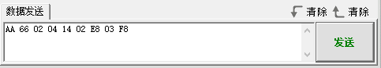

# 串口通信实操课程

## 1. 设备主从通讯原理

本节旨在为用户介绍关于MiniArm机械臂（以下简称MiniArm）在与不同设备（如Arduino、PC）通信时的主从关系的详细信息，理解MiniArm是如何作为从机与其他设备进行通信的，以及其他设备如何作为主机控制MiniArm。

本章中MiniArm都是作为从机设备，通过UART串口与其他设备进行信息传输。

### 1.1 主从关系

在主从机控制系统中，MiniArm作为从机设备，其他单片机等设备作为主机。

MiniArm作为从机的功能

- 接收解析主机发送的信号：

等待串口信号，若串口有数据接收到，则根据通讯协议解析串口数据，可以根据数据信息调用对应的函数功能。

- 根据接收数据调用MiniArm的功能：

当解析出信号时，就需要调用对应的MiniArm本设备功能，如控制舵机运动、读取舵机角度、控制蜂鸣器、控制RGB灯。

- 数据封装与反馈：

当接收到读取命令时，则需要调用对应的读取函数后，将读取到的数据根据通讯协议封装为数据包，并发送给主机设备。

其他设备作为主机

- 指令封装与发送：

主机需要将控制指令和数据根据通讯协议封装为数据包，发送给设备。

- 控制协调：

主机设备需管理好整个系统的协同工作，确保MiniArm和其他设备之间的通信和操作无冲突，保持良好的工作状态。

- 数据接收：

主机读取舵机状态时，在发送读取指令后，需要接收MiniArm发送的状态信息数据，确保数据的完整性和正确性，并解析数据包，提取其中的有用信息。

### 1.2 硬件连接

以MiniArm接入PC为例：

1)  将USB转接器的RXD、TXD、GND通过杜邦线分别连接至Arduino UNO拓展板的IO12、IO10、GND接口。


2)  将USB转接器插入电脑。


### 1.3 数据传输格式

MiniArm的UART串口数据发送格式默认为：

| 波特率 | 9600 |
|:------:|:----:|
| 数据位 |  8   |
| 校验位 | None |
| 停止位 |  1   |

### 1.4 通信协议


|   帧头    | 功能码 | 数据长度 | 数据信息 | 校验位 |
|:---------:|:------:|:--------:|:--------:|:------:|
| 0xAA 0x66 |  func  |   len    |   data   | check  |

- **帧头**：当接收到帧头时，表示有数据传输，帧头数据长度固定为2个字节；

- **功能码**：用于标明一个信息帧的用途；

- **数据长度**：表示后续的数据量；

- **数据信息**：表示传输的数据信息；

- **校验位**：（功能码+数据长度+数据）取反，取低字节。

### 1.5 注意事项

- 主机设备与MiniArm的供电电源可以不同，但在连接时必须要共地，才可以提供稳定的通讯电平。

- 设备在接线时要注意UART串口的TX、RX引脚要交叉接线，否则不可通讯。

## 2. PC串口控制例程

**本文通过PC串口依次实现了MiniArm的舵机角度控制、蜂鸣器控制、RGB灯控制、读取舵机角度功能。**

### 2.1 实现原理

1)  MiniArm与TTL进行串行连接后接入PC机进行串口通信，实现串口控制MiniArm。

2)  通信协议：

下面我们以一些需要使用的通讯协议作为例子，协议指令包格式如下：

|   帧头    | 功能码 | 数据长度 | 数据信息 | 校验位 |
|:---------:|:------:|:--------:|:--------:|:------:|
| 0xAA 0x66 |  func  |   len    |   data   | check  |

- **帧头**：当接收到帧头时，表示有数据传输，帧头数据长度固定为2个字节；

- **功能码**：用于标明一个信息帧的用途；

- **数据长度**：表示后续的数据量；

- **数据信息**：表示传输的数据信息；

- **校验位**：（功能码+数据长度+数据）取反，取低字节。

### 2.2 准备工作

- #### 硬件准备

请确保MiniArm是否正确连接PC，否则会导致无法正常通信。

1)  将USB转接器的RXD、TXD、GND通过杜邦线分别连接至Arduino UNO拓展板的IO12、IO10、GND接口。


2)  将USB转接器插入电脑。


- #### 软件准备

请确保串口传输助手的波特率设置为9600、校验位为NONE、数据位为8、停止位为1，并勾选以十六进制发送，配置如下图所示：


### 2.3 功能实现

通过发送十六进制指令来进行控制MiniArm：

1)  指令名：FUNC_SET_SERVO 指令值0x01，数据长度5：

说明：控制MiniArm的舵机转动，转向角度为0-180度。

数据信息：5个舵机需要设置的角度，共5个数值。每个数值都对应着一个舵机，分别用一个字节来表示需要转动的角度。

举例：以发送十六进制AA 66 01 05 49 16 A1 39 5A 66为例，数据信息为**49 16 A1 39 5A**，其中49表示1号舵机转动至73度，16表示2号舵机转动至22度，A1表示3号舵机转动至161度，39表示4号舵机转动至57度，5A表示5号舵机转动至90度。


2)  指令名：FUNC_SET_BUZZER 指令值0x02，数据长度4：

说明：控制MiniArm的蜂鸣器，频率、时间的范围都是0-65535。

数据信息：首先是蜂鸣器的频率，其次是运行时间，共4个数值。每个数值都是分解为2个字节，低字节在前，高字节在后。

举例：以发送十六进制AA 66 02 04 14 02 E8 03 F8为例，数据信息为**14 02 E8 03**，其中14 02表示将蜂鸣器的频率设置为532，而E8 03则表示运行时间为1000ms。



3)  指令名：FUNC_SET_RGB 指令值0x03，数据长度3：

说明：控制RGB灯的颜色，值范围是0-255。

数据信息：一共有3个参数，分别代表着RGB中的R、G、B三种颜色。

举例：以发送十六进制AA 66 03 03 FF 00 00 FA为例，数据信息为**FF 00 00，**其中FF表示将红色设置为255，后面两个00分别表示将绿色和蓝色都设置为0。


4)  指令名：FUNC_READ_ANGLE 指令值0x11，数据长度0：

说明：读取当前MiniArm舵机角度。

数据信息：因为是读取操作，所以可无数据信息。

举例：以发送十六进制AA 66 11 00 EE为例，


数据发送后MiniArm分别返回当前5个舵机的角度，以接收到的数据AA 66 11 05 5A 5A 5A 5A 5A 27 为例，数据信息为5A 5A 5A 5A 5A，第1-5个5A分别表示第1-5个舵机当前的角度都是90度。


## 3. Arduino控制例程

**本文通过PC串口依次实现了MiniArm的舵机角度控制、蜂鸣器控制、RGB灯控制、读取舵机角度功能。**

### 3.1 实现原理

该程序的源代码位于本文档同路径下：“**Arduino主控程序\arduino_and_MiniArm\arduino_and_MiniArm.ino**”，具体底层实现请查看文件：“**Arduino主控程序\arduino_and_MiniArm\MiniArm_ctl.cpp**”。

1. 将调试打印串口波特率设置为115200，调用MiniArm_ctl.h库下的**mi_ctl.serial_begin()**函数，将通讯的软串口初始化为波特率9600。

```c
void setup() {
  Serial.begin(115200);
  mi_ctl.serial_begin();
}
```

2. 通过调用mi_ctl.set_angles()函数，即可实现对舵机的角度控制。以代码“**mi_ctl.set_angles(angles)**”为例，其中：第一个参数“**angles**”代表各个转动的角度，该参数是长度为5的一维数组，分别对应了5个舵机所需转动的角度，转动范围0°-180°。

```c
  //设置舵机角度
  Serial.println("set angles");
  uint8_t angles[5] = {73,10,161,57,90};
  //将PWM舵机的角度分别设置为73/10/161/57/90度，范围(0-180)
  mi_ctl.set_angles(angles); 
  delay(1500);
```

3.  通过调用mi_ctl.set_buzzer()函数，可实现对蜂鸣器的设置，以代码“mi_ctl.set_buzzer(532, 1000)”为例，其中：第一个参数“532”代表需要设置的蜂鸣器频率，该参数的范围是0-65535。第二个参数“1000”代表运行时间（单位为ms），此处的运行时间为1000ms。

```c
  //设置蜂鸣器
  Serial.println("set buzzer");
  //设置蜂鸣器的频率为532，运行时间为1000ms
  //两个参数的取值范围都是0-65535
  mi_ctl.set_buzzer(532,1000);
  delay(1500);
```

4. 通过调用mi_ctl.set_rgb()函数，可实现对RGB灯的颜色控制。以代码“mi_ctl.set_rgb(rgb)”为例，其中：参数rgb是一个长度为3的一维数组，分别对应着颜色红色、绿色、蓝色，取值范围是0-255。

```c
  //设置RGB灯
  Serial.println("set rgb");
  uint8_t rgb[3] = {0,255,0}; 
  //将RGB灯设置为绿色(范围0-255)
  mi_ctl.set_rgb(rgb);
  delay(1500);
```

5. 通过调用mi_ctl.read_angles()函数，获取MiniArm当前5个舵机的角度信息，将读取到的舵机角度存入“read_a”数组内，再通过串口打印出来。

```c
  //读取并打印出当前状态的舵机角度
  Serial.println("read angles");
  uint8_t read_a[5] = {0,0,0,0,0};
  if(mi_ctl.read_angles(read_a))
  {
    Serial.print("angles: ");
    for(int i=0;i<5;i++){
      Serial.print(read_a[i]);
      Serial.print(" ");
    }
  }
  delay(100);
```

### 3.2 准备工作

- #### 硬件准备

MiniArm串口通讯的接口，为4Pin接口，适用于有针脚接口作为UART通讯的设备，常用于Arduino开发板等，我们需要连接MiniArm的4pin接口进行通信。

4Pin接口通讯连接如下：


其连接线具体如下:

- MiniArm的IO12引脚作为TX信号脚，连接Arduino开发板的6号引脚；

- MiniArm的IO10引脚作为RX信号脚，连接Arduino开发板的7号引脚；

- MiniArm的GND引脚连接Arduino开发板的GND引脚；

- #### 软件准备

参照“**[4.二次开发基础与环境配置\4.1 Arduino开发环境搭建]()**”内容，将MiniArm机械臂与Arduino编辑器建立连接。

### 3.3 程序下载

1)  双击打开Arduino IDE 客户端


2)  点击“**文件-\>打开**”。


3)  打开“**1.实现原理**”中的源代码路径，并点击“**打开**”。


4)  选择开发板型号。点击“**工具-\>开发板**”选择“**Arduino UNO**”，此处以COM10为例（若在开发环境搭建中已将开发板型号和端口号配置好，则可跳过此步骤）。


5)  如果不清楚端口号，可右键单击“**此电脑**”，依次点击“**属性**-\>**设备管理器**”，查看主板对应的端口号（带有CH340的就是我们的设备）。找到之后在Arduino中重新选择即可。


6)  确认无误后，点击图标，验证程序。如果程序无误，状态区则会依次显示“**正在编译程项目-编译完成**”，编译完成后显示当前项目使用的字节数、程序存储空间等信息。


7)  编译无误后我们点击图标，将程序上传到开发板中。状态区依次显示“正在编译项目-上传-上传成功”上传成功之后，状态区停止打印上传信息。


### 3.4 功能实现

程序运行时：

1)  5个舵机分别转动到73/10/161/57/90度。

2)  1.5秒后MiniArm的蜂鸣器以532hz鸣响1秒。

3)  然后将LED灯设置为绿色。

4)  最后在串口内打印出MiniArm当前的5个舵机角度。
